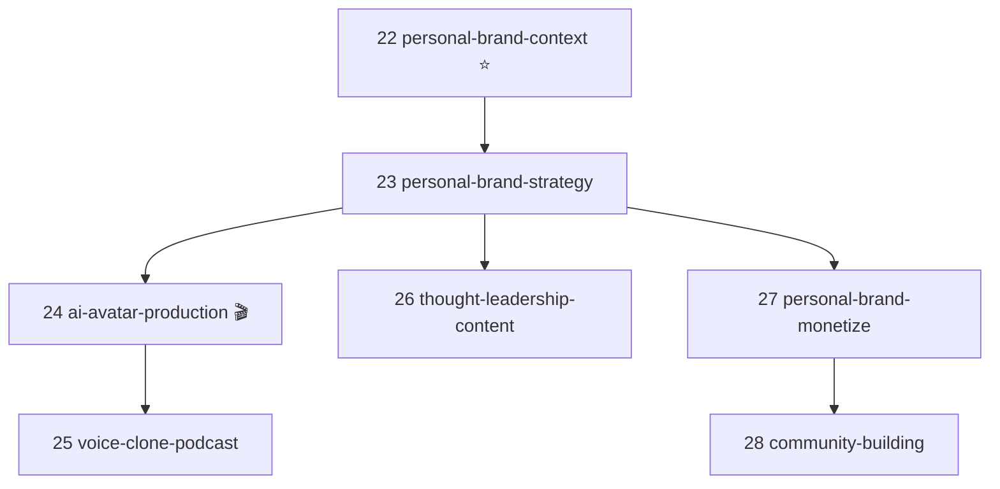
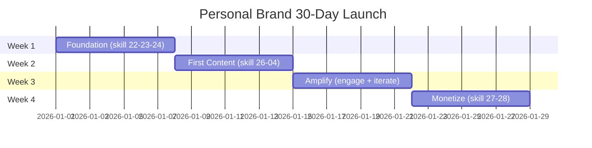

<p align="center">
  <a href="README.md"></a>
  <a href="README.vi.md"></a>
</p>

<p align="center">
  
  
  
  
  
  
</p>

> **🆕 v2.4.0 (2026-05-08)** — Personal Brand + AI Avatar Cluster.
> 7 new skills, 1 agent, 3 workflows. Zero breaking changes.
> [Read release notes →](docs/release-notes/v2.4.0.md) ·
> [Quick start →](docs/getting-started-personal-brand.md)

<p align="center">
  <a href="https://github.com/minhnv0807/fullstack-mkt-skills/stargazers"></a>
  <a href="https://github.com/minhnv0807/fullstack-mkt-skills/network/members"></a>
  <a href="https://github.com/minhnv0807/fullstack-mkt-skills/issues"></a>
  <a href="https://github.com/minhnv0807/fullstack-mkt-skills/pulls"></a>
  <a href="https://github.com/minhnv0807/fullstack-mkt-skills/commits/master"></a>
  <a href="https://github.com/minhnv0807/fullstack-mkt-skills/actions/workflows/validate.yml"></a>
</p>

<p align="center">
  <a href="docs/getting-started.md"><b>Getting Started</b></a> &middot;
  <a href="docs/skill-map.md"><b>Skill Map</b></a> &middot;
  <a href="docs/workflow-guide.md"><b>Workflows</b></a> &middot;
  <a href="docs/mcp-setup-guide.md"><b>MCP Setup</b></a> &middot;
  <a href="docs/faq.md"><b>FAQ</b></a> &middot;
  <a href="CONTRIBUTING.md"><b>Contributing</b></a> &middot;
  <a href="CHANGELOG.md"><b>Changelog</b></a>
</p>

<h1 align="center">Fullstack Marketing Skills</h1>

<p align="center">
  <strong>Turn any AI into a professional marketing assistant — built for the Vietnamese market.</strong>
  <br/>
  <sub>Framework <b>Over Powers Agency</b> | Claude Code + ChatGPT + Gemini + Copilot + Cursor</sub>
</p>

<p align="center">
  <sub>
    Compliant with <a href="https://agentskills.io">Agent Skills Spec</a> |
    Claude Code Plugin Marketplace |
    Universal AI agent compatibility
  </sub>
</p>

> **Note:** Skills content is written in Vietnamese (target: VN market 2025-2026). Docs available in both English and Vietnamese. Perfect for Vietnamese businesses or anyone marketing TO Vietnamese consumers.

---

## The Problem

```
You:    "Plan marketing for my spa business"
AI:     *Generic 500-word response, no numbers, no KPIs, no timeline*

You:    "Write Facebook ad copy"
AI:     *One generic paragraph, no cold/warm/hot audience distinction*

You:    "Monthly report"
AI:     *Data dump, no insights, no action items*
```

## The Solution

```
You:    "Plan marketing for my spa"
AI:     *2000+ word .md file — 5 sections, tables, 3-scenario KPIs,
         budget allocation, weekly timeline, risk matrix*

You:    "Write ad copy"
AI:     *6 variations — 2 TOFU + 2 MOFU + 2 BOFU,
         each with headline + primary text + CTA*

You:    "Monthly report"
AI:     *Insights first, data as evidence, root-cause analysis,
         48h action plan + weekly plan + next month strategy*
```

---

## Foundation Skill — No Repeating Info

Every skill starts by reading: **`.agents/product-marketing-context.md`** first.

```
One-time setup per project:
> Set up product marketing context for [my product]
  → AI creates .agents/product-marketing-context.md
    with 12 sections (product, audience, persona,
    competitors, positioning, pain points, differentiation, ...)

Every time after:
> Write Facebook ad copy
  → AI reads context → writes immediately, no questions
> Plan marketing for next month
  → AI reads context → plans immediately, no questions
```

**Saves ~70% of time per conversation.**

---

## Quick Start

### Option 1: Claude Code Plugin (recommended)

```bash
# In Claude Code
/plugin marketplace add minhnv0807/fullstack-mkt-skills
/plugin install fullstack-mkt-skills
```

### Option 2: Clone + Install

```bash
git clone https://github.com/minhnv0807/fullstack-mkt-skills.git
cd fullstack-mkt-skills
```

<table>
<tr>
<td><b>macOS / Linux</b></td>
<td><b>Windows</b></td>
</tr>
<tr>
<td>

```bash
chmod +x install.sh
./install.sh --global
```

</td>
<td>

```powershell
.\install.ps1 -Global
```

</td>
</tr>
</table>

### Option 3: Other AI agents (ChatGPT, Gemini, Cursor)

Copy `.md` files as Custom Instructions or context. Each file is a standalone prompt.

### Use

```
# First time
> Set up product marketing context for Luna Spa

# Subsequent times — no need to repeat product info
> Plan fullstack marketing for May
> Write 30s TikTok script for new facial treatment
> CPMess is 45K, ROAS 1.8x — audit and suggest optimization
> Reverse-calculate budget for 200M VND revenue target
```

---

## 29 Skills (22 Marketing SP + 7 Personal Brand)

<table>
<tr><th>#</th><th>Skill</th><th>What it does</th><th>Category</th></tr>
<tr><td><b>★</b></td><td><a href="skills/product-marketing-context/SKILL.md"><b>Product Marketing Context</b></a></td><td><b>Foundation</b> — read first, avoids repeating info</td><td>


</td></tr>
<tr><td><code>00</code></td><td><a href="skills/00-ke-hoach-mkt/SKILL.md"><b>Marketing Plan</b></a></td><td>Fullstack 7-section plan + SAVE framework + risk matrix</td><td>


</td></tr>
<tr><td><code>01</code></td><td><a href="skills/01-lich-noi-dung/SKILL.md"><b>Content Calendar</b></a></td><td>Monthly calendar + 1:9 repurposing matrix + AI scoring</td><td>


</td></tr>
<tr><td><code>02</code></td><td><a href="skills/02-brief-chien-dich/SKILL.md"><b>Campaign Brief</b></a></td><td>9-section brief + RACI matrix + risk mitigation</td><td>


</td></tr>
<tr><td><code>03</code></td><td><a href="skills/03-danh-gia-hieu-suat/SKILL.md"><b>Performance Audit</b></a></td><td>Diagnostic tree + 5 Whys + 48h action plan</td><td>


</td></tr>
<tr><td><code>04</code></td><td><a href="skills/04-script-video/SKILL.md"><b>Video Script</b></a></td><td>A/B scripts + 5 hook types + viral score + filming guide</td><td>


</td></tr>
<tr><td><code>05</code></td><td><a href="skills/05-copy-quang-cao/SKILL.md"><b>Ad Copy</b></a></td><td>6 variations, 3 funnel tiers + emotional triggers</td><td>


</td></tr>
<tr><td><code>06</code></td><td><a href="skills/06-brief-ugc-egc/SKILL.md"><b>UGC/EGC Brief</b></a></td><td>Creator brief + legal + payment + batch management</td><td>


</td></tr>
<tr><td><code>07</code></td><td><a href="skills/07-bao-cao-marketing/SKILL.md"><b>Marketing Report</b></a></td><td>5-min readable monthly report — insights first</td><td>


</td></tr>
<tr><td><code>08</code></td><td><a href="skills/08-nghien-cuu-doi-thu/SKILL.md"><b>Competitor Research</b></a></td><td>3-tier competitor model + SWOT + positioning map + gaps</td><td>


</td></tr>
<tr><td><code>09</code></td><td><a href="skills/09-insight-khach-hang/SKILL.md"><b>Customer Insight</b></a></td><td>Persona + customer journey + JTBD + validation</td><td>


</td></tr>
<tr><td><code>10</code></td><td><a href="skills/10-tinh-kpi-nguoc/SKILL.md"><b>Reverse KPI Calculator</b></a></td><td>Revenue → budget + 3 scenarios + sensitivity analysis</td><td>


</td></tr>
<tr><td><code>11</code></td><td><a href="skills/11-thiet-lap-kenh/SKILL.md"><b>Channel Setup A-Z</b></a></td><td>Setup 7 channels + 4-phase checklist + 30-day plan</td><td>


</td></tr>
<tr><td><code>12</code></td><td><a href="skills/12-brief-landing-page/SKILL.md"><b>Landing Page Brief</b></a></td><td>7-section brief + conversion checklist + A/B plan</td><td>


</td></tr>
<tr><td><code>13</code></td><td><a href="skills/13-phan-tich-du-lieu/SKILL.md"><b>Data Analysis</b></a></td><td>Meta/TikTok/GA4 → insights + trends + anomaly detection</td><td>


</td></tr>
<tr><td><code>14</code></td><td><a href="skills/14-email-marketing/SKILL.md"><b>Email Marketing</b></a></td><td>Welcome/nurture/re-engage + automation + deliverability</td><td>


</td></tr>
<tr><td><code>15</code></td><td><a href="skills/15-social-listening/SKILL.md"><b>Social Listening</b></a></td><td>Brand monitoring + sentiment + crisis protocol</td><td>


</td></tr>
<tr><td><code>16</code></td><td><a href="skills/16-marketing-psychology/SKILL.md"><b>Marketing Psychology</b></a> <sup>NEW</sup></td><td>7 Cialdini principles + VN cultural adaptation</td><td>


</td></tr>
<tr><td><code>17</code></td><td><a href="skills/17-pricing-strategy/SKILL.md"><b>Pricing Strategy</b></a> <sup>NEW</sup></td><td>Pricing tiers + charm/anchor/bundle + break-even</td><td>


</td></tr>
<tr><td><code>18</code></td><td><a href="skills/18-referral-program/SKILL.md"><b>Referral Program</b></a> <sup>NEW</sup></td><td>1-way/2-way/affiliate + VN channels + anti-fraud</td><td>


</td></tr>
<tr><td><code>19</code></td><td><a href="skills/19-ab-test-setup/SKILL.md"><b>A/B Test Setup</b></a></td><td>Sample size + 8 what-to-test + significance analysis</td><td>


</td></tr>
<tr><td><code>20</code></td><td><a href="skills/20-brief-client-intake/SKILL.md"><b>Client Intake Brief</b></a> <sup>NEW</sup></td><td>20-industry intake form + 11-section brief for agencies</td><td>


</td></tr>
<tr><td><code>21</code></td><td><a href="skills/21-audit-ads-performance/SKILL.md"><b>Ads Health Audit</b></a> <sup>NEW</sup></td><td>84 checkpoints + Health Score (0-100) + Quality Gates</td><td>


</td></tr>
<tr><td><code>22</code></td><td><a href="skills/22-personal-brand-context/SKILL.md"><b>Personal Brand Context</b></a> <sup>v2.4 ⭐</sup></td><td>Foundation skill for personal brand (3 variants: founder/coach/creator)</td><td>


</td></tr>
<tr><td><code>23</code></td><td><a href="skills/23-personal-brand-strategy/SKILL.md"><b>Personal Brand Strategy</b></a> <sup>v2.4</sup></td><td>12-month strategy: niche + positioning + content pillars + authority ladder</td><td>


</td></tr>
<tr><td><code>24</code></td><td><a href="skills/24-ai-avatar-production/SKILL.md"><b>AI Avatar Production</b></a> <sup>v2.4 🎬</sup></td><td>Deep-dive AI Avatar (3-tier tools, 4 workflows, QA Score 100)</td><td>


</td></tr>
<tr><td><code>25</code></td><td><a href="skills/25-voice-clone-podcast/SKILL.md"><b>Voice Clone & Podcast</b></a> <sup>v2.4 🎙️</sup></td><td>Audio AI: voice clone, podcast, audiobook, 1:10 repurpose</td><td>


</td></tr>
<tr><td><code>26</code></td><td><a href="skills/26-thought-leadership-content/SKILL.md"><b>Thought Leadership Content</b></a> <sup>v2.4</sup></td><td>Long-form text: 3 structures, 6 hooks, 1:5 repurpose</td><td>


</td></tr>
<tr><td><code>27</code></td><td><a href="skills/27-personal-brand-monetize/SKILL.md"><b>Personal Brand Monetize</b></a> <sup>v2.4</sup></td><td>3 funnel versions + pricing psychology + VN tax 2026</td><td>


</td></tr>
<tr><td><code>28</code></td><td><a href="skills/28-community-building/SKILL.md"><b>Community Building</b></a> <sup>v2.4</sup></td><td>Zalo/Telegram/Skool blueprint + 3-layer community</td><td>


</td></tr>
</table>

---

## Personal Brand + AI Avatar Cluster (NEW v2.4.0)

7 new skills for founder/coach/creator building personal brand with AI Avatar.

### Cluster Diagram



### 30-Day Launch Timeline



### 3-Tier Tools Matrix (Compact)

| Tier | Cost/month | Tools | Best For |
|------|-----------|-------|----------|
| Free | $0 | Captions free, HeyGen trial | 1-5 videos/mo |
| Pro | $30-100 | HeyGen Creator, ElevenLabs Pro | 10-30 videos/mo |
| Enterprise | $200+ | Synthesia Enterprise, custom API | 30+ videos/mo |

See: [examples/personal-brand-coach.md](examples/personal-brand-coach.md) ·
[docs/getting-started-personal-brand.md](docs/getting-started-personal-brand.md)

---

## 5 Agents

```
                        ┌─────────────────────┐
                        │   MKT STRATEGIST    │
                        │ Planning + Strategy │
                        │ Skills: 00,02,08,09,│
                        │         16,17       │
                        └─────────┬───────────┘
                                  │
              ┌───────────────────┼───────────────────┐
              │                   │                   │
    ┌─────────▼─────────┐ ┌──────▼──────────┐ ┌──────▼──────────┐
    │ CONTENT PRODUCER  │ │ PERF. ANALYST   │ │ CHANNEL OPERATOR│
    │ Content + Scripts │ │ Data + Reports  │ │ Channels+Landing│
    │ 01, 04, 05, 06    │ │ 03,07,10,13,19  │ │ 11,12,14,15,18  │
    └───────────────────┘ └─────────────────┘ └─────────────────┘

                        ┌──────────────────────────┐
                        │ PERSONAL BRAND BUILDER 🆕│
                        │ Personal Brand + Avatar  │
                        │ Skills: 22,23,24,25,     │
                        │         26,27,28         │
                        └──────────────────────────┘
```

| Agent | Main Skills |
|-------|-------------|
| [MKT Strategist](agents/mkt-strategist.md) | 00, 02, 08, 09, 16, 17 |
| [Content Producer](agents/content-producer.md) | 01, 04, 05, 06 |
| [Performance Analyst](agents/performance-analyst.md) | 03, 07, 10, 13, 19 |
| [Channel Operator](agents/channel-operator.md) | 11, 12, 14, 15, 18 |
| [Personal Brand Builder](agents/personal-brand-builder.md) <sup>v2.4 NEW</sup> | 22, 23, 24, 25, 26, 27, 28 |

---

## 7 Workflows

### Client Onboard — Agency (5-7 days) <sup>NEW</sup>
```
20 Brief Intake → 09 Insights → 08 Competitors → 10 KPIs → 00 Plan → 02 Brief → 01 Calendar
```

### Campaign Launch (14-21 days)
```
08 Competitors → 09 Insights → 00 Plan → 02 Brief → 01+04+05 Content → 06 UGC → 11+12 Channels
```

### Monthly Cycle (3-5 days)
```
13 Data → 03 Audit → 07 Report → 10 New KPIs → 01 New Calendar
```

### Content Production (weekly)
```
Review calendar → 04 Script → Film/Edit → 05 Ad copy → Schedule posts
```

### Personal Brand Launch (30 days) <sup>v2.4 NEW</sup>
```
22 Context → 23 Strategy → 24 AI Avatar → 26 Long-form → 27 Monetize → 28 Community
```

### AI Avatar Batch (5 days × 5 hours) <sup>v2.4 NEW</sup>
```
30 AI Avatar videos in 5 days, <$2/video — production line workflow
```

### Personal Brand Monthly (3-5 days) <sup>v2.4 NEW</sup>
```
13 Data → 03 Audit → 07 Report → review pillars → adjust personal brand
```

---

## Vietnam Benchmarks 2025-2026

<table>
<tr><th>Metric</th><th>Poor</th><th>Average</th><th>Good</th><th>Excellent</th></tr>
<tr><td><b>Meta CPMess</b></td><td>>40K VND</td><td>25-40K</td><td>18-25K</td><td>&lt;18K</td></tr>
<tr><td><b>TikTok CPMess</b></td><td>>45K</td><td>28-45K</td><td>20-28K</td><td>&lt;20K</td></tr>
<tr><td><b>Lead→Booking</b></td><td>&lt;40%</td><td>40-60%</td><td>60-75%</td><td>>75%</td></tr>
<tr><td><b>Booking→Customer</b></td><td>&lt;25%</td><td>25-40%</td><td>40-55%</td><td>>55%</td></tr>
<tr><td><b>ROAS</b></td><td>&lt;2x</td><td>2-4x</td><td>4-7x</td><td>>7x</td></tr>
<tr><td><b>Email Open Rate</b></td><td>&lt;15%</td><td>15-25%</td><td>25-35%</td><td>>35%</td></tr>
</table>

> Full benchmarks by industry at [`references/benchmarks-vietnam.md`](references/benchmarks-vietnam.md)

---

## Platform Compatibility

| Platform | Support | How to use |
|----------|---------|-----------|
| **Claude Code** | Full | `/plugin install` or `install.sh --global` |
| **Claude Pro** | Full | Upload to Project Knowledge |
| **ChatGPT** | Partial | Upload `.md` as Custom GPT config |
| **Gemini** | Partial | System prompt / context |
| **Copilot** | Partial | `.github/copilot-instructions.md` |
| **Cursor / Windsurf** | Partial | `.cursorrules` |
| **Any AI agent** | Partial | Each `.md` is a standalone prompt |

---

## Project Structure

```
fullstack-mkt-skills/
│
├── .claude-plugin/
│   └── marketplace.json            # Claude Code plugin spec
│
├── .github/
│   ├── ISSUE_TEMPLATE/              # Bug report + skill request
│   └── PULL_REQUEST_TEMPLATE/       # New skill + skill update
│
├── skills/                          # 29 skills (folder per skill)
│   ├── product-marketing-context/   # Foundation skill (★)
│   │   └── SKILL.md
│   ├── 00-ke-hoach-mkt/
│   │   └── SKILL.md
│   ├── ... (skills 01-21 — Marketing SP cluster)
│   ├── 22-personal-brand-context/   # NEW v2.4: Foundation with 3 variants
│   │   ├── SKILL.md
│   │   ├── README.md
│   │   └── variants/
│   │       ├── 01-founder.md
│   │       ├── 02-coach.md
│   │       └── 03-creator.md
│   ├── 23-personal-brand-strategy/  # NEW v2.4
│   ├── 24-ai-avatar-production/     # NEW v2.4: Flagship deep-dive
│   ├── 25-voice-clone-podcast/      # NEW v2.4
│   ├── 26-thought-leadership-content/ # NEW v2.4
│   ├── 27-personal-brand-monetize/  # NEW v2.4
│   └── 28-community-building/       # NEW v2.4
│
├── references/                      # Shared references
│   ├── benchmarks-vietnam.md
│   ├── channel-system.md
│   ├── content-angles.md
│   ├── copy-frameworks-vn.md       # 6 copy frameworks (v2.3)
│   ├── kpi-formulas.md
│   ├── mcp-ads-integration.md      # MCP server guide (v2.3)
│   ├── quality-gates-vn.md         # 10 hard rules (v2.3)
│   ├── hook-formulas-vn.md         # 6 hook types for VN (v2.3)
│   ├── ai-avatar-tools-vn.md       # NEW v2.4
│   ├── voice-clone-prompts-vn.md   # NEW v2.4
│   ├── ai-video-disclosure-vn.md   # NEW v2.4
│   └── tool-stack.md
│
├── workflows/                       # 7 multi-skill workflows
│   ├── campaign-launch.md
│   ├── client-onboard.md           # Agency workflow (v2.3)
│   ├── content-production.md
│   ├── monthly-cycle.md
│   ├── personal-brand-launch.md    # NEW v2.4 (30-day)
│   ├── ai-avatar-batch.md          # NEW v2.4 (5-day batch)
│   └── personal-brand-monthly.md   # NEW v2.4 (review)
│
├── docs/                            # Documentation
│   ├── best-practices.md
│   ├── faq.md                      # FAQ + troubleshooting (v2.3)
│   ├── getting-started.md
│   ├── mcp-setup-guide.md          # MCP setup guide (v2.3)
│   ├── skill-map.md                # System visualization (v2.3)
│   ├── update-guide.md             # Maintenance guide (v2.3)
│   ├── workflow-guide.md           # Workflow selection (v2.3)
│   ├── personal-brand-guide.md     # NEW v2.4 (8-chapter cam nang)
│   ├── getting-started-personal-brand.md # NEW v2.4 (5-min quickstart)
│   └── release-notes/
│       └── v2.4.0.md               # NEW v2.4
│
├── agents/                          # Agent personas
│   └── personal-brand-builder.md   # NEW v2.4
├── examples/                        # Sample outputs
│   └── personal-brand-coach.md     # NEW v2.4
│
├── AGENTS.md                        # Universal agent spec
├── CLAUDE.md                        # Claude-specific config
├── CONTRIBUTING.md                  # How to contribute
├── VERSIONS.md                      # Version tracking
├── validate-skills.sh               # Bash validator
├── validate-skills.ps1              # PowerShell validator
├── install.sh                       # macOS/Linux installer
├── install.ps1                      # Windows installer
└── LICENSE                          # MIT
```

---

## Why Vietnamese content?

Skills are written in Vietnamese because:

1. **Target market is Vietnam** — benchmarks, channels (Zalo, Shopee, TikTok Shop), cultural psychology all specific to VN
2. **Better AI output** — when skill prompts match target market language, AI outputs match too
3. **Vietnamese customer language** — capturing exact phrases customers use makes copy resonate

**If you want English skills:** The structure is language-agnostic. Fork the repo and translate skills to your target market. Keep the framework, swap the language.

---

## Contributing

See [`CONTRIBUTING.md`](CONTRIBUTING.md) before starting.

```bash
# 1. Fork repo
# 2. Create branch
git checkout -b feature/new-skill

# 3. Run validator before committing
./validate-skills.sh

# 4. Conventional Commits
git commit -m "feat(skill): add new-skill"

# 5. Open PR with template
```

Contributions welcome in any language — just make sure to specify target market in the skill description.

---

## Credits

- **Inspired by:** [coreyhaines31/marketingskills](https://github.com/coreyhaines31/marketingskills) — foundation skill concept + plugin spec
- **Spec:** [Agent Skills Spec](https://agentskills.io)
- **Framework:** Over Powers Agency — VN market 2025-2026

---

## Star History

<a href="https://star-history.com/#minhnv0807/fullstack-mkt-skills&Date">
 <picture>
   <source media="(prefers-color-scheme: dark)" srcset="https://api.star-history.com/svg?repos=minhnv0807/fullstack-mkt-skills&type=Date&theme=dark" />
   <source media="(prefers-color-scheme: light)" srcset="https://api.star-history.com/svg?repos=minhnv0807/fullstack-mkt-skills&type=Date" />
   
 </picture>
</a>

If you find this project useful, please star it — helps the repo appear in GitHub Trending.

---

## License

MIT — free to use, modify, distribute.

---

<p align="center">
  <strong>Framework:</strong> Over Powers Agency
  <br/>
  <strong>Benchmark:</strong> Vietnam Market 2025-2026
  <br/>
  <strong>Compatible with:</strong> Claude Code &middot; ChatGPT &middot; Gemini &middot; Copilot &middot; Cursor &middot; any AI that reads Markdown
</p>

<p align="center">
  <sub>Built with AI, for marketers who use AI.</sub>
</p>
