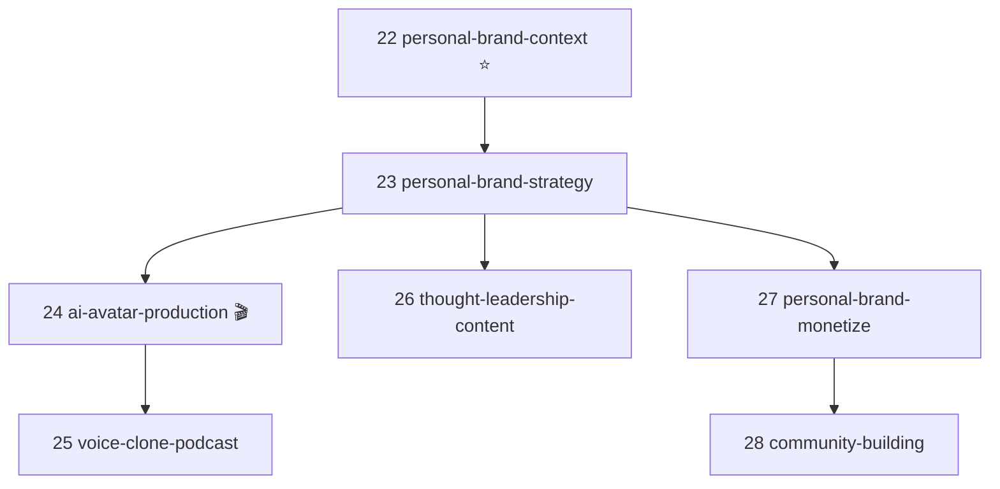
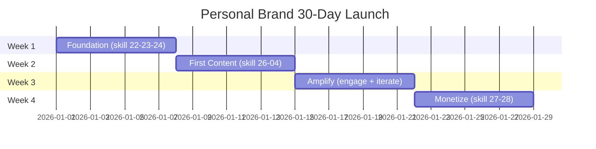

<p align="center">
  <a href="README.md"></a>
  <a href="README.vi.md"></a>
</p>

<p align="center">
  
  
  
  
  
  
</p>

> **🆕 v2.4.0 (2026-05-08)** — Cum Personal Brand + AI Avatar.
> 7 skills moi, 1 agent, 3 workflows. Khong breaking changes.
> [Xem release notes →](docs/release-notes/v2.4.0.md) ·
> [Bat dau nhanh →](docs/getting-started-personal-brand.md)

<h1 align="center">Fullstack Marketing Skills</h1>

<p align="center">
  <strong>Bien AI thanh tro ly marketing chuyen nghiep — thiet ke cho thi truong Viet Nam.</strong>
  <br/>
  <sub>Framework <b>Over Powers Agency</b> | Claude Code + ChatGPT + Gemini + Copilot + Cursor</sub>
</p>

<p align="center">
  <sub>
    Tuan thu <a href="https://agentskills.io">Agent Skills Spec</a> |
    Claude Code Plugin Marketplace |
    Universal AI agent compat
  </sub>
</p>

---

## The Problem

```
Ban:    "Lap ke hoach marketing cho spa di"
AI:     *Tra loi 500 tu chung chung, khong so lieu, khong KPI, khong timeline*

Ban:    "Viet copy quang cao Facebook"
AI:     *1 doan generic, khong phan biet cold/warm/hot audience*

Ban:    "Bao cao thang nay"
AI:     *Liet ke so lieu, khong co nhan dinh, khong de xuat hanh dong*
```

## The Solution

```
Ban:    "Lap ke hoach marketing cho spa"
AI:     *File .md 2000+ tu — 5 phan, bang bieu, KPI 3 kich ban,
         ngan sach phan bo, timeline tuan, risk matrix*

Ban:    "Viet copy quang cao"
AI:     *6 bien the — 2 TOFU + 2 MOFU + 2 BOFU,
         moi bien the co headline + primary text + CTA*

Ban:    "Bao cao thang"
AI:     *Nhan dinh truoc, so lieu minh hoa, nguyen nhan goc re,
         de xuat xu ly 48h + tuan nay, ke hoach thang sau*
```

---

## Foundation Skill — Khong phai hoi lai

Moi skill khac bat dau bang: **doc `.agents/product-marketing-context.md` truoc**.

```
Chay 1 lan dau du an:
> Thiet lap product marketing context cho [san pham]
  → AI tao file .agents/product-marketing-context.md
    chua 12 section (product, audience, persona, 
    doi thu, dinh vi, noi dau, differentiation, ...)

Moi lan sau:
> Viet copy quang cao Facebook
  → AI doc context → viet luon, khong hoi lai
> Lap ke hoach MKT tháng toi
  → AI doc context → lap luon, khong hoi lai
```

Tiet kiem **70% thoi gian** moi cuoc hoi thoai.

---

## Quick Start

### Option 1: Claude Code Plugin (khuyen dung)

```bash
# Trong Claude Code
/plugin marketplace add minhnv0807/fullstack-mkt-skills
/plugin install fullstack-mkt-skills
```

### Option 2: Clone + Install

```bash
git clone https://github.com/minhnv0807/fullstack-mkt-skills.git
cd fullstack-mkt-skills
```

<table>
<tr>
<td><b>macOS / Linux</b></td>
<td><b>Windows</b></td>
</tr>
<tr>
<td>

```bash
chmod +x install.sh
./install.sh --global
```

</td>
<td>

```powershell
.\install.ps1 -Global
```

</td>
</tr>
</table>

### Option 3: Voi agent khac (ChatGPT, Gemini, Cursor)

Copy file `.md` lam Custom Instructions hoac context. Moi file la 1 prompt doc lap.

### Use

```
# Lan dau
> Thiet lap product marketing context cho spa Luna

# Cac lan sau — khong can nhac lai thong tin san pham
> Lap ke hoach fullstack marketing thang 5
> Viet script TikTok 30s cho facial moi
> CPMess dang 45K, ROAS 1.8x — danh gia va de xuat toi uu
> Tinh nguoc ngan sach de dat 200 trieu doanh thu/thang
```

---

## 29 Skills (22 Marketing SP + 7 Personal Brand)

<table>
<tr><th>#</th><th>Skill</th><th>Lam gi</th><th>Category</th></tr>
<tr><td><b>★</b></td><td><a href="skills/product-marketing-context/SKILL.md"><b>Product Marketing Context</b></a></td><td><b>Foundation</b> — doc truoc moi skill, tranh lap lai thong tin</td><td>


</td></tr>
<tr><td><code>00</code></td><td><a href="skills/00-ke-hoach-mkt/SKILL.md"><b>Ke Hoach MKT</b></a></td><td>Ke hoach toan dien 7 phan + SAVE framework + risk matrix</td><td>


</td></tr>
<tr><td><code>01</code></td><td><a href="skills/01-lich-noi-dung/SKILL.md"><b>Lich Noi Dung</b></a></td><td>Lich thang + repurposing matrix 1:9 + AI scoring</td><td>


</td></tr>
<tr><td><code>02</code></td><td><a href="skills/02-brief-chien-dich/SKILL.md"><b>Brief Chien Dich</b></a></td><td>Brief 9 phan + RACI matrix + risk mitigation</td><td>


</td></tr>
<tr><td><code>03</code></td><td><a href="skills/03-danh-gia-hieu-suat/SKILL.md"><b>Danh Gia Hieu Suat</b></a></td><td>Diagnostic tree + 5 Whys + 48h action plan</td><td>


</td></tr>
<tr><td><code>04</code></td><td><a href="skills/04-script-video/SKILL.md"><b>Script Video</b></a></td><td>Script A/B + 5 hook types + viral score + filming guide</td><td>


</td></tr>
<tr><td><code>05</code></td><td><a href="skills/05-copy-quang-cao/SKILL.md"><b>Copy Quang Cao</b></a></td><td>6 variations 3 tang pheu + emotional triggers</td><td>


</td></tr>
<tr><td><code>06</code></td><td><a href="skills/06-brief-ugc-egc/SKILL.md"><b>Brief UGC/EGC</b></a></td><td>Brief creator + legal + payment + batch management</td><td>


</td></tr>
<tr><td><code>07</code></td><td><a href="skills/07-bao-cao-marketing/SKILL.md"><b>Bao Cao Marketing</b></a></td><td>Bao cao thang doc 5 phut — nhan dinh truoc, so lieu sau</td><td>


</td></tr>
<tr><td><code>08</code></td><td><a href="skills/08-nghien-cuu-doi-thu/SKILL.md"><b>Nghien Cuu Doi Thu</b></a></td><td>3 tang doi thu + SWOT + positioning map + gaps</td><td>


</td></tr>
<tr><td><code>09</code></td><td><a href="skills/09-insight-khach-hang/SKILL.md"><b>Insight Khach Hang</b></a></td><td>Persona + customer journey + JTBD + validation</td><td>


</td></tr>
<tr><td><code>10</code></td><td><a href="skills/10-tinh-kpi-nguoc/SKILL.md"><b>Tinh KPI Nguoc</b></a></td><td>Doanh thu → ngan sach + 3 kich ban + sensitivity</td><td>


</td></tr>
<tr><td><code>11</code></td><td><a href="skills/11-thiet-lap-kenh/SKILL.md"><b>Thiet Lap Kenh</b></a></td><td>Setup 7 kenh + checklist 4 phase + 30-day plan</td><td>


</td></tr>
<tr><td><code>12</code></td><td><a href="skills/12-brief-landing-page/SKILL.md"><b>Brief Landing Page</b></a></td><td>Brief 7 section + conversion checklist + A/B plan</td><td>


</td></tr>
<tr><td><code>13</code></td><td><a href="skills/13-phan-tich-du-lieu/SKILL.md"><b>Phan Tich Du Lieu</b></a></td><td>Meta/TikTok/GA4 → insight + trend + anomaly</td><td>


</td></tr>
<tr><td><code>14</code></td><td><a href="skills/14-email-marketing/SKILL.md"><b>Email Marketing</b></a></td><td>Welcome/nurture/re-engage + automation + deliverability</td><td>


</td></tr>
<tr><td><code>15</code></td><td><a href="skills/15-social-listening/SKILL.md"><b>Social Listening</b></a></td><td>Brand monitoring + sentiment + crisis protocol</td><td>


</td></tr>
<tr><td><code>16</code></td><td><a href="skills/16-marketing-psychology/SKILL.md"><b>Marketing Psychology</b></a> <sup>NEW</sup></td><td>7 Cialdini principles + VN cultural adaptation</td><td>


</td></tr>
<tr><td><code>17</code></td><td><a href="skills/17-pricing-strategy/SKILL.md"><b>Pricing Strategy</b></a> <sup>NEW</sup></td><td>Pricing tier + charm/anchor/bundle + break-even</td><td>


</td></tr>
<tr><td><code>18</code></td><td><a href="skills/18-referral-program/SKILL.md"><b>Referral Program</b></a> <sup>NEW</sup></td><td>1-way/2-way/affiliate + VN channels + anti-fraud</td><td>


</td></tr>
<tr><td><code>19</code></td><td><a href="skills/19-ab-test-setup/SKILL.md"><b>A/B Test Setup</b></a></td><td>Sample size + 8 what-to-test + significance analysis</td><td>


</td></tr>
<tr><td><code>20</code></td><td><a href="skills/20-brief-client-intake/SKILL.md"><b>Brief Client Intake</b></a> <sup>v2.3</sup></td><td>Form intake 20 nganh + brief 11 phan cho agency</td><td>


</td></tr>
<tr><td><code>21</code></td><td><a href="skills/21-audit-ads-performance/SKILL.md"><b>Audit Ads Performance</b></a> <sup>v2.3</sup></td><td>84 checkpoint + Health Score (0-100) + Quality Gates</td><td>


</td></tr>
<tr><td><code>22</code></td><td><a href="skills/22-personal-brand-context/SKILL.md"><b>Personal Brand Context</b></a> <sup>v2.4 ⭐</sup></td><td>Foundation skill cho personal brand (3 variants: founder/coach/creator)</td><td>


</td></tr>
<tr><td><code>23</code></td><td><a href="skills/23-personal-brand-strategy/SKILL.md"><b>Personal Brand Strategy</b></a> <sup>v2.4</sup></td><td>Chien luoc 12 thang: niche + positioning + content pillars + authority ladder</td><td>


</td></tr>
<tr><td><code>24</code></td><td><a href="skills/24-ai-avatar-production/SKILL.md"><b>AI Avatar Production</b></a> <sup>v2.4 🎬</sup></td><td>Deep-dive AI Avatar (3 tier tool, 4 workflow, QA Score 100)</td><td>


</td></tr>
<tr><td><code>25</code></td><td><a href="skills/25-voice-clone-podcast/SKILL.md"><b>Voice Clone & Podcast</b></a> <sup>v2.4 🎙️</sup></td><td>Audio AI: voice clone, podcast, audiobook, repurpose 1:10</td><td>


</td></tr>
<tr><td><code>26</code></td><td><a href="skills/26-thought-leadership-content/SKILL.md"><b>Thought Leadership Content</b></a> <sup>v2.4</sup></td><td>Long-form text: 3 cau truc, 6 hook, repurpose 1:5</td><td>


</td></tr>
<tr><td><code>27</code></td><td><a href="skills/27-personal-brand-monetize/SKILL.md"><b>Personal Brand Monetize</b></a> <sup>v2.4</sup></td><td>3 phien ban funnel + pricing psychology + thue VN 2026</td><td>


</td></tr>
<tr><td><code>28</code></td><td><a href="skills/28-community-building/SKILL.md"><b>Community Building</b></a> <sup>v2.4</sup></td><td>Blueprint Zalo/Telegram/Skool + cong dong 3 lop</td><td>


</td></tr>
</table>

---

## Cum Personal Brand + AI Avatar (NEW v2.4.0)

7 skill moi cho founder/coach/creator xay dung personal brand voi AI Avatar.

### Cluster Diagram



### Timeline 30 ngay launch



### Ma tran tool 3 tang (rut gon)

| Tier | Chi phi/thang | Tool | Phu hop |
|------|---------------|------|---------|
| Free | $0 | Captions free, HeyGen trial | 1-5 video/thang |
| Pro | $30-100 | HeyGen Creator, ElevenLabs Pro | 10-30 video/thang |
| Enterprise | $200+ | Synthesia Enterprise, custom API | 30+ video/thang |

Xem them: [examples/personal-brand-coach.md](examples/personal-brand-coach.md) ·
[docs/getting-started-personal-brand.md](docs/getting-started-personal-brand.md)

---

## 5 Agents

```
                        ┌─────────────────────┐
                        │   MKT STRATEGIST    │
                        │ Ke hoach + Chien luoc│
                        │ Skills: 00,02,08,09,16,17│
                        └─────────┬───────────┘
                                  │
              ┌───────────────────┼───────────────────┐
              │                   │                   │
    ┌─────────▼─────────┐ ┌──────▼──────────┐ ┌──────▼──────────┐
    │ CONTENT PRODUCER  │ │ PERF. ANALYST   │ │ CHANNEL OPERATOR│
    │ Noi dung + Script │ │ Data + Bao cao  │ │ Kenh + Landing  │
    │ Skills: 01,04,05,06│ │ 03,07,10,13,19 │ │ 11,12,14,15,18 │
    └───────────────────┘ └─────────────────┘ └─────────────────┘

                        ┌──────────────────────────┐
                        │ PERSONAL BRAND BUILDER 🆕│
                        │ Personal Brand + Avatar  │
                        │ Skills: 22,23,24,25,     │
                        │         26,27,28         │
                        └──────────────────────────┘
```

| Agent | Skills chinh |
|-------|--------------|
| [MKT Strategist](agents/mkt-strategist.md) | 00, 02, 08, 09, 16, 17 |
| [Content Producer](agents/content-producer.md) | 01, 04, 05, 06 |
| [Performance Analyst](agents/performance-analyst.md) | 03, 07, 10, 13, 19 |
| [Channel Operator](agents/channel-operator.md) | 11, 12, 14, 15, 18 |
| [Personal Brand Builder](agents/personal-brand-builder.md) <sup>v2.4 NEW</sup> | 22, 23, 24, 25, 26, 27, 28 |

---

## 7 Workflows

### Client Onboard — Agency (5-7 ngay) <sup>v2.3</sup>
```
20 Brief Intake → 09 Insight → 08 Doi thu → 10 KPI → 00 Ke hoach → 02 Brief → 01 Lich
```

### Campaign Launch (14-21 ngay)
```
08 Doi thu → 09 Insight → 00 Ke hoach → 02 Brief → 01+04+05 Content → 06 UGC → 11+12 Kenh
```

### Monthly Cycle (3-5 ngay)
```
13 Data → 03 Danh gia → 07 Bao cao → 10 KPI moi → 01 Lich moi
```

### Content Production (hang tuan)
```
Review lich → 04 Script → Quay/Dung → 05 Copy ads → Len lich dang
```

### Personal Brand Launch (30 ngay) <sup>v2.4 NEW</sup>
```
22 Context → 23 Strategy → 24 AI Avatar → 26 Long-form → 27 Monetize → 28 Community
```

### AI Avatar Batch (5 ngay × 5 gio) <sup>v2.4 NEW</sup>
```
30 video AI Avatar trong 5 ngay, <$2/video — workflow san xuat day chuyen
```

### Personal Brand Monthly (3-5 ngay) <sup>v2.4 NEW</sup>
```
13 Data → 03 Audit → 07 Report → review pillars → dieu chinh personal brand
```

---

## Benchmark Vietnam 2025-2026

<table>
<tr><th>Chi so</th><th>Kem</th><th>Trung binh</th><th>Tot</th><th>Xuat sac</th></tr>
<tr><td><b>CPMess Meta</b></td><td>>40K</td><td>25-40K</td><td>18-25K</td><td>&lt;18K</td></tr>
<tr><td><b>CPMess TikTok</b></td><td>>45K</td><td>28-45K</td><td>20-28K</td><td>&lt;20K</td></tr>
<tr><td><b>Lead->Booking</b></td><td>&lt;40%</td><td>40-60%</td><td>60-75%</td><td>>75%</td></tr>
<tr><td><b>Booking->Customer</b></td><td>&lt;25%</td><td>25-40%</td><td>40-55%</td><td>>55%</td></tr>
<tr><td><b>ROAS</b></td><td>&lt;2x</td><td>2-4x</td><td>4-7x</td><td>>7x</td></tr>
<tr><td><b>Email Open Rate</b></td><td>&lt;15%</td><td>15-25%</td><td>25-35%</td><td>>35%</td></tr>
</table>

> Full benchmark theo nganh tai [`references/benchmarks-vietnam.md`](references/benchmarks-vietnam.md)

---

## Tuong thich

| Platform | Ho tro | Cach dung |
|----------|--------|----------|
| **Claude Code** | Full | `/plugin install` hoac `install.sh --global` |
| **Claude Pro** | Full | Upload vao Project Knowledge |
| **ChatGPT** | Partial | Upload `.md` lam Custom GPT config |
| **Gemini** | Partial | System prompt / context |
| **Copilot** | Partial | `.github/copilot-instructions.md` |
| **Cursor / Windsurf** | Partial | `.cursorrules` |
| **Bat ky AI agent** | Partial | Moi file `.md` la 1 prompt doc lap |

---

## Project Structure

```
fullstack-mkt-skills/
│
├── .claude-plugin/
│   └── marketplace.json            # Claude Code plugin spec
│
├── .github/
│   ├── ISSUE_TEMPLATE/              # Bug report + skill request
│   └── PULL_REQUEST_TEMPLATE/       # New skill + skill update
│
├── skills/                          # 29 skills (folder per skill)
│   ├── product-marketing-context/   # Foundation skill (★)
│   │   └── SKILL.md
│   ├── 00-ke-hoach-mkt/
│   │   └── SKILL.md
│   ├── 01-lich-noi-dung/
│   │   └── SKILL.md
│   ├── ... (skill 02-21 — cum Marketing SP)
│   ├── 22-personal-brand-context/   # NEW v2.4: Foundation co 3 variants
│   │   ├── SKILL.md
│   │   ├── README.md
│   │   └── variants/
│   │       ├── 01-founder.md
│   │       ├── 02-coach.md
│   │       └── 03-creator.md
│   ├── 23-personal-brand-strategy/  # NEW v2.4
│   ├── 24-ai-avatar-production/     # NEW v2.4: Flagship deep-dive
│   ├── 25-voice-clone-podcast/      # NEW v2.4
│   ├── 26-thought-leadership-content/ # NEW v2.4
│   ├── 27-personal-brand-monetize/  # NEW v2.4
│   └── 28-community-building/       # NEW v2.4
│
├── references/                      # Shared references
│   ├── benchmarks-vietnam.md
│   ├── channel-system.md
│   ├── content-angles.md
│   ├── copy-frameworks-vn.md       # 6 copy framework (v2.3)
│   ├── kpi-formulas.md
│   ├── mcp-ads-integration.md      # MCP server guide (v2.3)
│   ├── quality-gates-vn.md         # 10 hard rules (v2.3)
│   ├── hook-formulas-vn.md         # 6 hook type cho VN (v2.3)
│   ├── ai-avatar-tools-vn.md       # NEW v2.4
│   ├── voice-clone-prompts-vn.md   # NEW v2.4
│   ├── ai-video-disclosure-vn.md   # NEW v2.4
│   └── tool-stack.md
│
├── workflows/                       # 7 multi-skill workflows
│   ├── campaign-launch.md
│   ├── client-onboard.md           # Agency workflow (v2.3)
│   ├── content-production.md
│   ├── monthly-cycle.md
│   ├── personal-brand-launch.md    # NEW v2.4 (30 ngay)
│   ├── ai-avatar-batch.md          # NEW v2.4 (batch 5 ngay)
│   └── personal-brand-monthly.md   # NEW v2.4 (review)
│
├── agents/                          # Agent personas
│   └── personal-brand-builder.md   # NEW v2.4
├── examples/                        # Sample outputs
│   └── personal-brand-coach.md     # NEW v2.4
│
├── docs/                            # Documentation
│   ├── personal-brand-guide.md     # NEW v2.4 (8-chapter cam nang)
│   ├── getting-started-personal-brand.md # NEW v2.4 (5-min quickstart)
│   └── release-notes/
│       └── v2.4.0.md               # NEW v2.4
│
├── AGENTS.md                        # Universal agent spec
├── CLAUDE.md                        # Claude-specific config
├── CONTRIBUTING.md                  # How to contribute
├── VERSIONS.md                      # Version tracking
├── validate-skills.sh               # Bash validator
├── validate-skills.ps1              # PowerShell validator
├── install.sh                       # macOS/Linux installer
├── install.ps1                      # Windows installer
└── LICENSE                          # MIT
```

---

## Contributing

Doc [`CONTRIBUTING.md`](CONTRIBUTING.md) truoc khi bat dau.

```bash
# 1. Fork repo
# 2. Tao branch
git checkout -b feature/ten-skill-moi

# 3. Chay validator truoc khi commit
./validate-skills.sh

# 4. Conventional Commits
git commit -m "feat(skill): add ten-skill-moi"

# 5. Tao PR voi template
```

---

## Thanks & Credits

- **Inspired by:** [coreyhaines31/marketingskills](https://github.com/coreyhaines31/marketingskills) — foundation skill concept + plugin spec
- **Spec:** [Agent Skills Spec](https://agentskills.io)
- **Framework:** Over Powers Agency — thi truong VN 2025-2026

---

## Star History

<a href="https://star-history.com/#minhnv0807/fullstack-mkt-skills&Date">
 <picture>
   <source media="(prefers-color-scheme: dark)" srcset="https://api.star-history.com/svg?repos=minhnv0807/fullstack-mkt-skills&type=Date&theme=dark" />
   <source media="(prefers-color-scheme: light)" srcset="https://api.star-history.com/svg?repos=minhnv0807/fullstack-mkt-skills&type=Date" />
   
 </picture>
</a>

Neu thay project huu ich, cho 1 sao de theo doi — giup repo xuat hien trong GitHub Trending.

---

## License

MIT — tu do su dung, chinh sua, phan phoi.

---

<p align="center">
  <strong>Framework:</strong> Over Powers Agency
  <br/>
  <strong>Benchmark:</strong> Thi truong Viet Nam 2025-2026
  <br/>
  <strong>Tuong thich:</strong> Claude Code &middot; ChatGPT &middot; Gemini &middot; Copilot &middot; Cursor &middot; bat ky AI nao doc Markdown
</p>

<p align="center">
  <sub>Built with AI, for marketers who use AI.</sub>
</p>
