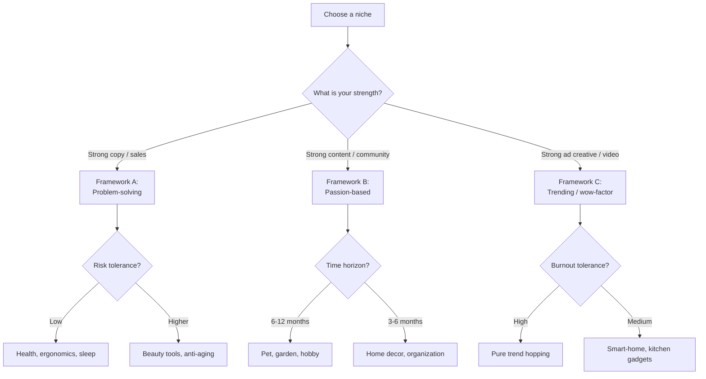

# Dropshipping Handbook 2025-2026 — Full Edition

> 8-chapter guide to dropshipping for international markets (US/EU primarily, SEA viable). Built for newbies who want a real picture, not the hype.
> Pair this with skill `29-dropshipping-mastery-global` and workflow `dropshipping-launch-global.md`.

**Table of contents**

- Chapter 1: What is dropshipping?
- Chapter 2: Choosing a niche
- Chapter 3: Finding winning products
- Chapter 4: Shopify store building
- Chapter 5: Ad creative for dropshipping
- Chapter 6: Scaling beyond $10K/day
- Chapter 7: 15 common mistakes
- Chapter 8: 30-question FAQ

---

## Chapter 1: What is dropshipping?

### 1.1 Definition

Dropshipping is a retail fulfillment model where the seller (you) does not hold inventory. Instead, when a customer places an order, you forward it to a third-party supplier (typically AliExpress, CJ Dropshipping, Spocket, or Zendrop), who ships the product directly to the customer. You pocket the difference between the retail price (what the customer pays) and the wholesale cost (what you pay the supplier) minus ad spend, payment fees, and Shopify subscription.

The seller's job in this model is essentially three things: (1) pick a product that converts, (2) build a storefront and ad creative that sells it, (3) handle customer service. Inventory, packing, and last-mile shipping are outsourced to the supplier.

### 1.2 Dropshipping vs adjacent models

| Model | You hold inventory? | Margin | Brand control | Scaling friction |
|-------|--------------------|--------|----------------|------------------|
| **Dropshipping** | No (supplier ships) | 15-30% (low) | Low — generic supplier products | Low — easy to add SKUs |
| **Amazon FBA** | Yes (Amazon warehouse) | 25-40% | Medium — your packaging, FBA handles fulfillment | Medium — requires inventory upfront |
| **Branded e-commerce** | Yes (3PL or in-house) | 50-70% | High — your product, your brand | High — design, manufacturing, inventory |
| **White label** | Yes (factory makes for your brand) | 35-55% | Medium-High — your brand on someone's product | Medium — MOQs |
| **Print on demand** | No (printer ships) | 20-35% | Medium — custom design on generic blank | Low — design once, sell many |

Dropshipping wins on speed-to-test (a new product can be live in 24-48 hours). It loses on margin and brand defensibility (anyone can sell the same AliExpress widget).

### 1.3 Pros

1. **Low startup capital** — $300-500 ad budget + $39 Shopify + ~$50 in apps = $400-600 to test a product
2. **Speed to test** — winning product can be validated in 7-14 days
3. **No inventory risk** — if a product flops, you do not have a warehouse full of stock
4. **Geography-flexible** — run from anywhere with internet (laptop + Stripe account)
5. **Skill-transferable** — what you learn (ads, copy, product research, customer service) transfers to branded e-commerce, agency work, or your own product later

### 1.4 Cons

1. **Low margins** — 15-30% gross margin means a single bad ad week wipes the month
2. **Supplier dependency** — supplier delays, defects, or shutdowns are YOUR customer service problem
3. **Long shipping ETAs** — AliExpress/China-based shipping is 12-25 days, kills repeat purchase psychology
4. **High competition / saturation** — winning products get copied within 2 weeks
5. **Reputation risk** — chargebacks and refund rates are higher than branded e-commerce; payment processors (Stripe, Shopify Payments) flag dropshippers regularly

### 1.5 The 90% fail rate reality check

Industry estimates put the dropshipping fail rate at 80-90% within the first year. The ones who fail share patterns:

- **Product picking by guess, not by data** — falling in love with a product without ad-spend or trend validation
- **Underestimating ad spend** — going in with $100 budget and expecting a winner; reality is $300-500 minimum to get statistical significance
- **Not iterating creative** — running the same ad for 3 weeks instead of testing 5-10 angles
- **Ignoring CPA math** — selling a $30 product with $25 CAC plus $8 supplier cost equals $-3 contribution margin
- **Quitting too early or too late** — pulling a winner at day 5 because of slow start, OR keeping a loser to day 60 because of sunk cost

The 10% who succeed treat dropshipping as a 12-month learning investment, not a 30-day get-rich scheme. Plan for 3-5 product attempts before finding a true winner.

---

## Chapter 2: Choosing a niche

### 2.1 Three niche frameworks

**Framework A: Problem-solving**

Pick a niche where customers have a recurring pain point that a product can solve. Pain = wallet-open. Examples: back pain (posture correctors), pet anxiety (calming supplements), meal prep stress (food storage organizers). Margins tend to be higher because customers tolerate $30-50 price points to escape pain.

**Framework B: Passion-based**

Pick a niche where customers buy out of identity, hobby, or fandom — not just utility. Examples: dog parents (premium dog accessories), home gardeners (raised garden beds, hydroponic kits), aquarium hobbyists (LED lights, plant tools). Lower price sensitivity, higher LTV via cross-sell.

**Framework C: Trending / wow-factor**

Pick a niche where impulse-buy is driven by visual novelty. Examples: smart-home gadgets, viral kitchen tools, beauty tools (gua sha, jade rollers). High volume short term but burn fast — trending products typically peak in 60-90 days.

### 2.2 Decision tree



### 2.3 Ten niche examples for 2025-2026 (US/EU primary)

1. **Pet products** — calming supplements, slow-feeders, cooling mats, GPS trackers. LTV high (recurring).
2. **Eco-friendly / sustainable** — reusable kitchenware, beeswax wraps, refillable cleaning kits. Story-driven margin.
3. **Smart home** — leak detectors, motion lights, plug timers. High ASP, mature audiences.
4. **Kitchen gadgets** — air fryer accessories, electric salt grinders, vegetable choppers. Fast to test.
5. **Fitness / recovery** — massage guns, percussion therapy, posture correctors. Pain-driven.
6. **Beauty tools** — gua sha, LED masks, scalp massagers, ice rollers. Visual, TikTok-friendly.
7. **Garden / outdoor** — raised beds, hydroponic kits, seed starters. Seasonal but recurring.
8. **Baby / parenting** — silicone bibs, sound machines, sensory toys. Trust-heavy, harder to scale.
9. **Automotive accessories** — phone mounts, dash cams, organizers. Steady, not flashy.
10. **Home office** — ergonomic accessories, cable organizers, monitor stands. Post-2020 stable demand.

Avoid: pure trend products (fidget spinners era), supplements with FDA risk, anything <$10 retail (no margin), heavy items (>1kg shipping kills math).

### 2.4 Validation checklist (5 criteria)

Before committing to a niche, confirm all 5:

- [ ] **Demand signal** — Google Trends shows 12-month rising or stable trend (not spike-and-crash)
- [ ] **Margin viability** — wholesale cost <30% of retail target ($30 retail needs <$10 supplier cost to leave room for ads)
- [ ] **Ad creative ease** — can you film or source 5-10 video angles? (boring products = boring ads = no conversion)
- [ ] **Audience size** — Meta Audience Insights shows 5M+ targetable audience in your region
- [ ] **Competition saturation** — 5-15 active sellers is healthy; 50+ is saturated; 0-2 is risky (may indicate no demand)

If any criterion fails, move to the next niche candidate. Do NOT force-fit.

---

## Chapter 3: Finding winning products

### 3.1 Five sources

**1. Minea ($49-129/month)** — Facebook + TikTok ad spy tool. Filters by ad spend, engagement, dropshipping flag. Best for finding ads that have been running profitably for 30+ days (signal of winner). Free tier allows ~10 searches/day.

**2. PiPiAds ($77-155/month)** — TikTok-focused ad spy. Better than Minea for TikTok-specific products. Filters by views, conversions, country. Free tier limited to 7 days.

**3. TikTok organic (free)** — Search hashtags `#TikTokMadeMeBuyIt`, `#AmazonFinds`, `#dropshipping`, plus niche-specific hashtags. Sort by recent + engagement. Tiktok Creative Center (free tool from TikTok) gives top-performing creatives by region.

**4. Reddit r/Dropshipping + r/EntrepreneurRideAlong (free)** — Real operators sharing wins/losses. Search "winning product" filter to last 30 days. Cross-reference with Minea to confirm.

**5. AliExpress sorting (free)** — Sort by orders or by recent. Look for products with 10K+ orders in 30 days, 4.5+ stars, multiple suppliers (= verified demand). Less reliable than ad spy but free.

### 3.2 Winning product criteria scorecard (5 criteria, score each 1-5, total /25)

| # | Criterion | Score 1-5 | Notes |
|---|-----------|-----------|-------|
| 1 | **Wow-factor or pain-solver** — can you create a 3-second video hook that stops scroll? | __ | 5 = obvious wow, 1 = boring/commodity |
| 2 | **Margin** — retail $30-80 with supplier cost <30% of retail | __ | 5 = 4x markup, 1 = <2x markup |
| 3 | **Shipping** — supplier has US/EU warehouse OR <14-day ETA | __ | 5 = US warehouse 5-day ship, 1 = AliExpress 25-day |
| 4 | **Saturation** — 5-15 active sellers (Goldilocks zone) | __ | 5 = 5-15 sellers, 1 = saturated 50+ or empty 0-2 |
| 5 | **Trend trajectory** — Google Trends rising or stable last 12 months | __ | 5 = strong rising, 1 = peak-and-decline |
| | **Total** | __/25 | Advance to validation if 18+ |

### 3.3 Common newbie mistakes when picking products

1. **Picking based on personal taste** — "I love this product, customers will too" — your taste is a sample of 1, not a market
2. **Ignoring shipping time** — picking a product with 25-day ETA = high refund rate, low repeat purchase
3. **Picking heavy items** — anything >500g doubles shipping cost, kills margin math
4. **Picking saturated products** — if 100 sellers are running ads, your CPA is competitive bid, not novelty bid
5. **Picking commodity products** — generic phone cases, generic tumblers — race to the bottom on price
6. **Skipping validation** — going from "looks cool on Minea" to "buy 50 units" without a $50-100 ad test
7. **Not reading reviews** — AliExpress reviews reveal defect rates, sizing issues, customer complaints — read them
8. **Overpaying for samples** — $100+ for 1 sample is wasteful; buy 1-2 cheapest variants for $20-30 to confirm quality

---

## Chapter 4: Shopify store building

### 4.1 Theme selection

**For first store (free):** Use Dawn (Shopify's free reference theme). Mobile-optimized, fast loading, conversion-focused defaults. Do NOT spend money on premium themes for product #1 — you may pivot before justifying it.

**Once profitable ($1K+/day):** Upgrade to Symmetry ($350), Minimog ($89-249), or Shrine Pro ($199). These give better cart-page UX, currency switching, advanced upsell sections.

**Avoid:** custom-coded themes (debugging trap), themes from outside Shopify Theme Store (security/update risk).

### 4.2 Must-have apps (10 apps with pricing)

| App | Pricing | Purpose |
|-----|---------|---------|
| **Klaviyo** | Free up to 250 contacts, then $20+/mo | Email marketing — abandoned cart, welcome series, post-purchase |
| **Vitals** | $29.99/mo | Reviews, upsells, currency conversion, social proof popups (40+ tools in one) |
| **DSers** | Free (PayPal partner) | AliExpress order fulfillment automation (auto-place orders to supplier) |
| **CJ Dropshipping** | Free | Alternative to AliExpress, often US-warehouse stock |
| **Loox** | $9.99-39.99/mo | Photo + video reviews (UGC at scale) |
| **PageFly** | Free + $19-99/mo | Landing page builder for ad-specific landing pages |
| **Shopify Email** | Free + usage | Native alternative to Klaviyo if budget is tight |
| **Currency Converter Plus** | Free | Multi-currency display for international visitors |
| **Tidio / Shopify Inbox** | Free + $19+/mo | Live chat, abandoned cart recovery |
| **TrackiPal / Trackify** | $14.99/mo | Server-side conversion tracking (compensates for iOS 14.5+ pixel decay) |

Total monthly app cost: $50-150 at minimum, $200-400 once scaling.

### 4.3 Five essential pages

1. **Product page** — main offer, hero image carousel (5-7 images), bullet-point benefits, social proof (reviews), urgency element (limited stock or timer), FAQ section, sticky add-to-cart on mobile
2. **Cart / Checkout** — Shopify default works; optimize: free shipping bar, gift-with-purchase upsell, post-purchase upsell (1-click upsell apps)
3. **About page** — story-based, founder photo, "why we exist" — increases trust, lifts conversion 5-10%
4. **FAQ page** — addresses top 10 objections (shipping time, returns, sizing, materials, country availability)
5. **Contact page** — email + form, response-time promise (e.g. "we reply within 24 hours") — required by FTC for email/refund requests

### 4.4 Conversion-focused design rules

1. **Above the fold = headline + price + add-to-cart** — visible without scrolling on mobile
2. **5-second test** — show your product page to a stranger for 5 seconds; can they describe the product? If no, redesign
3. **Mobile first** — 70-80% of dropshipping traffic is mobile; design mobile UX before desktop
4. **Trust signals** — reviews (5+ visible), badges (secure checkout, 30-day return), shipping policy clear
5. **Urgency without lying** — real countdown timers OK, fake "only 3 left in stock!" timers cause chargebacks and refund spikes
6. **Clear price** — no hidden costs, free shipping threshold visible, total at checkout matches expectation

### 4.5 Mobile-first checklist

- [ ] Page loads in <3 seconds on 4G (use PageSpeed Insights)
- [ ] Hero image fills mobile viewport, no horizontal scroll
- [ ] Buttons minimum 44px tap target (Apple HIG)
- [ ] Font size minimum 16px for body, 18-20px preferred
- [ ] No autoplay video with sound (kills user trust)
- [ ] Sticky add-to-cart bar on mobile when scrolling past hero
- [ ] Checkout fields auto-fill and minimal (use Shop Pay or Apple/Google Pay)
- [ ] Tap-to-call number on contact page (mobile users prefer call over email)

---

## Chapter 5: Ad creative for dropshipping

### 5.1 UGC pattern (Problem-Solution-Reveal)

The dominant winning structure for TikTok and Meta dropshipping ads is User-Generated Content (UGC) style with three beats:

1. **Problem** (first 1-2 seconds) — show the pain: cluttered drawer, sore back, frustrating cooking, etc.
2. **Solution** (3-8 seconds) — introduce the product and show it solving the problem
3. **Reveal / Result** (9-15 seconds) — show the after-state, customer reaction, or product in action

Why it works: this structure feels like organic content (peer-to-peer recommendation) rather than a polished brand ad, which is the dominant feed format on TikTok and Reels.

### 5.2 Four hook types for dropshipping ads

1. **The Curiosity Hook** — "POV: you didn't know your kitchen was missing this", "Watch this before you buy another posture corrector"
2. **The Problem-Agitation Hook** — "If you're tired of [PAIN], you need to see this", "This is why your back hurts every morning"
3. **The Discovery Hook** — "I just found this and now I can't stop using it", "TikTok made me buy this and OMG"
4. **The Authority Hook** — "A physical therapist showed me this trick", "After 10 years as a chef, this is the only tool I recommend"

Test all 4 in week 1. Drop the bottom 2 by performance, double down on the top 2.

### 5.3 Video ad structure (5 acts × specific timestamps)

For a 15-second TikTok / Reels ad:

```
0:00 - 0:02   Hook   — pattern-interrupt visual + spoken hook
0:02 - 0:05   Problem — show the pain or context
0:05 - 0:09   Solution — product reveal, demonstrate use
0:09 - 0:13   Result  — show the after-state, satisfaction
0:13 - 0:15   CTA     — "tap shop now", "link in bio", or implicit (CTA in caption)
```

For 30-second variant: extend Result + add 1 review/testimonial card before CTA.

### 5.4 Static ad template

For Meta feed (where static still wins ~30% of slots):

```
Image:    Product in use, lifestyle context (NOT white-background catalog photo)
Headline: Benefit-driven, 5-7 words ("Finally, a posture fix that works")
Primary text:
  Line 1 (hook):    A single sharp claim or question
  Line 2-3 (proof): 1 stat or 1 review snippet
  Line 4 (CTA):     "Tap shop now -> link in bio" or similar
Description: Free shipping / 30-day return / secure checkout
```

Keep primary text under 125 characters to avoid mobile truncation in the feed.

### 5.5 10 ads/week testing methodology

Standard testing cadence for week 1-3:

```
Week 1: Launch 10 distinct ads (mix: 4 UGC, 3 static, 3 hook variants)
        Budget: $20-30/ad/day for 2-3 days = $60-90/ad spent for 0-1 conversions signal
        Kill: ads with <$0.10 CTR (CPM/CPC math broken from the start)
        Keep: ads with conversions OR strong CTR + add-to-cart
Week 2: Take top 3 winners. Make 2 variants of each (different hook, same product).
        Now testing 6 ads at $30-50/day each.
Week 3: Top 1-2 ads scale to $100/day. Test 2 new angles in parallel for next phase.
```

This methodology assumes $300-500 ad budget. If lower, reduce ads/week to 5-6 and extend timeline.

---

## Chapter 6: Scaling beyond $10K/day

### 6.1 Four-phase scaling progression

| Phase | Daily spend | Daily revenue | Focus |
|-------|-------------|---------------|-------|
| **Validation** | $50-200 | $0-1K | Find a winner; ROAS 1.5-2x acceptable |
| **Profitable** | $200-1K | $1-3K | Scale profitable creatives; ROAS 2.5x+ target |
| **Scaling** | $1K-5K | $3-15K | Vertical + horizontal scaling; manage CBO |
| **Plateau / Pivot** | $5K-20K+ | $15K-60K | Diversify creative pipeline; brand-build OR pivot to new winner |

Each phase has different rules. The biggest mistake operators make is using Validation rules (test new ads daily) at Scaling phase (where stability of working ads matters more than novelty).

### 6.2 CBO (Campaign Budget Optimization) tactics

CBO = letting Meta allocate budget across ad sets within a campaign automatically. At scale ($1K+/day), CBO outperforms manual ABO (ad-set budget optimization) for most operators.

**CBO setup at scale:**
- 1 campaign with 3-5 ad sets (different audiences: lookalike, broad, interest stack, retargeting)
- Each ad set has 2-3 winning ads
- Daily budget at campaign level ($1K-3K)
- Let Meta optimize for 7 days before manual intervention
- Avoid: changing budget more than 20% per day (resets learning)

### 6.3 Vertical scaling (similar products, similar audience)

Once you have a winning product, scale by adding adjacent SKUs to the same audience:

- Original: posture corrector
- Vertical 1: posture brace upgrade ($60 vs $30)
- Vertical 2: lumbar support pillow ($45)
- Vertical 3: back stretcher mat ($50)

Same audience (back pain sufferers), different SKUs. LTV doubles or triples without finding a new winner.

### 6.4 Pivot decision criteria

Pivot away from a product when 2+ are true:

1. ROAS has dropped below 2x for 7+ consecutive days despite creative refresh
2. Saturation: 50+ active competitors, your CPA has risen 50%+ in 30 days
3. Supplier issues: shipping delays, quality complaints, or price increase that breaks margin math
4. Customer complaints / refunds spike >5% — sign of product issue not creative issue
5. You have 3+ better-scored candidates from product research queue waiting

Sunk-cost fallacy is the dropshipper's biggest tax. If 2 of the above are true, pivot in 7 days.

---

## Chapter 7: 15 common mistakes

**1. Picking products with <$30 retail price**
Why bad: ad CPA in US/EU is $15-30. With <$30 retail and 30% margin = $9 contribution. You lose money on every order.
Fix: stick to $30-80 retail range with supplier cost <30%.

**2. Running ads without a Pixel + Conversion API**
Why bad: post-iOS 14.5, pixel-only attribution is wildly inaccurate. Ads optimize for the wrong signals.
Fix: install Conversion API (CAPI) day 1. Use Shopify's native CAPI integration or Trackify/Elevar.

**3. Testing 1 ad creative at $20/day**
Why bad: $20/day for 3 days = $60. Statistical insignificance — could be variance, could be signal. Wasted spend.
Fix: 5-10 creatives in parallel at $20-30 each, judge after $50-100 spent per ad.

**4. Killing ads after 24 hours**
Why bad: Meta's learning phase is 50 conversions or 7 days. Killing earlier means you never see the real performance.
Fix: hold judgment for 3-4 days minimum (assuming spend has reached $50-100).

**5. Copying a competitor's exact ad**
Why bad: identical creative loses to original (which has the algorithmic head start) AND violates copyright/likeness rights.
Fix: study the structure, write your own copy, film your own footage.

**6. Selling without a real refund policy**
Why bad: Stripe and Shopify Payments will freeze accounts if dispute rate exceeds 1%. Refund policy reduces disputes.
Fix: clear refund policy, 30-day return, respond to refund requests within 24 hours, issue refund quickly.

**7. Promising 3-5 day shipping when supplier ships in 15-25 days**
Why bad: 60% of chargebacks are "item never arrived" — because shipping was real but customer expected it sooner.
Fix: be honest about ETAs (14-21 days), show on product page and order confirmation.

**8. Running TikTok ads without TikTok Pixel + Events API**
Why bad: TikTok algorithm needs purchase signal to optimize. Without it, you are bidding blind.
Fix: install TikTok Pixel + Events API day 1, test with TikTok's Event Manager.

**9. Spending on Facebook ads when product is TikTok-native**
Why bad: TikTok-native products (visual wow, Gen Z audience) underperform on Facebook (older demographics).
Fix: match channel to audience. Pet products = Facebook. Beauty tools / smart home = TikTok.

**10. Ignoring email and SMS post-purchase**
Why bad: 30%+ of LTV in branded e-commerce comes from email. Dropshippers leave this on the table.
Fix: install Klaviyo. Set up: welcome series (3 emails), abandoned cart (2 emails + 1 SMS), post-purchase (1 thank you + 1 review request + 1 cross-sell).

**11. No retargeting campaign**
Why bad: 80%+ of visitors do not buy first session. Without retargeting, you pay full CAC again to bring them back.
Fix: build retargeting audiences (visitors last 7/14/30 days, add-to-cart abandoners) and run retargeting at 20-30% of acquisition spend.

**12. Using AliExpress branding on packaging**
Why bad: customer sees "AliExpress" or Chinese supplier branding on package = trust collapse, refund spike, brand damage.
Fix: use suppliers who allow blind dropshipping (CJ, Spocket, or AliExpress sellers who explicitly offer no-branding). For higher-tier: use a 3PL with custom packaging once profitable.

**13. Relying on Stripe alone**
Why bad: Stripe holds funds (rolling reserve) for new dropshippers. If you have a single payment method, account freezes = business stops.
Fix: Shopify Payments + Stripe + PayPal as redundancy. Apply for all 3.

**14. Not localizing currency / language for non-US traffic**
Why bad: a US store getting EU traffic priced in USD with no language switch loses 30-40% of would-be conversions.
Fix: Currency Converter Plus app + Shopify Markets feature. Localize at least for top 3 traffic countries.

**15. Quitting after first product fails**
Why bad: 80%+ of operators fail product #1. The survivors find their winner on attempt 3-5.
Fix: budget for 3-5 product tests upfront. Treat product #1 as "tuition" — your real winner is in attempts #2-5.

---

## Chapter 8: 30-question FAQ

### Legal (5 Q&A)

**Q1: Do I need an LLC or business entity to start dropshipping?**
US: technically no for under $100K revenue, but a single-member LLC ($50-300 to set up) protects personal assets and is required by most payment processors after $100K. Recommendation: form an LLC after you have 1 month of profitable operations, not before.

**Q2: How do sales taxes work?**
US: complex. Use TaxJar or Avalara from day 1. After Wayfair v. South Dakota (2018), most states require sales tax collection above thresholds (typically $100K revenue or 200 transactions/year per state). Shopify automates collection if you set it up.

**Q3: What about EU VAT?**
EU: if you sell to EU consumers from outside, you typically need to register for VAT (One-Stop Shop / IOSS scheme) once revenue exceeds EUR 10K cross-border. Shopify handles via VAT settings, but you must register with a member state.

**Q4: Can I dropship on Amazon?**
Yes, but Amazon's dropshipping policy requires you to be the seller of record (your name on the package, not the supplier's). This rules out 90% of AliExpress dropshipping. Stick to Shopify for traditional dropshipping.

**Q5: What about FTC ad disclosure rules (US)?**
Influencer endorsements must disclose paid relationship ("#ad", "#sponsored", or clear in-video disclosure). FTC fines start at $46K per violation. Always include disclosure in influencer briefs.

### Operations (10 Q&A)

**Q6: How do I find a reliable supplier?**
Start with CJ Dropshipping or Spocket (more vetted than AliExpress). For AliExpress, look for: 4.7+ star rating, 1+ year on platform, 1000+ reviews per product, "Choice" badge if available. Order 1-2 samples to verify before committing.

**Q7: What shipping ETAs should I promise?**
Be honest. AliExpress typical: 14-25 days. CJ US warehouse: 5-10 days. Spocket US/EU: 3-7 days. Always show ETA on product page AND order confirmation. Underpromising helps — promise 21 days, deliver in 14 = customer happy.

**Q8: How do I handle refunds?**
30-day satisfaction guarantee is standard. Process refunds within 24-48 hours of request. Do NOT require return shipping for items under $30 (refund-and-keep is cheaper than return logistics). Above $30, ask for return.

**Q9: What's a normal chargeback rate?**
Under 1% is target. 0.5% is great. Above 1% triggers Stripe / Shopify Payments warnings. Above 2% = account freeze risk. Drivers of chargebacks: shipping delays, product quality, "I forgot I ordered" — all preventable with clear comms.

**Q10: How do I prevent "Item Not Received" chargebacks?**
Tracking number on every order, automated shipping update emails (Klaviyo flow), proactive 14-day check-in email ("Your order is on the way, ETA Day X").

**Q11: Can I dropship internationally?**
Yes, but each country adds: (a) currency conversion, (b) customs / duty, (c) language, (d) regulations. Start with 1 region, master it, then expand.

**Q12: What payment processors should I use?**
Order of priority: Shopify Payments (lowest fees, native integration), Stripe (backup), PayPal (older buyers prefer), Apple Pay + Google Pay (mobile conversion lift). Avoid: only PayPal (older audience skew) or only Stripe (single point of failure).

**Q13: How long until I should incorporate / hire?**
Incorporate at $5-10K/month profit. Hire (VA for customer service first) at $20K/month profit or 30+ orders/day.

**Q14: What's a normal customer service response time?**
Under 12 hours acknowledgment, under 24 hours full resolution. Use Tidio or Shopify Inbox + Klaviyo. Once at 30+ tickets/day, hire a VA from Onlinejobs.ph or similar.

**Q15: How do I handle product defects?**
Refund or replace, no questions asked, for items <$50. For >$50, ask for photo evidence, then refund or replace. Do NOT make customer ship back for cheap items — costs more than the refund.

### Marketing (10 Q&A)

**Q16: Should I start on TikTok or Facebook?**
TikTok if: visual product, Gen Z / Millennial target, you can film vertical video, budget for organic experimentation. Facebook if: older audience, B2B-adjacent, you have stronger copy than video skills, larger upfront budget.

**Q17: How much budget do I need to test a product?**
$300-500 minimum. Below $300, you cannot get statistical significance on creative testing. Above $500, you are scaling, not testing.

**Q18: How many ad creatives should I launch with?**
5-10 in parallel for week 1. Mix: 4 UGC video, 3 static image, 3 different hook angles. Kill bottom 50% by day 4-5.

**Q19: What's a good ROAS target?**
Validation phase: 1.5-2x acceptable while learning. Profitable: 2.5x+. Scaling: 3-4x at $1K-5K/day. At scale, 2-2.5x is realistic with strong LTV.

**Q20: How do I scale beyond $1K/day?**
Switch from ABO to CBO. Diversify audiences (lookalike, broad, interest stack, retargeting). Add adjacent products (vertical scaling). Don't increase ad-set budgets more than 20%/day.

**Q21: When should I hire a media buyer?**
At $5-10K/day spend, when ad-platform complexity exceeds owner-operator capacity. Before that, you learn more by running ads yourself.

**Q22: Should I use influencer marketing?**
At $5K+/month profit, allocate 10-20% to UGC creators and micro-influencers. Pay $50-200 per creator for video assets you own and can run as ads. Skip mega-influencers (>1M followers) — ROI rarely positive.

**Q23: What's the role of email marketing?**
30%+ of LTV in mature dropshipping comes from email. Set up: welcome series (3 emails), abandoned cart (2 emails), post-purchase (review request + cross-sell), seasonal campaigns. Klaviyo is the standard.

**Q24: Should I use SMS marketing?**
After $20K/month, yes. SMS abandoned cart recovers 5-10% of additional revenue. Opt-in compliance (TCPA in US, GDPR in EU) is critical — use Klaviyo or Postscript.

**Q25: How do I handle ad fatigue?**
Refresh creative every 2-4 weeks at scale. Track frequency: above 3.0 = fatigue starting. Rotate hooks, music, opening seconds before retiring entire ad.

### Money (5 Q&A)

**Q26: What payment processors are dropshipping-friendly?**
Stripe (with rolling reserve initially), Shopify Payments (best rates, fastest payout), PayPal (broader acceptance but more disputes). Avoid: Square (less dropshipping-friendly), Authorize.net (older, more friction).

**Q27: How long until Stripe releases my reserve?**
Standard rolling reserve: 90 days hold on 10-25% of receipts for new merchants. Reduces over time as chargeback history is established. Keep dispute rate under 1% to qualify for reduced reserves at 6 months.

**Q28: What's the typical cash flow cycle?**
Order placed -> Stripe charges customer -> 2-day Stripe payout -> you pay supplier (CJ or AliExpress). Net cash cycle: 2-7 days favorable for you. Watch out: rolling reserve eats into payout, plan for 70-80% of revenue available as cash.

**Q29: Should I use a separate business bank account?**
Yes from day 1. Mercury, Relay, Bluevine (all online, no minimums) are dropshipper-friendly US options. EU equivalents: Wise Business, Revolut Business. Keeps personal vs business clean for taxes.

**Q30: How much profit margin should I expect?**
Net margin (after all costs): 5-15% is typical for healthy dropshipping. 20%+ is excellent. Below 5% = unsustainable, redo product/ad math. Above 25% = either you're at small scale or you've cracked something — verify, then scale hard.

---

## Resources

- Skill: `/skill 29-dropshipping-mastery-global` — distilled tactical playbook (chapters 3-5 deep)
- Workflow: `workflows-global/dropshipping-launch-global.md` — 30-day launch plan
- Region guide: `docs/global-region-guide.md` — pick US, EU, SEA, or LATAM variant first
- Quickstart: `docs/getting-started-global.md` — install + foundation skill in 5 minutes

Questions? Open an issue: [github.com/minhnv0807/fullstack-mkt-skills/issues](https://github.com/minhnv0807/fullstack-mkt-skills/issues)
