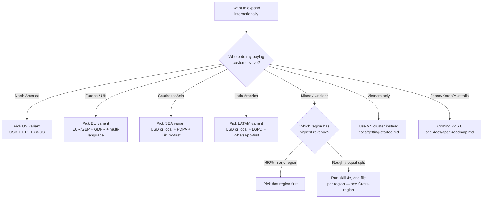

# Global Region Guide — Which Region Should I Pick?

> Decision guide for picking 1 of 4 region variants in the global cluster: **US**, **EU**, **SEA**, **LATAM**. Pick the wrong one and your context file ends up with the wrong currency, wrong platforms, wrong regulations baked in.

---

## Why regions matter

Marketing fundamentals are universal — but execution is regional. Four things change between regions:

1. **Currency and pricing psychology** — $48 lands differently in the US vs $48 in Indonesia (where it is a week of grocery budget)
2. **Primary platforms** — Meta dominates US/EU; TikTok dominates SEA Gen Z; WhatsApp Business dominates LATAM customer service
3. **Regulations** — FTC (US), GDPR + EU AI Act (EU), PDPA per country (SEA), LGPD (Brazil) — each has its own consent, disclosure, and ad-claim rules
4. **Cultural norms** — humor, urgency, social proof formats, holidays, color associations

A US ad creative dropped into LATAM without translation, currency conversion, and WhatsApp-as-primary-channel rewiring usually returns 0.5x ROAS at best.

The 4 region variants of the global cluster are designed to lock these 4 things in upfront — so every downstream skill (00-29) writes ad copy, plans funnels, and picks platforms with the right defaults.

---

## The 4 regions

### US (United States + Canada)

```
Currency:           USD (Canada: CAD as secondary)
Population reach:   ~370M (US 333M + Canada 39M)
GDP per capita:     ~$77K (US), ~$53K (Canada)
Primary platforms:  Meta (Facebook + Instagram), Google Ads, TikTok, LinkedIn (B2B), YouTube
Secondary:          X (formerly Twitter), Reddit, Pinterest, Snapchat (Gen Z)
E-commerce:         Amazon (50%+ category dominance), Shopify (DTC), Walmart Marketplace, Target+
Messaging:          iMessage (iOS), SMS for transactional, email primary
Search engine:      Google ~90%, Bing ~6%, DuckDuckGo growing
Languages:          English (en-US primary), Spanish (en-US-Latino, ~13% population)
Regulations:        FTC Act §5 (deceptive ads), CAN-SPAM, COPPA (kids), CCPA/CPRA (California), state-level (NY, IL biometric, etc.)
Ad disclosure:      "#ad" or "#sponsored" tag mandatory for influencer endorsements (FTC 2023 guides)
Persona framework:  Demographic + psychographic + JTBD (Jobs-To-Be-Done)
Key holidays:       Black Friday/Cyber Monday (Nov), Christmas (Dec), Mother's/Father's Day, July 4th, Thanksgiving
KPI norms:          ROAS 3-5x retail, CAC $30-150 DTC, LTV:CAC 3:1 healthy, payback <12 months
Pricing psychology: $19.99 charm pricing, free shipping over $35-50, BNPL (Afterpay/Klarna) ~30% adoption
```

When to pick US: most early international expansions from VN start here because (a) revenue ceiling is highest, (b) infra is easy (Stripe, Shopify, Klaviyo all native), (c) English creative has highest leverage. Caveat: ad costs are 3-5x VN.

### EU (European Union + UK)

```
Currency:           EUR (eurozone), GBP (UK), with regional variants (CHF, DKK, NOK, SEK, PLN)
Population reach:   ~510M (EU 447M + UK 67M)
GDP per capita:     ~$45K average (Germany ~$54K, Spain ~$32K, Eastern EU lower)
Primary platforms:  Meta, Google, LinkedIn (B2B strong in DACH region), YouTube
Secondary:          TikTok (UK, FR, DE growing fast), Xing (DACH B2B alternative to LinkedIn), Pinterest (UK, DE), X
E-commerce:         Amazon (DE/UK/FR/IT/ES), Zalando (fashion DACH), bol.com (NL), Allegro (PL), Otto (DE)
Messaging:          WhatsApp dominant (~85% adoption), Signal in privacy-conscious cohort, email business primary
Search engine:      Google ~92%, Bing ~3%, Ecosia (eco-focused) growing
Languages:          en-GB (UK), de (Germany/Austria/Switzerland), fr (France/Belgium), es (Spain), it (Italy), nl (Netherlands), pl (Poland), pt-PT (Portugal)
Regulations:        GDPR (consent + data rights), EU AI Act (2024+), Digital Services Act (DSA), Digital Markets Act (DMA), ePrivacy Directive (cookies), country-level consumer law
Ad disclosure:      Influencer disclosure required ("#ad" or "Werbung" in DE, "Anzeige", "Pubblicita" in IT, etc.)
Persona framework:  Demographic + psychographic + value-based segmentation, country-by-country adaptation
Key holidays:       Christmas, Easter, summer holidays (Aug shutdown in FR/IT/ES), Boxing Day (UK), local saint days, Carnival (DE/IT/ES)
KPI norms:          ROAS 3-4x retail, CAC EUR 25-100 DTC, LTV:CAC 3:1, longer payback acceptable (24 months)
Pricing psychology: VAT included in displayed price (mandatory in many countries), 99-cent endings less common than US, "Sale" runs limited by law in DE/FR
```

When to pick EU: pick if your product fits multi-language localization (or you start UK-only as English bridge), revenue is split across 5+ countries, or you need GDPR-compliant infrastructure. Avoid if you cannot stomach localizing into 4+ languages — GBP-only "UK English" works as v1, but DE/FR/ES are revenue ceilings that need translation to unlock.

### SEA (Southeast Asia, excluding Vietnam)

```
Currency:           USD (cross-border B2B), local currency for D2C (THB, IDR, PHP, MYR, SGD)
Population reach:   ~570M (Indonesia 273M, Philippines 113M, Thailand 70M, Malaysia 33M, Singapore 6M, plus Cambodia, Laos, Myanmar)
GDP per capita:     Singapore ~$73K, Malaysia ~$13K, Thailand ~$8K, Indonesia ~$5K, Philippines ~$4K
Primary platforms:  TikTok (dominant Gen Z + Millennial), Meta (Facebook still huge SEA), Shopee + Lazada (e-commerce), LINE (Thailand specifically)
Secondary:          YouTube, Instagram, Tokopedia (ID), Bukalapak (ID), GoTo ecosystem (ID)
E-commerce:         Shopee (multi-country), Lazada (multi-country), Tokopedia (ID-only), Tiki (cross to VN)
Messaging:          WhatsApp (PH, MY, ID, SG), LINE (TH, JP-adjacent), Telegram (SG tech), Messenger (PH high adoption)
Search engine:      Google dominant, but TikTok used as discovery search by Gen Z (~40% of Gen Z search there first)
Languages:          en-SG (Singapore English bridge), th (Thai), id (Indonesian/Bahasa), tl (Tagalog/Filipino), ms (Malay), zh-SG (Singaporean Chinese), zh-MY (Malaysian Chinese)
Regulations:        PDPA (Personal Data Protection Act) — separate per country: Singapore PDPA, Thailand PDPA, Malaysia PDPA, Indonesia UU PDP (2022), Philippines DPA
Ad disclosure:      Singapore ASAS guidelines, Thailand FDA strict on health/beauty claims, Indonesia BPOM for cosmetics/food
Persona framework:  Demographic + cultural cluster (Chinese-SEA, Malay, Thai, Indonesian, Filipino) + income tier (LSM)
Key holidays:       Chinese New Year (multi-country), Ramadan + Eid al-Fitr (ID, MY), Loy Krathong (TH), Singles Day (Nov 11), 12.12 sale, Christmas (PH especially)
KPI norms:          ROAS 4-7x DTC (lower ad costs help), CAC USD 5-30 DTC, LTV:CAC 4:1 healthy, payback <6 months
Pricing psychology: Round numbers preferred (THB 990 not 999), free shipping critical, COD (cash on delivery) still ~30-50% in PH/ID, installment plans (e.g. SPayLater) ~25%
```

When to pick SEA: pick if your product fits Southeast Asia consumer behavior (mobile-first, social commerce, Shopee/Lazada native), you have Mandarin/Bahasa/Thai team capacity, or you are scaling from a VN base into adjacent SEA. Caveat: 5-6 countries means 5-6 consumer behaviors — start with 1-2 (typically Singapore as English bridge + Thailand or Indonesia as scale market).

### LATAM (Latin America)

```
Currency:           USD (cross-border B2B), local currency for D2C (BRL, MXN, ARS, COP, CLP, PEN)
Population reach:   ~660M (Brazil 215M, Mexico 130M, Colombia 52M, Argentina 46M, Peru 34M, Chile 19M)
GDP per capita:     Chile ~$17K, Mexico ~$11K, Brazil ~$9K, Colombia ~$7K, Argentina volatile (USD vs ARS)
Primary platforms:  WhatsApp Business (dominant — 90%+ adoption), Meta (Facebook + Instagram), TikTok (Brazil + Mexico), YouTube
Secondary:          LinkedIn (B2B Mexico/Brazil), Mercado Libre (e-commerce dominant), Pinterest (Mexico growing), X
E-commerce:         Mercado Libre (multi-country), Magalu (Brazil), Americanas (Brazil), Linio (Mexico)
Messaging:          WhatsApp Business is THE channel (customer service, sales, support), email secondary
Search engine:      Google dominant, Mercado Libre used as product search
Languages:          es (Spanish — Mexico, Colombia, Argentina, Chile, Peru), pt-BR (Brazilian Portuguese — Brazil only)
Regulations:        LGPD (Brazil — GDPR-equivalent), Mexico LFPDPPP, Argentina PDP Law, Colombia Ley 1581, Chile Law 19628
Ad disclosure:      Brazil CONAR (self-regulation, but enforced), Mexico PROFECO, generally less strict than US/EU
Persona framework:  Demographic + cultural cluster (urban vs rural, A/B/C/D/E income classes — strong segmentation tool in Brazil)
Key holidays:       Carnival (Brazil + Colombia), Day of the Dead (Mexico), Christmas + Reyes (Mexico), Black Friday (adopted), Buen Fin (Mexico), Children's Day (multi-country)
KPI norms:          ROAS 3-5x DTC, CAC USD 8-40 DTC, LTV:CAC 3-4:1, payback 6-12 months
Pricing psychology: Installment plans (cuotas) critical — 6-12x sin interes is standard, "12 cuotas" framing increases conversion 30%+, cash discount often 10-15%
```

When to pick LATAM: pick if your product fits LATAM consumer (high-trust selling via WhatsApp, installment-heavy purchase behavior), you have Spanish/Portuguese team capacity, or you are testing a high-LTV product where WhatsApp customer service is a moat. Avoid if your team has zero Spanish/Portuguese — automated translation does NOT work here for sales conversations.

---

## Decision tree — Which region am I?



---

## Comparison matrix

| Dimension | US | EU | SEA | LATAM |
|-----------|-----|-----|-----|-------|
| Currency | USD | EUR / GBP | USD or local | USD or local |
| Primary platforms | Meta, Google, TikTok, LinkedIn | Meta, Google, LinkedIn, Xing (DACH) | TikTok, Meta, Shopee/Lazada, LINE (TH) | WhatsApp Biz, Meta, Mercado Libre, Magalu (BR) |
| Top regulation | FTC + state laws (CCPA) | GDPR + EU AI Act + DSA | PDPA (per country) | LGPD (BR) + per-country PDP |
| Persona framework | Demographic + JTBD | Demographic + value-based + country-level | Demographic + cultural cluster + LSM | Demographic + A/B/C/D/E income class |
| Pricing psychology | Charm ($19.99), BNPL ~30% | VAT included, no charm in DE | Round numbers, COD common in PH/ID | Installment plans (cuotas) critical |
| Cultural norms | Direct, value-prop heavy, urgency works | Reserved, evidence-heavy, urgency feels pushy | Indirect, family-frame, social proof heavy | Warm, relational, WhatsApp 1:1 selling |
| Key holidays | BF/CM, Christmas, July 4th | Christmas, Easter, summer break | CNY, Ramadan/Eid, 11.11, 12.12 | Carnival, Day of Dead, Buen Fin |
| KPI norms (ROAS) | 3-5x | 3-4x | 4-7x | 3-5x |

---

## Cross-region marketing — when to pick multi-region

You should run `product-marketing-context-global` **once per region** (not once total) when:

1. Revenue is split roughly evenly across 2+ regions (no region has >60% share)
2. Your product is genuinely region-neutral (e.g. SaaS, digital course, info-product) and you can localize creative
3. You have native-speaker team capacity for at least 2 regions

To set up cross-region:

```bash
/skill product-marketing-context-global   # variant 1: US
# Save as .agents/product-marketing-context-global-us.md (rename after creation)

/skill product-marketing-context-global   # variant 2: EU
# Save as .agents/product-marketing-context-global-eu.md

# When running downstream skills, reference the right file:
> Use .agents/product-marketing-context-global-us.md and run skill 00-marketing-plan-global for US Q4 launch
```

Caveat: cross-region adds **complexity**. v2.5.0 supports it through manual file naming. v2.6.0+ may add an explicit multi-region flag.

---

## APAC note (Japan, Korea, Australia)

The APAC region (Japan, South Korea, Australia, New Zealand — distinct from SEA) is **NOT** in v2.5.0. Reasoning:

- Japan and Korea require deep platform integration (LINE for Japan, KakaoTalk for Korea) that does not map cleanly onto the existing 4-variant structure
- Australia/New Zealand sit between US and EU patterns and would need their own variant
- We are following YAGNI — adding regions before validated demand wastes scope

If your customers are primarily in Japan, Korea, or Australia, see `docs/apac-roadmap.md` for the v2.6.0 plan and how to flag interest.

---

## What about Vietnam?

Vietnam is **NOT** part of the global cluster. Vietnam has its own dedicated cluster (skills `00-21` plus `product-marketing-context` foundation) that handles VND, Zalo, Shopee VN, Tiki, Lazada VN, TikTok VN benchmarks, and VN regulations (Nghi dinh 147/2024 disclosure). Use:

- `docs/getting-started.md` — VN onboarding
- `docs/personal-brand-guide.md` — VN personal brand handbook
- `/skill product-marketing-context` — VN foundation (no `-global` suffix)

Why separate? Vietnam's marketing infrastructure (Zalo OA, VietQR, Momo, ShopeePay, VND benchmarks, Tet seasonality) is unique enough that mixing it with global defaults would degrade output quality for both.

---

Questions? Open an issue: [github.com/minhnv0807/fullstack-mkt-skills/issues](https://github.com/minhnv0807/fullstack-mkt-skills/issues)
