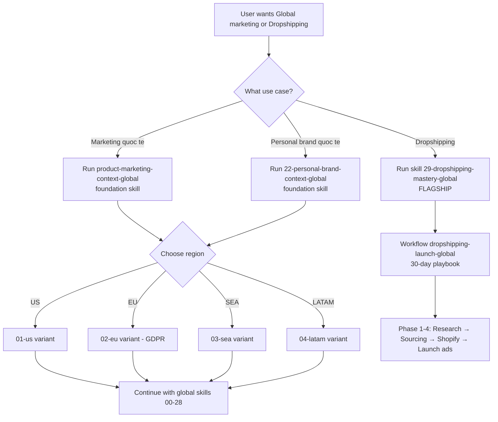

# Skill Map — Ban Do Toan Bo He Thong

> **Muc dich:** Giup user va agent nhin thay TOAN CANH — skill nao co, lien ket the nao, dung khi nao.
> Doc file nay TRUOC khi chay bat ky skill nao.

---

## So do tong the

```
                    ┌─────────────────────────────────────┐
                    │     PRODUCT MARKETING CONTEXT (★)    │
                    │   Nen tang — moi skill doc file nay  │
                    └──────────────────┬──────────────────┘
                                       │
          ┌────────────────────────────┼────────────────────────────┐
          │                            │                            │
    ┌─────▼──────┐              ┌──────▼──────┐              ┌─────▼──────┐
    │  STRATEGY  │              │   CONTENT   │              │PERFORMANCE │
    │  (Tim loi) │              │  (Lam noi   │              │ (Do luong) │
    │            │              │   dung)     │              │            │
    │ 00 Ke hoach│              │ 01 Lich ND  │              │ 03 Danh gia│
    │ 02 Brief CD│              │ 04 Script   │              │ 07 Bao cao │
    │ 08 Doi thu │              │ 05 Copy ads │              │ 10 KPI     │
    │ 09 Insight │              │ 06 UGC/EGC  │              │ 13 Data    │
    │ 16 Tam ly  │              │ 15 Listening│              │ 19 A/B test│
    │ 17 Gia     │              │             │              │ 21 Audit   │
    └─────┬──────┘              └──────┬──────┘              └─────┬──────┘
          │                            │                            │
          │         ┌──────────────────┼──────────────┐             │
          │         │            OPERATIONS            │             │
          │         │         (Van hanh kenh)          │             │
          │         │                                  │             │
          │         │ 11 Thiet lap kenh                │             │
          │         │ 12 Landing page                  │             │
          │         │ 14 Email marketing               │             │
          │         │ 18 Referral program              │             │
          │         └──────────────────────────────────┘             │
          │                                                         │
    ┌─────▼─────────────────────────────────────────────────────────▼─────┐
    │                        INPUT GATE                                   │
    │              20 Brief Client Intake (20 nganh)                      │
    └────────────────────────────────────────────────────────────────────┘

                    ┌─────────────────────────────────────┐
                    │   PERSONAL BRAND + AI AVATAR (NEW)  │
                    │                                     │
                    │ 22 personal-brand-context (★)       │
                    │ 23 personal-brand-strategy          │
                    │ 24 ai-avatar-production (FLAGSHIP)  │
                    │ 25 voice-clone-podcast              │
                    │ 26 thought-leadership-content       │
                    │ 27 personal-brand-monetize          │
                    │ 28 community-building               │
                    └─────────────────────────────────────┘

      ════════════════════════════════════════════════════════════════════
      ║              GLOBAL CLUSTER (v2.5.0) — skills-global/             ║
      ║                                                                   ║
      ║       ┌─────────────────────────────────────────────────┐         ║
      ║       │  PRODUCT MARKETING CONTEXT GLOBAL (★)            │         ║
      ║       │  4 region variants: US / EU / SEA / LATAM        │         ║
      ║       └─────────────────────┬───────────────────────────┘         ║
      ║                             │                                     ║
      ║   ┌──────────────┬──────────┴──────────┬──────────────┐           ║
      ║   │ Marketing    │ Personal Brand      │ Dropshipping │           ║
      ║   │ Global       │ Global              │ Flagship     │           ║
      ║   │ (00-21 EN)   │ (22-28 EN)          │ (29)         │           ║
      ║   │              │ 22 PB context (★)    │ 30-day       │           ║
      ║   │ 22 marketing │ + 4 region variants  │ launch       │           ║
      ║   │ skills       │ 7 personal brand     │ playbook     │           ║
      ║   │              │ skills              │              │           ║
      ║   └──────────────┴─────────────────────┴──────────────┘           ║
      ║                                                                   ║
      ║   Skills with 4 region variants (US/EU/SEA/LATAM):                ║
      ║   foundation, 03, 10, 11, 14, 17, 18, 21, 22, 24, 27              ║
      ════════════════════════════════════════════════════════════════════
```

---

## Bang tra nhanh — 60 Skills (29 VN + 30 Global + 1 foundation per cluster)

| # | Skill | Lam gi | Khi nao dung | Output |
|---|-------|--------|-------------|--------|
| ★ | product-marketing-context | Tao hieu biet san pham 1 lan | Bat dau project moi | `.agents/product-marketing-context.md` |
| 00 | ke-hoach-mkt | Ke hoach toan dien 7 phan | Moi quy / launch moi | Plan + KPI + budget + timeline |
| 01 | lich-noi-dung | Lich noi dung thang | Moi thang | Calendar + repurpose matrix |
| 02 | brief-chien-dich | Brief chien dich 9 phan | Truoc moi chien dich | Brief + RACI + risk |
| 03 | danh-gia-hieu-suat | Chan doan hieu suat | Khi ads chay kem / hang thang | Diagnostic + 5 Whys + 48h plan |
| 04 | script-video | Script video A/B | Can quay video | 2 script + filming guide |
| 05 | copy-quang-cao | 6 bien the copy | Can chay ads | 2 TOFU + 2 MOFU + 2 BOFU |
| 06 | brief-ugc-egc | Brief cho creator | Can UGC/EGC | Creator brief + legal |
| 07 | bao-cao-marketing | Bao cao thang | Cuoi moi thang | Report doc 5 phut |
| 08 | nghien-cuu-doi-thu | Phan tich 3 tang doi thu | Truoc plan / khi gap ap luc | SWOT + positioning map |
| 09 | insight-khach-hang | Persona + customer journey | Dau project / pivot | Persona + JTBD |
| 10 | tinh-kpi-nguoc | Tinh budget tu doanh thu | Dau thang / dau quy | 3 scenarios + sensitivity |
| 11 | thiet-lap-kenh | Setup kenh A-Z | Launch kenh moi | Checklist + 30-day plan |
| 12 | brief-landing-page | Brief LP cho dev | Can landing page | 7-section brief |
| 13 | phan-tich-du-lieu | Phan tich data tho | Nhan data → can insight | Insights + trends + anomaly |
| 14 | email-marketing | Chuoi email automation | Setup email / nurture | Welcome + nurture + re-engage |
| 15 | social-listening | Theo doi thuong hieu | Ongoing | Sentiment + crisis protocol |
| 16 | marketing-psychology | Tam ly Cialdini + VN | Chien luoc cam xuc | 7 principles applied |
| 17 | pricing-strategy | Chien luoc gia | Dinh gia san pham | Tiers + charm/anchor + break-even |
| 18 | referral-program | Chuong trinh gioi thieu | Can tang organic growth | 1-way/2-way + anti-fraud |
| 19 | ab-test-setup | Thiet ke A/B test | Can test gia thuyet | Sample size + significance |
| 20 | brief-client-intake | Form thu thap thong tin KH | Agency nhan KH moi | Brief 11 phan × 20 nganh |
| 21 | audit-ads-performance | Audit Health Score 0-100 | Kiem tra tai khoan ads | 84 checkpoints + Quick Wins |
| ★22 | personal-brand-context | Foundation personal brand (3 variants) | Bat dau personal brand | `.agents/personal-brand-context.md` |
| 23 | personal-brand-strategy | Strategy 12 thang | Sau skill 22 | Strategy file |
| 24 | ai-avatar-production | AI Avatar production deep dive | Can lam video AI | Pipeline + QA |
| 25 | voice-clone-podcast | Audio AI | Can voiceover/podcast | Audio pipeline |
| 26 | thought-leadership-content | Long-form text | Can viet bai chieu sau | 3 structures + repurpose |
| 27 | personal-brand-monetize | Kiem tien tu personal brand | Sau khi co audience | Offer ladder + funnel |
| 28 | community-building | Xay community | Can grow community | Blueprint 3-lop |

---

## Global Cluster (v2.5.0) — 30 Skills + 1 Foundation

> **Path:** `skills-global/` — International English, multi-region (US/EU/SEA/LATAM).
> **Use when:** Marketing cho thi truong nuoc ngoai, dropshipping, audience quoc te.

### Marketing Global (skills 00-21, 22 skills)

| # | Skill | Region variants | Khi nao dung |
|---|-------|----------------|-------------|
| ★ | product-marketing-context-global | 4 (US/EU/SEA/LATAM) | Foundation cho global marketing |
| 00 | marketing-plan-global | — | Ke hoach marketing global |
| 01 | content-calendar-global | — | Lich noi dung quoc te |
| 02 | campaign-brief-global | — | Brief chien dich quoc te |
| 03 | performance-eval-global | 4 regions | Danh gia hieu suat theo region |
| 04 | script-video-global | — | Script video tieng Anh |
| 05 | ad-copy-global | — | Copy quang cao quoc te |
| 06 | ugc-egc-brief-global | — | Brief UGC quoc te |
| 07 | marketing-report-global | — | Bao cao marketing quoc te |
| 08 | competitor-research-global | — | Phan tich doi thu quoc te |
| 09 | customer-insight-global | — | Persona quoc te |
| 10 | reverse-kpi-global | 4 regions | KPI nguoc theo region |
| 11 | channel-setup-global | 4 regions | Setup kenh quoc te |
| 12 | landing-page-brief-global | — | Brief LP quoc te |
| 13 | data-analysis-global | — | Phan tich data quoc te |
| 14 | email-marketing-global | 4 regions | Email global (GDPR/CAN-SPAM) |
| 15 | social-listening-global | — | Listening da ngon ngu |
| 16 | marketing-psychology-global | — | Tam ly cross-cultural |
| 17 | pricing-strategy-global | 4 regions | Pricing USD/EUR/etc. |
| 18 | referral-program-global | 4 regions | Referral quoc te |
| 19 | ab-test-setup-global | — | A/B test quoc te |
| 20 | client-intake-brief-global | — | Intake form quoc te |
| 21 | ads-audit-global | 4 regions | Audit ads quoc te |

### Personal Brand Global (skills 22-28, 7 skills)

| # | Skill | Region variants | Khi nao dung |
|---|-------|----------------|-------------|
| ★22 | personal-brand-context-global | 4 (US/EU/SEA/LATAM) | Foundation personal brand quoc te |
| 23 | personal-brand-strategy-global | — | Strategy 12 thang quoc te |
| 24 | ai-avatar-production-global | 4 regions | AI Avatar quoc te (FTC/GDPR) |
| 25 | voice-clone-podcast-global | — | Audio AI quoc te |
| 26 | thought-leadership-content-global | — | Long-form English |
| 27 | personal-brand-monetize-global | 4 regions | Monetize USD/EUR |
| 28 | community-building-global | — | Community Discord/Circle |

### Dropshipping Flagship (skill 29)

| # | Skill | Khi nao dung |
|---|-------|-------------|
| 29 | dropshipping-mastery-global | **FLAGSHIP v2.5.0** — Pipeline 12 phan: product research → supplier sourcing → Shopify setup → ad creative → scaling. Market US ~$128B (2025). |

---

## 14 Reference Files

### VN Cluster (7 references)

| File | Noi dung | Dung boi skill |
|------|---------|---------------|
| `references/copy-frameworks-vn.md` | 6 framework copy (AIDA/PAS/BAB/4P/FAB/SSS) | 05 |
| `references/quality-gates-vn.md` | 10 hard rules khong bao gio vi pham | 03, 21 |
| `references/mcp-ads-integration.md` | Huong dan ket noi MCP Meta/Google/TikTok | 03, 08, 21 |
| `references/hook-formulas-vn.md` | 6 kieu hook + funnel mapping + platform limits + anti-patterns | 04, 05, 01 |
| `references/ai-avatar-tools-vn.md` | So sanh tools AI Avatar (HeyGen/Synthesia/D-ID) + pricing VN | 24, 25 |
| `references/ai-video-disclosure-vn.md` | Nghi dinh 147/2024/ND-CP — disclosure rules cho AI video | 24, 26 |
| `references/personal-brand-playbook-vn.md` | Founder/Coach/Creator playbooks + content cadence | 22, 23, 26, 27, 28 |

### Global Cluster (7 references)

| File | Noi dung | Dung boi skill |
|------|---------|---------------|
| `skills-global/references/hook-formulas-global.md` | Hook formulas tieng Anh + cross-cultural variants | 04, 05 global |
| `skills-global/references/global-currency-pricing.md` | Pricing USD/EUR/GBP + multi-currency strategies | 17 global |
| `skills-global/references/global-platforms-comparison.md` | Meta/Google/TikTok/X/LinkedIn benchmarks 4 regions | 03, 11, 21 global |
| `skills-global/references/global-legal-compliance.md` | GDPR/CCPA/FTC/CAN-SPAM legal compliance | 14, 18, 24 global |
| `skills-global/references/ai-video-disclosure-global.md` | FTC AI disclosure + EU AI Act + SEA/LATAM rules | 24, 26 global |
| `skills-global/references/voice-clone-prompts-global.md` | Voice clone prompts EN + multi-language | 25 global |
| `skills-global/references/dropshipping-tools-global.md` | Shopify/Spocket/AutoDS + supplier directory | 29 global |

---

## 15 Workflows (7 VN + 8 Global)

### VN Workflows (7)

| Workflow | Skills | Khi nao | Thoi gian |
|----------|--------|---------|-----------|
| **client-onboard** | 20 → 09 → 08 → 10 → 00 → 02 → 01 | Agency nhan khach moi | 5-7 ngay |
| **campaign-launch** | 08 → 09 → 00 → 02 → 01+04+05 → 06 → 11+12 | Launch chien dich | 14-21 ngay |
| **monthly-cycle** | 13 → 03 → 07 → 10 → 01 | Cuoi thang | 3-5 ngay |
| **content-production** | Review 01 → 04 → Quay → 05 → Dang | Hang tuan | 5 ngay |
| **personal-brand-launch** | 22 → 23 → 26 → 24 → 27 | Build personal brand tu 0 | 30-60 ngay |
| **ai-avatar-batch** | 22 → 24 (×30) → 26 → 28 | Sx 30 video AI/thang | 7-10 ngay |
| **monetize-personal-brand** | 27 → 28 → 14 → 18 | Kiem tien tu audience da co | 14-21 ngay |

### Global Workflows (8, v2.5.0)

| Workflow | Skills | Khi nao | Thoi gian |
|----------|--------|---------|-----------|
| **client-onboard-global** | 20 → 09 → 08 → 10 → 00 → 02 → 01 (global) | Agency nhan KH quoc te | 5-7 ngay |
| **campaign-launch-global** | 08 → 09 → 00 → 02 → 01+04+05 → 06 → 11+12 (global) | Launch quoc te | 14-21 ngay |
| **monthly-cycle-global** | 13 → 03 → 07 → 10 → 01 (global) | Cuoi thang global | 3-5 ngay |
| **content-production-global** | 01 → 04 → 05 (global) | Content quoc te hang tuan | 5 ngay |
| **personal-brand-launch-global** | 22 → 23 → 26 → 24 → 27 (global) | PB quoc te tu 0 | 30-60 ngay |
| **ai-avatar-batch-global** | 22 → 24 (×30) → 26 → 28 (global) | 30 AI Avatar quoc te | 7-10 ngay |
| **personal-brand-monthly-global** | 27 → 28 → 14 → 18 (global) | PB monthly quoc te | 14-21 ngay |
| **dropshipping-launch-global** | 29 (12 phases) | 30-day dropship launch | 30 ngay |

---

## Luong lien ket giua cac skill

```
User gap van de "Ads chay kem"
    │
    ├─ Nhe (chi xem so lieu) → 03 danh-gia-hieu-suat
    │     └─ Can fix copy → 05 copy-quang-cao
    │     └─ Can fix creative → 04 script-video
    │     └─ Can bao cao → 07 bao-cao-marketing
    │
    ├─ Nang (audit toan dien) → 21 audit-ads-performance
    │     └─ Vi pham Quality Gates → Fix theo huong dan
    │     └─ Health Score < 60 → Rebuild structure
    │
    └─ Goc re (chien luoc sai) → 08 doi thu + 09 insight → 00 ke hoach moi

User muon "Launch san pham moi"
    │
    ├─ Agency? → 20 brief-client-intake → client-onboard workflow
    │
    └─ Tu lam? → campaign-launch workflow
          08 → 09 → 00 → 02 → 01+04+05 → 06 → 11+12

User muon "Content hang thang"
    │
    └─ monthly-cycle → content-production
       13 → 03 → 07 → 10 → 01 → 04 → 05
```

---

## 5 Agent (Vai tro chuyen biet) — Universal Mode (v2.5.0)

> **Universal Mode:** Tu v2.5.0, ca 5 agents tu dong nhan dien cluster qua `.agents/` directory.
> - `product-marketing-context.md` ton tai → VN mode (skills/)
> - `product-marketing-context-global.md` ton tai → Global mode (skills-global/)
> - Ca 2 ton tai → agent HOI user chon cluster
> - Khong co file nao → agent goi y tao foundation file

| Agent | Nhu "nhan vien" nao | Skills chinh | Khi nao dung |
|-------|-------|-------------|-------------|
| **mkt-strategist** | Marketing Manager | 00, 02, 08, 09, 16, 17 (VN/Global) | Plan, research, dinh vi |
| **content-producer** | Content Writer | 01, 04, 05, 06, 15 (VN/Global) | Viet, quay, dung |
| **performance-analyst** | Ads Manager | 03, 07, 10, 13, 19, 21 (VN/Global) | Data, audit, report |
| **channel-operator** | CRM Manager | 11, 12, 14, 18 (VN/Global) | Setup kenh, automation |
| **personal-brand-builder** | Personal Brand Coach | 22-28 (VN/Global) | Build personal brand, AI avatar, community |

---

## Quick Decision Tree — "Toi nen dung skill nao?"

```
Ban muon lam gi?
│
├─ "Lap ke hoach"
│   ├─ Ke hoach tong → 00
│   ├─ Brief chien dich → 02
│   ├─ Tinh ngan sach → 10
│   └─ Nghien cuu truoc → 08 + 09
│
├─ "Viet noi dung"
│   ├─ Copy quang cao → 05
│   ├─ Script video → 04
│   ├─ Lich noi dung → 01
│   ├─ Brief UGC → 06
│   └─ Email → 14
│
├─ "Phan tich / Bao cao"
│   ├─ Ads chay kem → 03 (nhanh) hoac 21 (day du)
│   ├─ Bao cao thang → 07
│   ├─ Phan tich data → 13
│   └─ Test gia thuyet → 19
│
├─ "Setup / Van hanh"
│   ├─ Thiet lap kenh moi → 11
│   ├─ Landing page → 12
│   ├─ Referral → 18
│   └─ Theo doi thuong hieu → 15
│
├─ "Agency nhan khach"
│   └─ 20 brief-client-intake → client-onboard workflow
│
└─ "Dinh gia / Tam ly"
    ├─ Chien luoc gia → 17
    └─ Tam ly marketing → 16
```

---

## Decision Tree — Personal Brand

```
User muon "Build personal brand"
    │
    ├─ Lan dau? → 22 personal-brand-context (foundation, ALWAYS first)
    │
    ├─ Co context roi → 23 personal-brand-strategy (next step)
    │
    ├─ Lam content → 26 (long-form) hoac 04 (Personal Brand Mode)
    │
    ├─ Tao AI Avatar → 24 (single) hoac workflow ai-avatar-batch (30 videos)
    │
    ├─ Kiem tien → 27 (offer ladder + funnel)
    │
    └─ Build community → 28 (Zalo/Telegram/Skool)
```

---

## Decision Tree — Global Cluster (v2.5.0)



**Quick path:**
- **User wants "Global marketing"** → Run `product-marketing-context-global` (foundation) → Choose region (US/EU/SEA/LATAM) → Continue with global skills
- **User wants "Dropshipping"** → Run skill `29-dropshipping-mastery-global` (flagship) → Workflow `dropshipping-launch-global` (30-day)

---

## VN vs Global — Khi nao chon cai nao?

| Tieu chi | VN Cluster (skills/) | Global Cluster (skills-global/) |
|----------|---------------------|-------------------------------|
| Thi truong | Vietnam | US/EU/SEA/LATAM |
| Ngon ngu | Tieng Viet | International English |
| Tien te | VND | USD/EUR/GBP/region |
| Compliance | Nghi dinh 147/2024 (VN) | GDPR/CCPA/FTC/CAN-SPAM |
| Platforms | Zalo, Shopee VN, TikTok VN | Discord, Stripe, Shopify, Klaviyo |
| Benchmarks | VN 2025-2026 | Region-specific 2025-2026 |
| Foundation | `product-marketing-context` | `product-marketing-context-global` (4 regions) |
