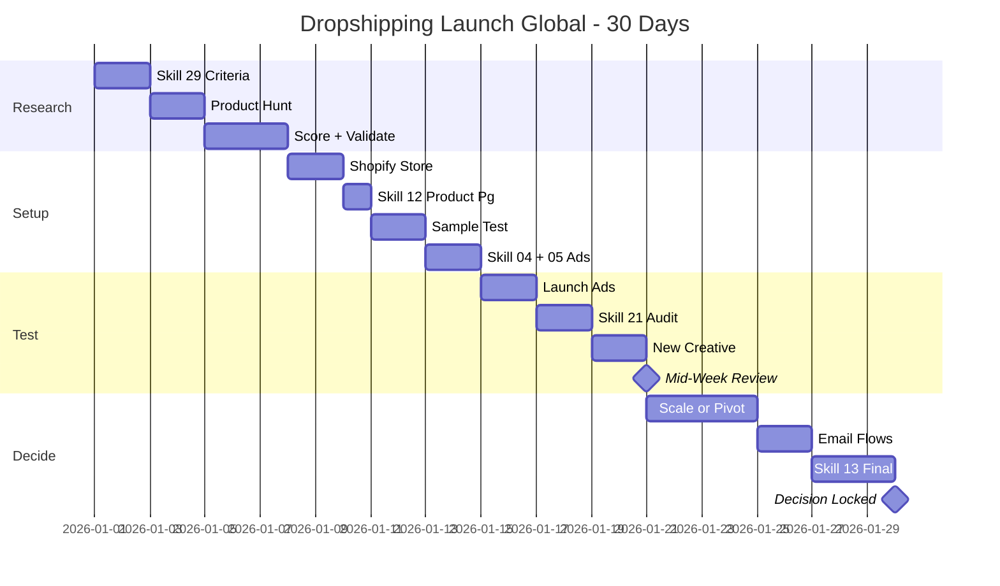

# Workflow: Dropshipping Launch (Global)

> Launch a new dropshipping product in 30 days — validate winning product, scale or pivot decision by Day 30.

---

## 1. Who is this workflow for?

```
Audience: Beginner-to-intermediate dropshipper testing a new product
Outcome after 30 days:
  - Product validated (winning) OR pivoted (losing) with data
  - 5+ orders by end of week 2
  - ROAS 2x+ by end of week 3 if winning
  - Email flows live (Klaviyo abandoned cart + welcome)
  - Either scale to $500/day spend or move to next product candidate
Time: 30 days × 2-4h/day (60-120h total)
Skills used: 6 global skills (29, 12, 04, 05, 21, 13, 17)
Output: Live store + tested ads + decision document
Default currency: USD; supplier costs may be CNY
```

**Pre-requisite:** Has $300-500 ad budget for testing. Has Shopify store ready (or will set up Day 1). Has payment processor (Shopify Payments / Stripe / PayPal). Comfortable iterating fast — kill products that don't work.

**NOT for:** Brand-builders investing in long-term moats (use branded e-commerce playbook instead) or anyone needing instant profitability (dropshipping requires 1-3 product attempts to find a winner).

---

## 2. Pre-flight Checklist

Complete these 10 items BEFORE Day 1:

- [ ] Shopify trial / paid plan active (Basic $39/month minimum)
- [ ] Payment processor set up + tested with $1 transaction
- [ ] Meta Pixel + Conversion API installed (test with Test Events)
- [ ] TikTok Pixel installed if testing on TikTok Ads
- [ ] $300-500 ad budget allocated (not borrowed; can absorb total loss)
- [ ] AliExpress / CJ Dropshipping / Spocket / Zendrop account ready
- [ ] Minea or PiPiAds account (free tier OK initially) for product research
- [ ] Domain purchased (avoid `.myshopify.com` for trust)
- [ ] Klaviyo / Shopify Email account ready (for cart abandonment)
- [ ] Customer service plan: Gmail with branded address + auto-reply

> **Skipping pre-flight = wasting first 3-4 days on setup mid-launch.** Burn the boring stuff first.

---

## 3. Step-by-step: 30 Days × 2-4h/day

### Week 1 (Days 1-7) — Product Research + Validation

**Day 1-2: Winning Product Criteria**
- Run `/skill 29-dropshipping-mastery-global` — read Chapter 3 (Winning Product Criteria).
- Lock the criteria: high perceived value, $30-80 retail target, lightweight (<500g shipping), problem-solving or wow-factor, not in big-box stores.
- Avoid: saturated products (already trending = late), fragile items, anything <$10 retail (no margin).
- Output mental model: when scrolling Minea, you reject 95% in 2 seconds.

**Day 3-4: Product Hunting**
- Open Minea (or PiPiAds, AdSpy alternatives). Filter: last 7 days, 1000+ engagements, e-commerce niche.
- Save 10 candidate products to spreadsheet. For each: ad URL, supplier link, retail price, supplier cost, weight, shipping ETA.
- Cross-check: does the supplier exist? CJ Dropshipping or Spocket has US warehouses for some — check shipping ETA.
- Time-box: 4 hours max. Don't go down rabbit holes.

**Day 5: Score Top 10 Candidates**
- Score sheet (1-5 per criterion): margin potential, demand signal, competition saturation, shipping speed, ad creative ease.
- Total out of 25. Top 3 advance to validation.
- Document why bottom 7 lost — pattern recognition for next product hunt.

**Day 6-7: Validate Top 3**
- Google Trends: 12-month trend for product keyword. Rising or stable? Spike-and-crash = late.
- Amazon BSR: is the product / category active? Reviews count?
- Supplier check: order 1 sample of #1 candidate (ships in week 2).
- Demand validation: search Reddit + niche forums. Are people asking for this?
- Pick winner: top 1 advances to launch. #2 and #3 backup if #1 fails sample test.

**Pass criteria for Week 1:** 1 product chosen with documented validation rationale.

---

### Week 2 (Days 8-14) — Store Setup + First Creative Batch

**Day 8-9: Shopify Store Setup**
- Theme: Dawn (free, fast) or Debutify / Ecomus (paid, conversion-optimized).
- Must-have apps: Klaviyo (email), Vitals or Loox (reviews), DSers / Zendrop (auto-fulfillment), Trust Badges.
- Pages: Home, Product (single), Cart, Checkout, Track Order, Returns, Privacy, Terms, Contact.
- Brand basics: logo (Canva), favicon, color palette, hero banner.

**Day 10: Product Page**
- Run `/skill 12-landing-page-brief-global` — Single-Product LP variant.
- Structure: hero benefit + scarcity, 5-7 benefit bullets, before/after visuals, social proof (3+ reviews), guarantee, FAQ, sticky add-to-cart.
- Pricing strategy from `/skill 17-pricing-strategy-global`: cost $5 → retail $29.99 (5x markup) for healthy margin including $7-12 ad cost.

**Day 11-12: Sample Quality Test**
- Sample arrives (ordered Day 6-7).
- Quality check: matches description? Packaging acceptable? Shipping time as promised?
- If quality fails: switch to candidate #2 from Week 1.
- Photo + video the sample for organic content + UGC angle.

**Day 13-14: First Creative Batch**
- Run `/skill 04-script-video-global` — 5 UGC-style scripts.
- Run `/skill 05-ad-copy-global` — Dropshipping Mode (urgency + social proof + risk reversal).
- Variants:
  - 2 problem-led hooks ("Tired of X? This solves it.")
  - 1 wow-factor demonstration ("Watch what this does in 30 seconds")
  - 1 social proof ("3,000+ orders shipped — here's why")
  - 1 testimonial style (using sample as prop)
- Edit in CapCut: 9:16 aspect, captions burn-in, CTA bumper.

**Pass criteria for Week 2:** Store live + 5 ad creatives ready + sample QA passed.

---

### Week 3 (Days 15-21) — Ad Testing ($300-500 Budget)

**Day 15-16: Launch First Ad Campaign**
- Meta Ads Manager: 1 CBO (Campaign Budget Optimization) campaign with 5 ad sets.
- Each ad set: $10-20/day budget, broad audience or 1 interest stack, 1 ad creative.
- Optimization: Purchase event (CAPI must be working).
- Daily budget total: $50-100/day for 3-5 days = $300-500 total test budget.
- Alternative: TikTok Ads with similar structure if product fits TikTok demo (visual / impulse / under $50).

**Day 17-18: Monitor + Iterate**
- Daily check (morning + evening): CTR, CPC, CPA, ROAS per ad set.
- Kill ad sets with: CPC > 2x avg AND no purchases after $20-30 spend.
- Scale ad sets with: CPA below target AND 2-3 purchases logged.
- Avoid: scaling too fast (reset learning phase), changing too much per day.

**Day 19-20: New Creative Batch**
- Always test new creative weekly — algorithm fatigues fast on dropship.
- Add 5 new ad variants: different hooks, different angles, different visuals.
- Replace bottom 2 performers from Week 1 batch.
- A/B test: same audience, new vs old creative.

**Day 21: Mid-Week Review**
- ROAS check: where are we?
- Run `/skill 21-ads-audit-global` — diagnose if performance is off.
- ROAS > 2x: continue + plan scale.
- ROAS 1.5-2x: borderline, optimize landing page + add upsell.
- ROAS < 1.5x: warning — likely pivot decision next week.

**Pass criteria for Week 3:** 5+ orders logged + ROAS data clear.

---

### Week 4 (Days 22-30) — Scale or Pivot Decision

**Day 22-23: Scale Decision (ROAS > 2x)**
- Move winning ad sets to CBO campaign with $50/day budget per set.
- Test lookalike audiences (1-3% LLA from purchasers).
- Begin retargeting campaign (cart abandoners, viewed product, added to cart).
- Daily scale: max +25% budget per ad set per day to preserve learning phase.

**Day 24-25: Pivot Decision (ROAS < 1.5x)**
- Run `/skill 13-data-analysis-global` — diagnose where the funnel breaks.
- Common causes:
  - Click → cart drop: landing page issue
  - Cart → checkout drop: shipping cost shock or trust signals weak
  - Ad fatigue: same creative for 7+ days
- Two paths:
  - Pivot angle: same product, new creative concept (1 more week test, $100-150 budget)
  - Kill product: move to candidate #2 from Week 1 backup list

**Day 26-27: Email Flow Setup**
- Klaviyo flows (regardless of scale or pivot — keep this revenue stream alive):
  - Abandoned cart: 3-email sequence (1h, 24h, 72h with discount)
  - Welcome series: 3-email sequence (intro, social proof, repeat-customer offer)
  - Browse abandonment (optional, for warm traffic)
- Estimated revenue lift: 15-30% with abandoned cart alone.

**Day 28-30: Final Review**
- Run `/skill 13-data-analysis-global` for the 30-day window.
- Document: total spend, total orders, total revenue, gross profit (revenue - product cost - shipping - ad spend - fees).
- Decision document:
  - Winner: scale to $500/day spend by Day 45. Add 2nd creative batch. Begin influencer outreach.
  - Loser: archive product (save data for pattern recognition). Restart Week 1 with new product.
  - Marginal: 1 more iteration cycle (2 weeks, $200 budget) before deciding.

**Pass criteria for Week 4:** Decision documented with data + next-step playbook locked.

---

## 4. Skills Chain & Timeline

### Mermaid Gantt Chart



### Skills Chain (Text)

```
29 (Dropshipping Mastery)
→ 12 (Landing Page - Single Product)
→ 04 (Video Script - UGC) + 05 (Ad Copy - Dropship Mode)
→ 21 (Ads Audit) → 13 (Data Analysis)
→ 17 (Pricing Strategy refresh if needed)
→ Decision: Scale or Pivot
```

### Output Files (30 Days)

| Week | Skill | File / Asset |
|------|-------|-------------|
| 1 | 29 | `winning-product-criteria-[date].md` + `product-validation-[product]-[date].md` |
| 2 | 12 | `landing-page-brief-[product]-[date].md` |
| 2 | 04 | `script-video-[product]-[date].md` |
| 2 | 05 | `ad-copy-[product]-[date].md` |
| 3 | 21 | `ads-audit-week-3-[product]-[date].md` |
| 4 | 13 | `data-analysis-30-day-[product]-[date].md` |
| 4 | — | `decision-doc-[product]-[date].md` (scale / pivot / kill) |

---

## 5. Success Criteria

| Criterion | Minimum target | Good target | Measurement |
|-----------|---------------|-------------|-------------|
| ROAS by end of week 3 | 2x | 3x+ | Ad platform reporting |
| Orders by end of week 2 | 5 | 15+ | Shopify analytics |
| Winning product validated by month-end | Profit > $100 net | Profit > $500 net | Profit calc (revenue - all costs) |
| Email flows live | Abandoned cart only | Cart + welcome + browse | Klaviyo flow status |
| Customer service tickets | <5% of orders | <2% of orders | Tickets / orders ratio |

> Hitting only minimums = marginal product. Likely needs 1 more iteration cycle. Hitting "good" column = scale candidate.

---

## 6. Common Pitfalls (10 Mistakes Newbies Make)

### 1. Choosing a saturated product
**Problem:** Already trending in your feed = 6+ weeks of saturation = thin margins, exhausted creative angles.
**Cause:** Following hype without checking timing.
**Fix:** Use Minea trend graphs. Pick products on the rise, not at the peak.

### 2. Cheap product with no margin
**Problem:** $10-15 retail with $5 cost — $5 margin can't absorb $7 ad CPA. Burn budget instantly.
**Cause:** "Cheaper to test."
**Fix:** Target $30-80 retail with 4-5x markup. Margin must absorb realistic CPA + fees + returns.

### 3. Heavy or fragile product
**Problem:** Shipping a >1kg product internationally costs $15-25, eats margin or alienates buyers with sticker shock.
**Cause:** Picking product without checking weight / dimensions.
**Fix:** Lightweight under 500g preferred. Check supplier shipping options before committing.

### 4. No sample ordered
**Problem:** Quality issues hit only after first 10 orders ship. Refunds + chargebacks + reviews tank.
**Cause:** "AliExpress photos look fine."
**Fix:** Always order 1 sample before launching ads. $10-20 saves $200+ in chargebacks.

### 5. Single creative, no rotation
**Problem:** Algorithm fatigues after 3-5 days. CTR drops, CPM rises, ROAS collapses.
**Cause:** "If it works, leave it alone."
**Fix:** New creative every week minimum. 5 active creatives at a time, rotate weakest out.

### 6. No abandoned cart email
**Problem:** 60-80% of carts abandon. Without recovery email, all that traffic value evaporates.
**Cause:** "Will set up email flows later."
**Fix:** Klaviyo abandoned cart by Day 14 max. 15-30% revenue lift, free money.

### 7. Pricing too low to scale
**Problem:** $19.99 retail with $5 product cost. CPA breakeven at $10. Can't scale because margin too thin to absorb scaling CPA.
**Cause:** Race-to-the-bottom thinking.
**Fix:** Skill 17 (pricing strategy). Higher perceived value + bundles + upsells > lowest price.

### 8. Pixel not firing correctly
**Problem:** Meta optimizing on bad signal. Burn $100-200 before realizing tracking is broken.
**Cause:** Trusting the install, skipping verification.
**Fix:** Test Events tool every launch. Verify Purchase event fires on actual transaction.

### 9. Long shipping not disclosed
**Problem:** AliExpress 12-21 day shipping not on product page. Customers chargeback when "lost."
**Cause:** Hiding bad news to convert.
**Fix:** Disclose shipping ETA prominently. CJ / Spocket / Zendrop US warehouses for faster shipping.

### 10. Scaling too fast on Day 5
**Problem:** Bumping budget +200% on Day 5 with 3 purchases of data. Resets learning, performance crashes.
**Cause:** FOMO scaling.
**Fix:** 50+ purchases before considering aggressive scale. +25% per day max even when scaling.

---

## 7. AI Research Prompts

### Prompt 1: Winning product pattern scan

```
Analyze top 10 winning products on Minea / PiPiAds this week in [niche].
What patterns emerge across:
- Hook style in their ads
- Price points
- Visual angles (demo / lifestyle / before-after)
- Creative length
- Target audience
List top 3 patterns I should mimic for my next product.
```

**Use when:** Day 3-4, during product hunting.
**Expected output:** 3 actionable patterns + example ads.

### Prompt 2: Pricing ladder generator

```
Product cost: $5 (AliExpress)
Shipping cost: $3 (ePacket)
Estimated ad CPA: $10
Suggest 3-tier pricing ladder:
- Single unit price (target margin)
- 2-pack bundle (target margin + AOV lift)
- 3-pack premium bundle (target margin + maximum AOV)
Goal: 30%+ net margin after all costs.
```

**Use when:** Day 10, while building product page.
**Expected output:** 3 price points + per-tier margin math.

### Prompt 3: UGC ad script critique

```
Critique this UGC ad script for conversion potential:
[paste script]
Check:
- Hook in 3 sec? Specific problem named?
- Demo / proof element visible by sec 10?
- Risk reversal / social proof by sec 25?
- CTA clear?
Will this convert cold traffic? Score 1-10 + 3 specific edits.
```

**Use when:** Day 13-14, during creative production.
**Expected output:** Score + 3 edits.

### Prompt 4: Break-even ROAS math

```
Product cost: $5
Retail price: $29.99
Ad cost per acquisition: $7
Shopify fee: 2.9% + $0.30
Calculate:
- Gross profit per order
- Net profit per order after all costs
- Break-even ROAS
- Target ROAS for healthy margin
- Max ad CPA before unprofitable
```

**Use when:** Day 21, mid-week review.
**Expected output:** Profit math + breakeven thresholds.

### Prompt 5: Scale or pivot decision

```
30-day data:
- Spend: $300
- Revenue: $540
- Orders: 18
- ROAS: 1.8x
- CPA: $16.67
- AOV: $30
Current week: 4 of 30-day test.
Should I:
(a) Scale - bump to $50/day with new lookalike audience
(b) Pivot - same product, new creative angle, 2 more weeks
(c) Kill - move to backup product candidate
Justify with the strongest 3 signals.
```

**Use when:** Day 22-25, scale-or-pivot decision.
**Expected output:** Recommendation + supporting data + risk per option.

---

## 8. Resources & Next Steps

### Workflows that connect

| Workflow | When | Description |
|----------|------|-------------|
| `campaign-launch-global` | If scaling winning product | Multi-region launch with full campaign workflow |
| `monthly-cycle-global` | Monthly review | Track scale-up performance |
| `content-production-global` | Weekly | Sustain creative output for winner |

### Reference docs

- `skills-global/29-dropshipping-mastery-global/SKILL.md` — full dropshipping playbook
- `skills-global/12-landing-page-brief-global/SKILL.md` — single-product LP template
- `skills-global/17-pricing-strategy-global/SKILL.md` — pricing ladder math
- `skills-global/21-ads-audit-global/SKILL.md` — diagnostic framework
- `skills-global/references/` — supplier comparison, MCP integration

### YouTube tutorial

```
Tutorial: Dropshipping 30-Day Launch Walkthrough
- Video link: [TBD - YouTube link to be added post v2.5.0 release]
- Estimated length: 15-20 minutes
- Recording window: ~14 days after v2.5.0 ships
- Content: Live product hunt, store build, ad launch, scale decision
```

---

## Final Day-30 Decision Checklist

- [ ] Total spend documented (in USD)
- [ ] Total revenue documented (in USD)
- [ ] Net profit calculated: revenue - product cost - shipping - ad spend - Shopify fees
- [ ] ROAS for 30-day window calculated
- [ ] Funnel breakdown documented (impressions → clicks → ATC → checkout → purchase)
- [ ] Email flows live and revenue contribution measured
- [ ] Customer service ticket rate documented
- [ ] Decision locked: scale, pivot, or kill — with rationale
- [ ] Next product hunt date booked if killing
- [ ] Scale plan drafted if winning (target $500/day spend by Day 45)
