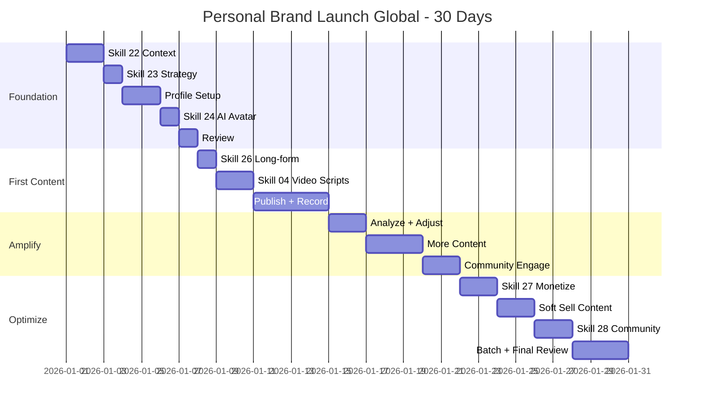

# Workflow: Personal Brand 30-Day Launch (Global)

> From zero to a live personal brand with profile, content, and followers — day-by-day guide for international Founders / Coaches / Creators.

---

## 1. Who is this workflow for?

```
Audience: Founder / Coach / Creator launching a personal brand from zero (international markets)
Outcome after 30 days:
  - Complete profile on chosen platform (LinkedIn-first recommended)
  - 10+ posts published (text + video)
  - 500+ new followers
  - First AI avatar published (if AI route chosen)
  - First offer / lead magnet live
Time: ~2-3 hours/day across 30 days
Skills used: 8+ global skills (22, 23, 24, 25, 26, 27, 28, 04, 05, 14)
Output: 10+ markdown files + live profile + published content
Default currency: USD; multi-region timezone-aware scheduling
```

**Pre-requisite:** Comfortable with Claude Code basics (running commands, answering prompts).

**NOT for:** People with established brand and 5K+ followers, or anyone with an existing content system in production.
- Use `personal-brand-monthly-global` instead for ongoing optimization.

---

## 2. Pre-flight Checklist

Complete these 10 items BEFORE Day 1:

- [ ] Account on target platform ready (LinkedIn / Twitter-X / YouTube — pick 1 as primary; LinkedIn-first recommended for B2B / Founder / Coach)
- [ ] Dedicated brand email (do NOT reuse personal Gmail)
- [ ] Professional headshot ready (or shoot in Week 1 — no excuses)
- [ ] Basic mic (Apple EarPods OK to start; Shure MV7 / Blue Yeti for upgrade)
- [ ] Tool budget allocated (start with $0 free tiers; expect $50-150/month at scale)
- [ ] 2-3 hours/day blocked for next 30 days (commit upfront, no exceptions)
- [ ] Claude Code plugin `fullstack-mkt-skills` installed
- [ ] Read `docs/getting-started-personal-brand-global.md`
- [ ] Identified your archetype: Founder / Coach / Creator
- [ ] Rough niche idea (doesn't need to be precise — skill 22 sharpens it)

> **Not ready?** Finish missing items first, then return. DO NOT skip pre-flight.

---

## 3. Step-by-step: 4 Weeks × 30 Days

### Week 1: Foundation (Days 1-7)

**Week goal:** Brand context locked, strategy drafted, profile live.

**Day 1-2: Brand Context**
- Run `/skill 22-personal-brand-context-global`
- Pick archetype variant: `founder` / `coach` / `creator`
- Answer all questions thoroughly (expertise, journey, core values, target audience, primary region(s))
- Output: `.agents/personal-brand-context.md`
- Verify: brand voice, tone, keyword bank, and timezone mapping included.

**Day 3: Brand Strategy**
- Run `/skill 23-personal-brand-strategy-global`
- Input: context file from Day 1-2
- Output covers: niche positioning, story arc (5-7 chapters), 3 content pillars
- Read story arc carefully — this is the spine of all 30 days of content
- Verify: Are the 3 pillars differentiated from competitors in your region?

**Day 4-5: Profile Setup (LinkedIn-first)**
- LinkedIn (primary for global B2B / coach / founder):
  - Headline: 220 chars (LinkedIn limit), keyword-rich, value-driven
  - Banner: 1584x396px, brand-aligned visuals
  - About: max 2,600 chars, problem-solver narrative + 3 proof points + CTA
  - Featured: pin 3 best assets (case study, talk, lead magnet)
  - Experience + Skills + Recommendations sections complete
- Twitter / X (secondary): bio 160 chars + pinned thread + header
- YouTube (if video-heavy route): channel banner + about + featured playlist
- ALL aligned with brand voice from context file — no improvising

**Day 6: AI Avatar Setup (Optional)**
- Run `/skill 24-ai-avatar-production-global` if going AI-avatar route
- Tool selection (USD pricing, May 2026 baseline):
  - HeyGen Creator: $30/month — solid lipsync, multi-language, strong English voices
  - Synthesia Starter: $30/month — corporate-friendly, 140+ languages, strong avatar variety
  - Captions Pro: $24/month — TikTok-native, shorter render, mobile-first
- Voice clone: ElevenLabs Pro $22/month (English voices excellent)
- Real-video alternative: clean background, ring light ($30-60), Shure MV7 ($249) or Yeti ($99)
- Test render 1× 30-second video to validate pipeline before batching
- CRITICAL: read FTC AI disclosure rules + EU AI Act Article 50 requirements before publishing

**Day 7: Foundation Review**
- Re-read context file + strategy file end-to-end
- Test profile on mobile (80% of viewers will use mobile)
- Get 3 peer / mentor reviews — ask: "Do you understand what I do?"
- Adjust if needed. DO NOT rush into Week 2 with weak foundation.

**Milestone Week 1:** Profile 80%+ complete, strategy file saved, brand voice documented.

---

### Week 2: First Content (Days 8-14)

**Week goal:** First 3-4 posts live, market response data collected.

**Day 8: Long-form Drafts**
- Run `/skill 26-thought-leadership-content-global`
- Write 3 long-form drafts — one per content pillar
- Format suggestions:
  - LinkedIn article: 800-1,500 words
  - Twitter thread: 8-15 tweets
  - YouTube script: 5-7 minute video outline
- DO NOT publish immediately. Sleep on drafts. Re-read morning Day 9.

**Day 9-10: Video Scripts**
- Run `/skill 04-script-video-global` Personal Brand Mode
- Write 2 scripts following story arc:
  - Script 1: "Who I am and why I'm here" (60-90 seconds)
  - Script 2: "One specific industry insight" (45-60 seconds)
- Each script: 3-second hook + 45-90s content + clear CTA
- Read aloud to validate naturalness — silent script ≠ spoken-friendly script

**Day 11: PUBLISH FIRST POST**
- Pick the strongest of the 3 drafts from Day 8
- Optimal post times (region-aware):
  - LinkedIn: Tue-Thu 7-9am local time of primary audience region
  - Twitter / X: Mon-Wed 8-10am or 12-1pm
  - YouTube: Friday 4-6pm to ride weekend watch time
- Add hashtags (LinkedIn: 3-5; Twitter: 2-3; YouTube: in description, 5-10)
- DO NOT delete posts that flop — flop data is data

**Day 12-13: Record / Render Video**
- Real video: 3-5 takes per video, pick best
- AI avatar: render from script, validate lipsync + voice clarity
- Edit in CapCut (free) or Descript (Creator plan $24/month)
- Burn captions IN (mandatory) — 85%+ of mobile viewers watch muted

**Day 14: Publish Video + Review**
- Publish first video
- Review Day 11 text post analytics: impressions, likes, comments, profile visits
- Notes file: which post landed, which flopped, what audience said
- Reply to EVERY comment within 1 hour — algorithm rewards engagement velocity
- Multi-region note: if audience spans 3+ timezones, schedule auto-replies in Buffer / Hootsuite

**Milestone Week 2:** 3-4 posts live, first engagement data captured.

---

### Week 3: Amplify (Days 15-21)

**Week goal:** Increase reach, build community foundations, iterate content.

**Day 15: Analyze + Adjust**
- Pull analytics: Impressions, engagement rate, profile visits, follower growth
- Highest-reach post — what was the hook? Format? Topic? Time?
- Lowest-reach post — what's the diagnosis?
- Adjust pillar ratio if a pillar dominates engagement (e.g., 50/30/20 vs initial 33/33/33)
- Decide format priority for Week 3: text article vs short video vs carousel?

**Day 16-17: Content Batch**
- Write 3 new posts (prioritize the winning pillar)
- 1 additional video script ("behind the scenes" or "Day 1 mistake I made")
- Test new format: LinkedIn carousel, Twitter thread, YouTube Short
- Publish 1-2 posts during this 2-day window — maintain rhythm

**Day 18-19: Community Engagement**
- Comment on 10 posts/day from peers in your niche (real, substantive comments)
- Reply to all comments on your posts within 1 hour
- Send 5-10 connection / follow requests with personalized notes
- Identify 2-3 potential collab partners (guest podcast, joint LinkedIn Live, X Spaces)

**Day 20: Podcast / Long-form (Optional)**
- Run `/skill 25-voice-clone-podcast-global` if going podcast route
- Record 1 episode 15-20 minutes on your core expertise
- Format: solo episode, 3 actionable insights with stories
- Publish to Spotify for Podcasters (free) + Apple Podcasts
- Cut 60-second clip for LinkedIn / Twitter / YouTube Shorts

**Day 21: Weekly Review**
- Compare Week 3 vs Week 2 metrics: up or down?
- Hit Week 3 milestone? (7-8 posts, engagement up, 10+ niche connections)
- 3 things working + 3 things to improve
- Mental prep for Week 4: shift from "content" to "monetize"

**Milestone Week 3:** 7-8 posts total, engagement up vs Week 2, 10+ niche connections.

---

### Week 4: Optimize + Launch Offer (Days 22-30)

**Week goal:** Monetization live, content batched, operations mode engaged.

**Day 22-23: Offer Ladder**
- Run `/skill 27-personal-brand-monetize-global`
- Set up offer ladder (USD pricing):
  - Free (lead magnet): ebook / template / mini-course
  - Low-ticket: $49-199 (workshop / starter course)
  - Mid-ticket: $499-1,499 (group program / cohort)
  - High-ticket: $2,500+ (1:1 coaching / consulting retainer)
- Example ladder: Free guide → $99 workshop → $499/month coaching
- Build lightweight landing page: Carrd ($19/year), Notion (free), or ConvertKit (free tier)

**Day 24-25: Soft-sell Content**
- Run `/skill 05-ad-copy-global` Personal Brand Mode
- Write 2 soft-sell posts: 80% value + 20% CTA
- DO NOT hard sell — you're building trust, not pushing
- Format: "I've helped X people achieve Y. Here's the framework..." + CTA

**Day 26-27: Community Setup**
- Run `/skill 28-community-building-global`
- Pick community platform:
  - Skool ($99/month): clean UI, gamification, courses + community native
  - Mighty Networks ($41/month base): branded community, mobile app
  - Discord (free): tech-savvy / Gen-Z audiences, real-time
  - Circle ($89/month): premium feel, B2B / coaching standard
- Setup: name, description, rules, welcome post, 3 seed content posts
- Invite 20-30 people from existing network to join

**Day 28-29: Batch Content for Month 2**
- Use `ai-avatar-batch-global` workflow if AI route, or manual batch
- Target: 8-10 drafts for first 2 weeks of Month 2
- Mix format: 5 text + 3 video + 2 carousel (adjust based on Month 1 data)
- Schedule via Buffer ($6/month) / Later ($25/month) / native scheduler

**Day 30: FINAL REVIEW**
- Run 30-day milestone checklist (see Section 5)
- Document all metrics: followers, posts, engagement, leads
- Plan Month 2 from real data
- Celebrate — you launched a personal brand from zero!

**Milestone Week 4:** 10+ posts total, offer published, community live, Month 2 content batched.

---

## 4. Skills Chain & Timeline

### Mermaid Gantt Chart



### Skills Chain (Text)

```
22 (Context Global) → 23 (Strategy Global) → 24 (AI Avatar Global)
→ 26 (Thought Leadership Global) → 04 (Video Script Global - Personal Mode)
→ 25 (Voice Clone Global) → 27 (Monetize Global)
→ 05 (Ad Copy Global - Personal Mode) → 28 (Community Global) → 14 (Email Marketing Global)
```

### Output Files

| Week | Skill | File output |
|------|-------|-------------|
| 1 | 22 | `.agents/personal-brand-context.md` |
| 1 | 23 | `personal-brand-strategy-[name]-[date].md` |
| 1 | 24 | `ai-avatar-[name]-[date].md` (optional) |
| 2 | 26 | `thought-leadership-[name]-[date].md` |
| 2 | 04 | `script-video-[name]-[date].md` |
| 3 | 25 | `podcast-script-[name]-[date].md` (optional) |
| 4 | 27 | `monetize-[name]-[date].md` |
| 4 | 05 | `ad-copy-personal-[name]-[date].md` |
| 4 | 28 | `community-plan-[name]-[date].md` |

---

## 5. Success Criteria

### 30-Day Targets

| Criterion | Minimum | Good | Measurement |
|-----------|---------|------|-------------|
| Profile completeness | 80% | 100% | Section-by-section audit |
| Posts published (text + video) | 10 | 20+ | Count of live content |
| New followers | 500 | 1,000+ | Followers Day 30 - Day 1 |
| Engagement rate | 3% | 5%+ | (Likes + Comments + Shares) / Impressions |
| First offer published | Yes | Yes + 3 leads | Live offer + inbound interest |

### KPI Baseline for Month 2

After 30 days, lock these baselines:

- **Follower growth rate:** New followers ÷ 30 = X followers/day
- **Content production rate:** Posts ÷ 30 = X posts/day
- **Engagement trend:** Week 4 ER vs Week 2 ER (rising / flat / falling)
- **Best performing format:** Text / Video / Carousel — which won?
- **Best performing pillar:** Which content pillar drove the most engagement?

> Use these baselines to plan Month 2 with the `personal-brand-monthly-global` workflow.

---

## 6. Common Pitfalls (10 Mistakes Newbies Make)

### 1. Skipping skill 22, jumping to content
**Problem:** Content has no direction, every post is different, audience can't tell what you do.
**Cause:** Impatience, "I'll figure it out as I go."
**Fix:** Always run skill 22 first. 2 foundation days save weeks of confused content.

### 2. Niche too broad
**Problem:** "Marketing" or "Business" is generic — no one follows because nothing stands out.
**Cause:** Fear that narrow = small audience. Reality is the opposite.
**Fix:** Narrow to "Performance marketing for D2C founders in EU" vs "Marketing."

### 3. Copying someone else's style
**Problem:** Brand feels like a clone, audience senses inauthenticity.
**Cause:** "If it worked for them, it'll work for me."
**Fix:** Skill 22 finds YOUR voice. Take inspiration without copying.

### 4. Posting without engaging
**Problem:** Post and ghost — algorithm buries content with low engagement velocity.
**Cause:** Belief that "good content sells itself."
**Fix:** 30-min reply window after every post + 10 thoughtful comments/day on others.

### 5. AI-generated content with no human touch
**Problem:** Robotic, generic, audience disengages.
**Cause:** Copy-paste from ChatGPT without editing.
**Fix:** AI drafts, you edit in your voice + add personal stories. Always.

### 6. Skipping AI disclosure
**Problem:** FTC violation (US), EU AI Act Article 50 violation, platform flags, trust collapse.
**Cause:** Unaware or believes disclosure hurts trust.
**Fix:** Mandatory disclaimer: "Created with AI assistance" or "AI-generated voice." Always.

### 7. Expecting viral on Day 1
**Problem:** 3 posts with 0 engagement → discouragement → quitting by Day 10.
**Cause:** Comparing to creators with 2-3 years of buildup. Survivorship bias.
**Fix:** First 30 days = foundation. 500 followers is realistic. Viral is bonus, not goal.

### 8. No story arc
**Problem:** Random posts, no narrative thread, audience can't follow your journey.
**Cause:** Writing reactively, no strategy file.
**Fix:** Skill 23 builds the story arc. Each week has a theme, posts connect.

### 9. Running ads too early
**Problem:** No trust → ads → poor ROAS, burned budget.
**Cause:** "Ads will replace organic." Reality: ads amplify organic, don't replace.
**Fix:** First 30 days = organic only. Run ads after 20+ posts + stable engagement.

### 10. No content batching
**Problem:** 1 post/day mode → exhaustion → burnout by Week 3 → silence.
**Cause:** No system, "I'll write each day."
**Fix:** Batch 3-5 posts in 1 sitting, schedule them. Week 4 should batch Month 2.

---

## 7. AI Research Prompts

5 prompts ready to use during 30-day launch:

### Prompt 1: Benchmark personal brands in your niche

```
Analyze the 10 most successful personal brands in [niche] for [region]
on LinkedIn / Twitter-X / YouTube in 2025-2026.
What do they do differently? Which content formats do they use most?
Posting frequency? Engagement strategy with audience?
```

**Use when:** Day 1-2, before drafting brand strategy.
**Expected output:** Benchmark table + 3-5 patterns to apply.

### Prompt 2: AI avatar tool comparison

```
Compare HeyGen vs Synthesia vs Captions for [specific use case].
Budget: [$X/month]. Need: English-first, multi-language fallback,
strong lipsync, batch-friendly API.
Provide pricing breakdown, output quality, language support, and recommendation.
```

**Use when:** Before Day 6 AI avatar setup.
**Expected output:** Comparison table + top 1-2 picks.

### Prompt 3: Content ideas per pillar

```
Generate 7 content ideas for pillar "[pillar name]" targeting [specific audience].
Platform: [LinkedIn / Twitter / YouTube]. Format: [text / video / carousel].
Each idea: title, hook, key message, CTA.
```

**Use when:** Anytime needing content batch.
**Expected output:** 7 content ideas ready to write.

### Prompt 4: Story arc review

```
Critique this story arc and give feedback:
[Paste story arc from skill 23]
Does it have a strong opening hook + emotional journey + clear CTA?
Will [target audience description] connect with it?
Provide 3 specific improvements.
```

**Use when:** After Day 3, before writing first content.
**Expected output:** Specific feedback + 3 adjustments.

### Prompt 5: Mid-launch progress review

```
I'm in Week [X] of a 30-day personal brand launch.
Current numbers: [followers, posts published, engagement rate].
Targets: 500 followers, 10 posts, 3% engagement.
Review progress and provide 3 specific actions for next week.
```

**Use when:** End of each week.
**Expected output:** Assessment + 3 actionable next steps.

---

## 8. Resources & Next Steps

### Workflows that connect

| Workflow | When to use | Description |
|----------|-------------|-------------|
| `ai-avatar-batch-global` | After Day 30 | Batch 30 AI avatar videos for Month 2 |
| `personal-brand-monthly-global` | End of every month | Review + plan next month + adjust strategy |
| `content-production-global` | Weekly | Batch produce content (text + video + podcast) |

### Reference docs

- `docs/getting-started-personal-brand-global.md` — 8-chapter newbie playbook
- `skills-global/22-personal-brand-context-global/SKILL.md` — Skill 22 detailed walkthrough
- `skills-global/references/mcp-ads-integration.md` — MCP ads setup (when ready to scale)

### YouTube tutorial

```
Tutorial: Personal Brand Launch Walkthrough (Global)
- Video: [TBD - YouTube link to be added post v2.5.0 release]
- Recording window: ~7 days after v2.5.0 ships
- Estimated length: 5-7 minutes
- Content: Week-by-week walkthrough, demo skill 22 + 23
```

---

## Final Pre-Launch Checklist

- [ ] Pre-flight checklist (Section 2) complete — 10/10 items
- [ ] Primary platform chosen (LinkedIn / Twitter / YouTube)
- [ ] 2-3 hours/day blocked for 30 days
- [ ] Read entire workflow once
- [ ] Ready to begin Day 1 with `/skill 22-personal-brand-context-global`

> **You're ready!** Start Day 1 by running: `/skill 22-personal-brand-context-global`
