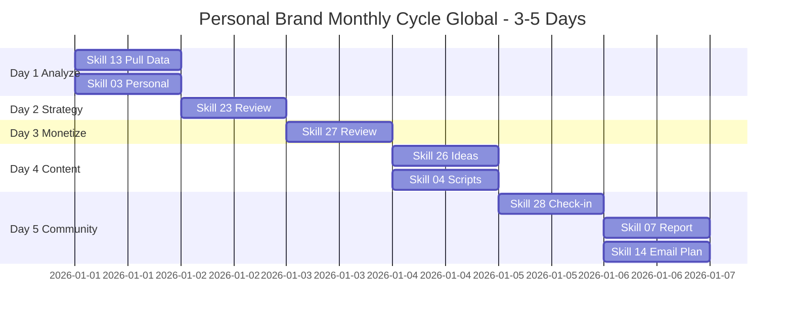

# Workflow: Personal Brand Monthly Cycle Global (Review + Adjust)

> End-of-month playbook — review data, adjust strategy, plan next 30 days of content. 3-5 days per cycle, multi-region aware.

---

## 1. Who is this workflow for?

```
Audience: Founder / Coach / Creator who finished `personal-brand-launch-global`
          and is now in Month 2+ of operating a personal brand.
Outcome after 3-5 days:
  - Detailed MoM growth report (followers, engagement, revenue per region)
  - Strategy file updated based on real data
  - Offer ladder reviewed for funnel performance
  - Next 30-day content plan locked
  - Community check-in done (NPS + feedback synthesis)
Time: 3-5 days × 4-5 hours = 15-25 hours total
Skills used: 13 → 03 (Personal) → 23 → 27 → 26 → 04 (Personal) → 07 (Personal) → 28 → 14
Output: 5+ markdown files + 1 content calendar + 1 community recap
Default currency: USD; multi-currency tracking if revenue spans regions
```

**Pre-requisite:**
- Completed `personal-brand-launch-global` 30-day workflow
- At least 1 full month of data
- `.agents/personal-brand-context.md` and `personal-brand-strategy-*.md` filled
- Identified top 5 / bottom 5 posts from previous month

**NOT for:**
- Newcomers without 1 month of data → run `personal-brand-launch-global` first
- Onboarding new client → use `client-onboard-global` workflow
- Batching content production → use `ai-avatar-batch-global`

---

## 2. Pre-flight Checklist

Complete these 10 items BEFORE Day 1:

- [ ] Previous month's data complete (followers count, engagement, post performance, region split if multi-region)
- [ ] Top 5 posts (highest engagement) exported from primary platform
- [ ] Bottom 5 posts (lowest engagement) exported from primary platform
- [ ] `.agents/personal-brand-context.md` (skill 22 filled)
- [ ] `personal-brand-strategy-*.md` from previous month (skill 23)
- [ ] `monetize-*.md` from previous month (skill 27, if offer is live)
- [ ] Baseline KPI from launch month documented (followers/day, engagement rate)
- [ ] Revenue data from previous month per currency / region
- [ ] 3-5 days × 4-5 hours blocked in calendar this week
- [ ] Mentally ready to KILL non-working ideas without ego

> **Not enough data?** Wait 2 more weeks to accumulate. DO NOT decide based on 1 week.

---

## 3. Step-by-step: 3-5 Days × 4-5 Hours/Day

### Day 1: Analyze Data (4-5 hours)

**Day goal:** Deep understanding of last month's data — wins, losses, patterns.

**Morning (2 hours): Pull data + skill 13**
- Run `/skill 13-data-analysis-global`
- Pull data from primary platform (LinkedIn Analytics / Twitter Analytics / YouTube Studio)
- If MCP ads connected: pull from Meta Official MCP / Pipeboard / TikTok Ads MCP
- Required metrics: Impressions, Reach, Engagement, Profile visits, Followers growth, Click-through rate
- Multi-region split: if audience spans 3+ countries, segment metrics by top 3 regions
- Output: `data-analysis-personal-brand-month-[M]-[YYYYMMDD].md`

**Afternoon (2-3 hours): Skill 03 Personal Brand mode**
- Run `/skill 03-performance-eval-global` with Personal Brand context
- Analyze top 5 posts: Hook? Format? Posting time? Topic? Region engagement?
- Analyze bottom 5 posts: Why flopped? Weak hook? Wrong audience? Wrong timing?
- Find PATTERNS — don't focus on individual posts
- Key question: "If I redid last month, what would I NOT do?"

**End-of-day QA gate (15 min):**
- [ ] 3 wins identified with specific numbers + reasoning
- [ ] 3 losses identified with specific numbers + reasoning
- [ ] 5 hypotheses listed for testing next month
- [ ] Multi-region patterns surfaced (if applicable)
- [ ] No rush to Day 2 if insights are still murky

> Burning through analysis = wrong adjustments = lose another month.

---

### Day 2: Update Strategy (4-5 hours)

**Day goal:** Strategy file reflects real data, no longer hypothetical plan.

**Morning (2 hours): Skill 23 quick review**
- Run `/skill 23-personal-brand-strategy-global` with `--review-mode` flag
- Open `personal-brand-strategy-*.md` from previous month
- For each section, ask: "Does data confirm this section?"
  - Niche positioning still right? Audience response matched target?
  - Story arc working? Which chapters got most engagement?
  - 3 content pillars — which performing best/worst? Adjust ratio?
- DO NOT delete old strategy — version it: create new file with `-v2` suffix

**Afternoon (2-3 hours): Refine + finalize**
- Update niche if needed (narrow further or rotate 30-45 degrees)
- Adjust pillar ratio: e.g., 33/33/33 → 50/30/20 if one pillar dominates
- Update brand voice if new tone working better
- Multi-region adjustments: if EU engagement strong but US weak, decide:
  - Double down on EU (regional brand)
  - Adjust content for US specifics (timing, references, tone)
- Output: `personal-brand-strategy-[name]-[YYYYMMDD]-v2.md`

**Principle:** SMALL adjustments. DO NOT redo entire strategy each month. Brands build through consistency, not constant pivoting.

---

### Day 3: Update Monetize (4-5 hours)

**Day goal:** Understand offer ladder real-world performance, adjust accordingly.

**Morning (2 hours): Review offer performance**
- Run `/skill 27-personal-brand-monetize-global` with `--review-mode` flag
- Open monetize file from previous month
- For each tier (Free / Tripwire / Core / Premium / Elite):
  - Top of funnel: how many entered?
  - Conversion rate to next tier?
  - Actual revenue vs target (per currency)?
  - Average LTV per tier?
- Find bottleneck: which tier loses most people?

**Afternoon (2-3 hours): Adjust offer ladder**
- If Free attracts but Tripwire under-converts → adjust Tripwire price/value
- If Core sells out but Premium has zero takers → create intermediate tier
- If Elite sells out → raise price OR create "VIP wait list"
- Multi-currency revenue tracking:
  - USD primary (US / Canada / global default)
  - EUR (EU customers)
  - GBP (UK customers)
  - SGD / AUD (SEA / Oceania)
  - Track gross + net per currency, plus FX-adjusted USD totals
- Update file: `monetize-[name]-[YYYYMMDD]-v2.md`

**Soft-sell content review:**
- Which soft-sell post converted best? Pattern (story / case study / framework)?
- Plan similar themes for next month's content

---

### Day 4: Plan Next 30 Days Content (4-5 hours)

**Day goal:** 30-day content plan locked, no more "what should I post today?" anxiety.

**Morning (2 hours): Skill 26 — Long-form ideas**
- Run `/skill 26-thought-leadership-content-global`
- Generate 12-15 long-form ideas for next month
- Prioritize topics based on top 5 posts from last month — extend / deepen
- Mix per new pillar ratio (e.g., 50/30/20)
- Each idea: title + hook + key message + CTA preview

**Afternoon (2-3 hours): Skill 04 — Video scripts (Personal Brand mode)**
- Run `/skill 04-script-video-global` Personal Brand Mode
- Cut each long-form into 1-2 short videos → total 18-25 video scripts
- If using AI avatar: prep for `ai-avatar-batch-global` workflow next
- Schedule preview in Buffer / Later — drag-drop into calendar
- Multi-region scheduling: split posts across 2-3 timezones if audience global

**Output:**
- `content-calendar-month-[M+1]-[YYYYMMDD].md`
- `script-video-batch-[YYYYMMDD].md` (12-15 long-form + 18-25 short)

---

### Day 5: Community Check-in (4-5 hours)

**Day goal:** Community health understood + monthly report ready + Month M+1 plan locked.

**Morning (2 hours): Skill 28 — Community check-in**
- Run `/skill 28-community-building-global` with `--monthly-checkin` flag
- Pull community data:
  - Skool: members count, post activity, engagement rate, courses completion
  - Mighty Networks: same plus events / live engagement
  - Discord: messages/day, voice channel hours, role distribution
  - Circle: same as Skool plus 1:1 DMs
- Multi-region community check:
  - If 3+ regions, spot-check sentiment per region (US / EU / SEA / LATAM)
  - Spot-check 5 most active members per region
- Create NPS poll in community: "0-10, would you recommend this community to a peer?"
- Read 20-30 recent comments — note 5 biggest themes

**Afternoon (2-3 hours): Skill 07 + Skill 14**
- Run `/skill 07-marketing-report-global` Personal Brand mode
- Compile monthly report: growth + engagement + revenue + community NPS
- Format: 1-page executive summary + appendix with full data
- Multi-currency revenue: list each currency separately + USD-equivalent total
- Run `/skill 14-email-marketing-global` if newsletter active — plan email cadence for next month
- Final output: `marketing-report-personal-brand-month-[M]-[YYYYMMDD].md`

**Final celebration (15 min):**
- Read full report start to finish
- Note 3 wins to celebrate + 1 lesson learned
- Share milestone with 1 mentor / accountability peer

**Cycle milestone:** 5+ output files + 30-day content plan ready + offer ladder v2 + strategy v2.

---

## 4. Skills Chain & Timeline

### Mermaid Gantt Chart



### Skills Chain (Text)

```
13 (Data Analysis Global) → 03 (Performance Eval Global - Personal mode)
  → 23 (Strategy Review Global) → 27 (Monetize Review Global)
  → 26 (Long-form Ideas Global) → 04 (Video Scripts Global - Personal mode)
  → 07 (Marketing Report Global - Personal mode) → 28 (Community Check-in Global)
  → 14 (Email Marketing Global)
```

### Output Files Map

| Day | Skill | File output |
|-----|-------|-------------|
| 1 | 13 | `data-analysis-personal-brand-month-[M]-[YYYYMMDD].md` |
| 1 | 03 | `performance-eval-personal-month-[M]-[YYYYMMDD].md` |
| 2 | 23 | `personal-brand-strategy-[name]-[YYYYMMDD]-v2.md` |
| 3 | 27 | `monetize-[name]-[YYYYMMDD]-v2.md` |
| 4 | 26+04 | `content-calendar-month-[M+1]-[YYYYMMDD].md` + `script-video-batch-[YYYYMMDD].md` |
| 5 | 28 | `community-checkin-month-[M]-[YYYYMMDD].md` |
| 5 | 07 | `marketing-report-personal-brand-month-[M]-[YYYYMMDD].md` |

---

## 5. Success Criteria

### End-of-Cycle Targets (Day 5)

| Criterion | Minimum | Good | Measurement |
|-----------|---------|------|-------------|
| MoM Followers growth | +10% | +20%+ | (End - Start) / Start month |
| Engagement trend | Stable | Rising | This month ER vs last month |
| Revenue MoM | Stable | +30%+ | Offer ladder revenue this vs last (per currency) |
| Community NPS | 7+ | 9+ | Mean of 0-10 poll |
| 30-day content plan | 80% drafted | 100% drafted | Posts / scripts pre-written |
| Strategy v2 published | Yes | Yes + shared | File saved + reviewed |

### KPI Baseline Update

After cycle, update baseline for next month:

- **New follower growth rate:** X followers/day (vs last month)
- **New engagement rate:** Y% (vs your own previous benchmark)
- **Best content format:** Format winning 2 months in a row?
- **Best pillar:** Pillar in top performance 2 months in a row?
- **Top revenue offer:** Highest revenue offer this month?
- **Top region (if multi-region):** Which region drove most growth + revenue?

> Use these for next cycle, or feed into `personal-brand-launch-global` if launching a 2nd brand.

---

## 6. Common Pitfalls (10 Mistakes Newbies Make on Monthly Reviews)

### 1. Looking at metrics without baseline
**Problem:** "1,000 followers — is that good?" No idea, because no comparison.
**Cause:** Didn't track baseline last month, no tracking sheet.
**Fix:** Tracking sheet with cols "Last month" + "This month" + "Delta %." Update every cycle.

### 2. Over-ambitious strategy adjustments
**Problem:** Change niche + audience + format in one cycle → audience confused → unfollow.
**Cause:** One slow month → panic → "reset everything."
**Fix:** 80/20 rule — keep 80%, adjust 20%. Change one major variable, observe 30 days, adjust again.

### 3. Comparing to top 1% creators
**Problem:** "Creator X has 100K followers this month — I have 1K, I'm failing!"
**Cause:** Ignoring buildup time, budget, niche differences.
**Fix:** Compare to YOURSELF last month, not to others. Survivorship bias is the biggest enemy.

### 4. Skipping community check-in
**Problem:** Numbers only — don't understand audience sentiment → quiet attrition.
**Cause:** Numbers easy to measure, sentiment hard → skip it.
**Fix:** Skill 28 MANDATORY in every cycle. Read 20-30 comments minimum.

### 5. No action after review
**Problem:** Review done → nice file → no concrete change next month.
**Cause:** Generic insights ("engagement dropped") → no specific action.
**Fix:** Every insight must have 1 specific action for next month, with deadline.

### 6. Not killing what doesn't work
**Problem:** Pillar A engagement -50% but kept because "I love this pillar."
**Cause:** Emotional attachment to old ideas.
**Fix:** Data dictates. Pillar engagement <50% of benchmark for 2 cycles → kill or major pivot.

### 7. Report only for yourself, no sharing
**Problem:** Long report → forgotten → repeat same mistakes next cycle.
**Cause:** No accountability — reading and reviewing yourself.
**Fix:** Share executive summary with 1 mentor / peer. 30-min discussion. Insight 3x.

### 8. Over-detailed content plan
**Problem:** Plan 30 days × 3 platforms × 5 details/post → exhausting → bail by Week 1.
**Cause:** Perfectionism. Over-detailed = burnout.
**Fix:** 30 ideas + 50% scripts ready is enough. Detail closer to publish date.

### 9. Not refreshing creative format
**Problem:** Same format 3 months in a row → audience bored → engagement decay.
**Cause:** Format worked last month → keep doing → diminishing returns.
**Fix:** Each cycle test 1 new format (carousel / poll / live / podcast). 80% keep, 20% experiment.

### 10. Cycle drags too long
**Problem:** 7-10 days reviewing → lose focus on actual operations → bail mid-cycle.
**Cause:** Over-detailed, perfectionism, too many sub-tasks.
**Fix:** 5-day max focus. Not done? "75% is enough" — move to next month, finish later.

---

## 7. AI Research Prompts

5 prompts ready for the review process:

### Prompt 1: Pattern detection from top/bottom posts

```
I have my top 5 and bottom 5 posts from this month:
[Paste 10 posts: title + hook + format + engagement number + region split if applicable]
Find 3 patterns differentiating top from bottom.
Hypothesis: why did top win, why did bottom flop?
Provide 5 actionable ideas to apply pattern from top into next month.
```

**Use when:** Day 1 afternoon.
**Expected output:** 3 patterns + 5 actionable ideas.

### Prompt 2: Strategy review checklist

```
Last month's strategy: [paste strategy]
This month's actual data: [paste data summary]
Find 3 strategy sections NOT matching data.
Suggest: narrow further / broaden / rotate 30-45 degrees?
Build strategy v2 from this data (keep 80%, adjust 20%).
```

**Use when:** Day 2.
**Expected output:** Strategy v1 vs v2 diff + reason for each change.

### Prompt 3: Offer ladder bottleneck

```
My offer ladder: [paste ladder with prices + capacity per tier, in USD]
This month's conversion data: [paste people count + revenue per tier]
Find bottleneck: which tier loses most people?
Provide 3 hypotheses + 3 things to test next month.
Multi-currency note: if revenue spans currencies, suggest FX-adjusted breakdown.
```

**Use when:** Day 3.
**Expected output:** Bottleneck analysis + 3 test plans.

### Prompt 4: 30-day content plan

```
Top 5 posts last month: [paste 5 posts]
Adjusted pillar ratio: [e.g., 50/30/20]
Audience feedback (top 3 themes from comments): [paste themes]
Build 30-day content plan:
- 12-15 long-form ideas (per pillar ratio)
- 18-25 short video angles (cut from long-form)
- Weekly schedule template with multi-region timing if applicable
```

**Use when:** Day 4.
**Expected output:** 30-day plan ready to schedule.

### Prompt 5: NPS feedback synthesis

```
30 community NPS poll responses:
[paste 30 comments]
Synthesize:
- 5 things audience loves (keep doing)
- 5 things audience wants more of (do more)
- 3 things audience confused / dislikes (fix or remove)
Provide 1-page action plan for next month.
Multi-region note: if community spans regions, segment top themes per region.
```

**Use when:** Day 5 morning.
**Expected output:** 1-page action plan based on real feedback.

---

## 8. Resources & Next Steps

### Workflows that connect

| Workflow | When to use | Description |
|----------|-------------|-------------|
| `ai-avatar-batch-global` | After Day 4 of this cycle | Batch 30 AI avatar videos from prepped scripts |
| `content-production-global` | Weekly during the month | Smaller content batches per plan |
| `personal-brand-launch-global` | Launching a 2nd brand | Start fresh from zero |

### Related skills

- `13-data-analysis-global` — Pull + analyze platform data
- `03-performance-eval-global` — Personal mode for personal brand metrics
- `23-personal-brand-strategy-global` — Review + adjust strategy
- `26-thought-leadership-content-global` — Long-form ideas for next month
- `27-personal-brand-monetize-global` — Offer ladder review
- `28-community-building-global` — Monthly check-in flow
- `07-marketing-report-global` — Personal mode executive summary

### Reference docs

- `docs/getting-started-personal-brand-global.md` — 8-chapter newbie playbook
- `skills-global/references/mcp-ads-integration.md` — MCP ads for auto data pull
- `skills-global/references/hook-formulas-global.md` — Reuse for next month's content

### YouTube tutorial

```
Tutorial: Personal Brand Monthly Cycle Walkthrough (Global)
- Video: [TBD - YouTube link to be added post v2.5.0 release]
- Recording window: ~14 days after v2.5.0 ships
- Estimated length: 6-8 minutes
- Content: 5-day walkthrough, demo skill 13 + 03 + 23 review
```

---

## Final Pre-Cycle Checklist

- [ ] Pre-flight checklist (Section 2) complete — 10/10 items
- [ ] Previous month's data exported (≥1 month full data)
- [ ] 3-5 days × 4-5 hours blocked in calendar
- [ ] Read entire workflow once
- [ ] Ready to begin Day 1 with `/skill 13-data-analysis-global`

> **You're ready!** Start Day 1 with: `/skill 13-data-analysis-global`
