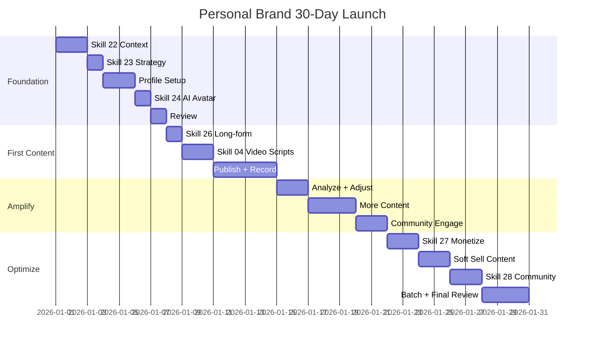

# Workflow: Personal Brand 30-Day Launch

> Tu con so 0 den personal brand co profile, content, va followers — huong dan tung ngay cho nguoi moi.

---

## 1. Workflow nay danh cho ai?

```
Doi tuong: Founder / Coach / Creator muon launch personal brand tu con so 0
Ket qua sau 30 ngay:
  - Profile day du tren nen tang muc tieu
  - 10+ bai dang (text + video)
  - 500+ followers moi
  - AI avatar dau tien (neu chon huong AI)
Thoi gian: ~2-3 gio/ngay trong 30 ngay
Skills su dung: 8+ skill (22, 23, 24, 25, 26, 27, 28, 04, 05, 14)
Output: 10+ file .md + profile live + content published
```

**Pre-requisite:** Biet dung Claude Code co ban (go lenh, tra loi cau hoi).

**KHONG danh cho:** Nguoi da co brand manh, da co 5K+ followers, da co content system.
→ Dung workflow `personal-brand-monthly` thay the.

---

## 2. Pre-flight Checklist

Hoan thanh 10 muc nay TRUOC khi bat dau Ngay 1:

- [ ] Co tai khoan nen tang muc tieu (LinkedIn / TikTok / Facebook — chon 1 lam chinh)
- [ ] Co email chuyen dung cho brand (khong dung email ca nhan cu)
- [ ] Co anh chan dung chuyen nghiep (hoac san sang chup trong tuan 1)
- [ ] Co mic co ban de ghi am (tai nghe iPhone ok cho giai doan dau)
- [ ] Co ngan sach cho tool (toi thieu $0 — free tier cac tool AI)
- [ ] Co 2-3 gio/ngay trong 30 ngay toi (cam ket truoc)
- [ ] Da cai Claude Code plugin `fullstack-mkt-skills`
- [ ] Da doc `docs/getting-started-personal-brand.md`
- [ ] Da xac dinh nhom cua minh: Founder / Coach / Creator
- [ ] Da co y tuong so bo ve niche (khong can chinh xac — skill 22 se giup tinh chinh)

> **Chua du?** Khong sao — hoan thanh cac muc thieu roi quay lai. Nhung KHONG skip buoc nay.

---

## 3. Step-by-step: 4 Tuan × 30 Ngay

### Tuan 1: Foundation (Ngay 1–7)

**Muc tieu tuan:** Co brand context, strategy, va profile san sang.

**Ngay 1-2: Brand Context**
- Chay `/skill 22-personal-brand-context`
- Chon variant phu hop: `founder` / `coach` / `creator`
- Tra loi day du cac cau hoi (chuyen mon, kinh nghiem, gia tri cot loi, audience muc tieu)
- Output: `.agents/personal-brand-context.md`
- Kiem tra: file co day du brand voice, tone, keywords chua?

**Ngay 3: Brand Strategy**
- Chay `/skill 23-personal-brand-strategy`
- Input: context file tu ngay 1-2
- Output bao gom: niche positioning, story arc (5-7 chuong), 3 content pillars
- Doc ky story arc — day la "xuong song" cua toan bo content 30 ngay
- Kiem tra: 3 pillars co khac biet so voi doi thu khong?

**Ngay 4-5: Profile Setup**
- LinkedIn: Headline (120 ky tu, co keyword), Banner (1584x396px), About (2600 ky tu max), Experience, Featured
- TikTok: Bio (80 ky tu), Link, Profile pic, Username de nho
- Facebook: Cover photo, Bio, Intro, Featured photos
- TAT CA theo brand voice tu context file — khong viet "ngau hung"
- Nho: profile la "landing page" cua ban — nguoi ta doc profile truoc khi follow

**Ngay 6: AI Avatar Setup (Optional)**
- Chay `/skill 24-ai-avatar-production` neu chon huong AI avatar
- Setup: chon tool (HeyGen/Synthesia/Captions), upload anh/video mau, clone voice
- Neu chon real video: chuan bi background sach, ring light, mic, goc quay co dinh
- Test thu 1 video ngan 30 giay de kiem tra chat luong
- QUAN TRONG: doc chinh sach AI disclosure cua nen tang muc tieu

**Ngay 7: Foundation Review**
- Doc lai context file + strategy file tu dau den cuoi
- Kiem tra profile tren dien thoai (80% nguoi xem tren mobile)
- Nho 3 nguoi ban/dong nghiep review profile — hoi: "Ban hieu toi lam gi khong?"
- Dieu chinh neu can. KHONG rush sang tuan 2 neu foundation chua vung

**Milestone tuan 1:** Profile 80%+ complete, co strategy file, co brand voice ro rang.

---

### Tuan 2: First Content (Ngay 8–14)

**Muc tieu tuan:** Dang 3-4 bai dau tien, test phan hoi thi truong.

**Ngay 8: Long-form Drafts**
- Chay `/skill 26-thought-leadership-content`
- Viet 3 long-form draft — moi bai 1 content pillar
- Format goi y: LinkedIn article (800-1200 tu), TikTok caption (150-300 tu), FB post (300-500 tu)
- KHONG dang ngay — de over night, doc lai sang hom sau

**Ngay 9-10: Video Scripts**
- Chay `/skill 04-script-video` (Personal Brand Mode)
- 2 video scripts theo story arc: 1 "gioi thieu ban la ai" + 1 "chia se insight nganh"
- Moi script: hook 3 giay dau + noi dung 45-90 giay + CTA cuoi
- Review script bang cach doc to thanh tieng — nghe tu nhien khong?

**Ngay 11: DANG BAI DAU TIEN**
- Chon bai tot nhat trong 3 draft ngay 8
- Gio dang toi uu: 8-9h sang (LinkedIn) hoac 19-21h (TikTok/FB)
- Them hashtag (3-5 cho LinkedIn, 5-10 cho TikTok/FB)
- KHONG xoa bai du engagement thap — de lam data

**Ngay 12-13: Quay/Render Video**
- Real video: quay 3-5 take moi video, chon take tot nhat
- AI avatar: render tu script, kiem tra lip-sync va giong noi
- Edit don gian: CapCut (free) hoac Canva Video
- Them subtitle (bat buoc) — 85% nguoi xem video khong bat tieng

**Ngay 14: Dang Video + Review**
- Dang video dau tien len nen tang
- Review engagement bai text ngay 11: bao nhieu view, like, comment?
- Ghi chu vao file: bai nao tot, bai nao can fix, audience phan hoi the nao
- Bat dau reply TAT CA comment — algorithm thuong bai co nhieu reply

**Milestone tuan 2:** 3-4 bai da dang, co data engagement dau tien.

---

### Tuan 3: Amplify (Ngay 15–21)

**Muc tieu tuan:** Tang reach, bat dau xay community, dieu chinh content.

**Ngay 15: Phan tich & Dieu chinh**
- Xem data: Impressions, Engagement rate, Profile visits, Follower growth
- Bai nao reach cao nhat? Comment noi gi? Audience muon nghe them gi?
- Dieu chinh content pillar neu can: them/bot/thay doi proportion
- Quyet dinh format chinh cho tuan 3: text hay video hieu qua hon?

**Ngay 16-17: Content Batch**
- Viet 3 bai moi (uu tien pillar co engagement tot nhat)
- 1 video script them (dang "behind the scenes" hoac "day 1 mistake")
- Thu format moi: carousel, poll, hoac thread (LinkedIn)
- Dang 1-2 bai trong 2 ngay nay — giu nhip dang deu

**Ngay 18-19: Community Engagement**
- Comment 10 bai/ngay cua nguoi khac trong niche (comment THAT SU, khong generic)
- Reply moi comment tren bai cua minh trong vong 1 gio
- Gui 5-10 connection/follow request den nguoi trong niche
- Tim 2-3 nguoi co the collab (guest post, podcast, live chung)

**Ngay 20: Podcast Mini (Optional)**
- Chay `/skill 25-voice-clone-podcast` neu muon tao podcast
- Record 1 episode 15 phut ve chuyen mon chinh cua ban
- Format: Solo episode, chia se 3 insight/tips thuc te
- Dang len Spotify/Apple Podcast (free) + clip ngan len TikTok/LinkedIn

**Ngay 21: Weekly Review**
- So sanh so lieu tuan 3 vs tuan 2: tang hay giam?
- Da dat milestone tuan 3 chua? (7-8 bai, engagement tang, 10+ connections)
- Lap danh sach 3 dieu lam tot + 3 dieu can cai thien
- Chuan bi tinh than cho tuan 4: chuyen tu "content" sang "monetize"

**Milestone tuan 3:** 7-8 bai tong, engagement tang so voi tuan 2, co 10+ connection trong niche.

---

### Tuan 4: Optimize + Launch Offer (Ngay 22–30)

**Muc tieu tuan:** Setup monetization, batch content, chuyen sang che do van hanh.

**Ngay 22-23: Offer Ladder**
- Chay `/skill 27-personal-brand-monetize`
- Setup offer ladder: Free (lead magnet) → Low-ticket ($50-200) → High-ticket ($500+)
- Vi du: Free ebook → Workshop $99 → Coaching 1:1 $500/thang
- Viet mo ta offer, landing page don gian (Notion/Carrd ok cho giai doan dau)

**Ngay 24-25: Soft Sell Content**
- Chay `/skill 05-copy-quang-cao` Personal Brand Mode
- Viet 2 bai "soft sell": 80% gia tri + 20% CTA
- KHONG hard sell — ban dang xay trust, chua phai luc push offer
- Format: "Toi da giup X nguoi dat Y ket qua. Day la cach..." + CTA cuoi

**Ngay 26-27: Community Setup**
- Chay `/skill 28-community-building`
- Chon 1 nen tang community: FB Group (de nhat), Zalo Group (VN-friendly), hoac Discord
- Setup: ten group, mo ta, rules, welcome post, 3 bai seed content
- Moi 20-30 nguoi tu network hien tai vao group

**Ngay 28-29: Batch Content Thang 2**
- Dung workflow `ai-avatar-batch` (neu co) hoac chuan bi thu cong
- Target: 8-10 draft cho 2 tuan dau thang 2
- Mix format: 5 text + 3 video + 2 carousel (dieu chinh theo data thang 1)
- Schedule san tren Buffer/Later/Creator Studio

**Ngay 30: FINAL REVIEW**
- Chay checklist 30-day milestone (xem Section 5)
- Ghi lai toan bo so lieu: followers, bai dang, engagement, leads
- Lap ke hoach thang 2 dua tren data that
- Celebrate — ban da launch personal brand tu con so 0!

**Milestone tuan 4:** 10+ bai tong, offer da publish, community da setup, content thang 2 da batch.

---

## 4. Skills Chain & Timeline

### Mermaid Gantt Chart



### Skills Chain (Text)

```
22 (Context) → 23 (Strategy) → 24 (AI Avatar) → 26 (Thought Leadership)
→ 04 (Video Script - Personal) → 25 (Voice Clone) → 27 (Monetize)
→ 05 (Copy - Personal) → 28 (Community) → 14 (Kenh tracking)
```

### Output Files

| Tuan | Skill | File output |
|------|-------|-------------|
| 1 | 22 | `.agents/personal-brand-context.md` |
| 1 | 23 | `personal-brand-strategy-[ten]-[date].md` |
| 1 | 24 | `ai-avatar-[ten]-[date].md` (optional) |
| 2 | 26 | `thought-leadership-[ten]-[date].md` |
| 2 | 04 | `script-video-[ten]-[date].md` |
| 3 | 25 | `podcast-script-[ten]-[date].md` (optional) |
| 4 | 27 | `monetize-[ten]-[date].md` |
| 4 | 05 | `copy-quang-cao-[ten]-[date].md` |
| 4 | 28 | `community-plan-[ten]-[date].md` |

---

## 5. Success Criteria

### Tieu chi sau 30 ngay

| Tieu chi | Target toi thieu | Target tot | Cach do |
|----------|-----------------|------------|---------|
| Profile completeness | 80% | 100% | Kiem tra tung section cua profile |
| Bai dang (text + video) | 10 | 20+ | Dem bai da publish |
| Followers moi | 500 | 1,000+ | So followers hien tai - so followers ngay 1 |
| Engagement rate | 3% | 5%+ | (Likes + Comments + Shares) / Impressions |
| First offer published | Co | Co + 3 leads | Offer da live + co nguoi hoi |

### KPI Baseline cho thang tiep theo

Sau 30 ngay, ghi lai cac so nay lam baseline:

- **Followers growth rate:** So followers moi / 30 ngay = X followers/ngay
- **Content production rate:** So bai / 30 ngay = X bai/ngay
- **Engagement trend:** Engagement rate tuan 4 vs tuan 2 (tang hay giam?)
- **Best performing content type:** Text / Video / Carousel — cai nao tot nhat?
- **Best performing pillar:** Content pillar nao co engagement cao nhat?

> Dung cac so nay de lap ke hoach thang 2 voi workflow `personal-brand-monthly`.

---

## 6. Common Pitfalls (10 Loi Newbie Hay Mac)

### 1. Skip skill 22, di thang lam content
**Van de:** Content khong co dinh huong, moi bai mot kieu, audience khong hieu ban la ai.
**Nguyen nhan:** Nong voi, muon thay ket qua ngay, nghi rang "lam roi se biet".
**Cach fix:** LUON chay skill 22 truoc. 2 ngay dau tu cho foundation tiet kiem hang thang sau.

### 2. Chon niche qua rong
**Van de:** "Marketing" hoac "Business" qua chung — khong ai follow vi khong noi bat.
**Nguyen nhan:** So thu hep se mat audience. Thuc te nguoc lai — niche hep moi noi bat.
**Cach fix:** Thu hep: "Performance Marketing cho SME F&B tai VN" cu the hon "Marketing".

### 3. Copy style nguoi khac
**Van de:** Brand giong het nguoi khac, mat authenticity, audience cam nhan duoc.
**Nguyen nhan:** Thay nguoi khac thanh cong, nghi lam giong se co ket qua tuong tu.
**Cach fix:** Skill 22 giup tim brand voice RIENG. Lay cam hung nhung khong sao chep.

### 4. Chi post khong engage
**Van de:** Dang bai roi bo di — algorithm giau bai vi khong co tuong tac.
**Nguyen nhan:** Nghi rang content tot tu khac se viral. Thuc te algorithm can tuong tac.
**Cach fix:** Moi bai dang, danh 30 phut reply comment + comment bai nguoi khac trong niche.

### 5. Dung AI 100% khong co human touch
**Van de:** Content nham, giong robot, audience cam thay gia tao.
**Nguyen nhan:** Tiet kiem thoi gian, copy/paste thang tu AI ra khong edit.
**Cach fix:** AI tao draft, ban LUON edit lai bang giong noi rieng. Them cau chuyen ca nhan that.

### 6. Khong disclose AI khi dung AI avatar
**Van de:** Bi report, mat trust, vi pham chinh sach nen tang.
**Nguyen nhan:** Khong biet hoac nghi rung disclosure se lam giam trust.
**Cach fix:** Them disclaimer ro rang: "AI-generated voice" hoac "Created with AI assistance".

### 7. Expect viral tu ngay 1
**Van de:** Dang 3 bai khong co ai like → that vong → bo cuoc.
**Nguyen nhan:** So sanh voi nguoi da xay brand 2-3 nam. Survivorship bias.
**Cach fix:** 30 ngay dau la XAY NEN. 500 followers la target thuc te. Viral la bonus, khong phai muc tieu.

### 8. Khong co story arc
**Van de:** Content roi rac, hom nay noi cai nay mai noi cai khac, khong co mach truyen.
**Nguyen nhan:** Viet theo cam hung, khong co ke hoach truoc. Thieu strategy file.
**Cach fix:** Skill 23 tao story arc. Moi tuan co 1 chu de chinh, cac bai lien ket voi nhau.

### 9. Chay ads qua som
**Van de:** Chua co trust, chua co content tot → chay ads → burn budget, ROAS thap.
**Nguyen nhan:** Nghi rang quang cao se thay cho organic. Thuc te ads amplify — khong tao trust.
**Cach fix:** 30 ngay dau la ORGANIC. Chi chay ads sau khi co 20+ bai + engagement on dinh.

### 10. Khong batch content
**Van de:** Viet 1 bai/ngay → met moi → burn out giua tuan 3 → ngung dang.
**Nguyen nhan:** Khong co he thong, lam theo kieu "ngay nao hay ngay do".
**Cach fix:** Batch 1 ngay viet 3-5 bai, schedule dang. Tuan 4 da bat dau batch cho thang 2.

---

## 7. AI Research Prompts

5 prompt san sang de nghien cuu va ho tro trong qua trinh 30 ngay:

### Prompt 1: Benchmark personal brand trong niche

```
Phan tich 10 personal brand thanh cong nhat trong nganh [niche] tai VN 2025-2026.
Ho lam gi khac biet? Content format nao ho dung nhieu nhat?
Frequency dang bai cua ho? Cach ho engage voi audience?
```

**Muc dich:** Hieu benchmark thi truong truoc khi bat dau. Chay vao ngay 1-2.
**Output ky vong:** Bang so sanh 10 brand + 3-5 insight co the ap dung.

### Prompt 2: So sanh tool AI avatar

```
So sanh HeyGen vs Synthesia vs Captions cho [use case cu the cua ban].
Budget [X USD/thang]. Can tieng Viet. Can lip-sync tot.
Cho bang so sanh gia, chat luong, tieng Viet support, va recommend.
```

**Muc dich:** Chon tool phu hop truoc khi invest thoi gian setup. Chay truoc ngay 6.
**Output ky vong:** Bang so sanh + recommend top 1-2 tool.

### Prompt 3: Content ideas cho tung pillar

```
Tao 7 content ideas cho pillar "[ten pillar]" nham [audience cu the].
Platform: [LinkedIn/TikTok/FB]. Format: [text/video/carousel].
Moi idea gom: tieu de, hook, key message, CTA.
```

**Muc dich:** Khong bao gio het y tuong content. Chay moi khi can batch content.
**Output ky vong:** 7 content ideas san sang viet thanh bai.

### Prompt 4: Review story arc

```
Danh gia story arc nay va cho feedback:
[Paste story arc tu skill 23]
No co du hook dau + emotional journey + CTA cuoi khong?
Audience [mo ta] co cam thay connect khong? Cho 3 goi y cai thien.
```

**Muc dich:** Kiem tra story arc truoc khi bien thanh content. Chay sau ngay 3.
**Output ky vong:** Feedback cu the + 3 dieu chinh.

### Prompt 5: Review progress giua chung

```
Toi dang o tuan [X] cua 30-day personal brand launch.
So lieu hien tai: [followers, bai dang, engagement rate].
Target: 500 followers, 10 bai, 3% engagement.
Review progress va cho 3 dieu chinh can lam NGAY trong tuan toi.
```

**Muc dich:** Course-correct kip thoi. Chay vao cuoi moi tuan.
**Output ky vong:** Danh gia + 3 action items cu the.

---

## 8. Resources & Next Steps

### Workflows tiep theo

| Workflow | Khi nao dung | Mo ta |
|----------|-------------|-------|
| `ai-avatar-batch` | Sau ngay 30 | San xuat video AI hang loat cho thang tiep theo |
| `personal-brand-monthly` | Moi cuoi thang | Review + plan thang moi + dieu chinh strategy |
| `content-production` | Hang tuan | San xuat content batch (text + video + podcast) |

### Docs tham khao

- `docs/getting-started-personal-brand.md` — Cam nang 8 chuong cho nguoi moi
- `skills/22-personal-brand-context/README.md` — Huong dan skill 22 chi tiet
- `skills/references/mcp-ads-integration.md` — Ket noi MCP ads (khi san sang chay ads)

### Video demo

```
Tutorial 30 ngay Personal Brand Launch:
- Video: [Se link sau khi quay — TBD YouTube link]
- Quay khi: ~7 ngay sau khi v2.4.0 release
- Do dai du kien: 5-7 phut
- Noi dung: Walkthrough tung tuan, demo chay skill 22 + 23
```

---

## Checklist truoc khi bat dau

- [ ] Da hoan thanh Pre-flight Checklist (Section 2) — du 10/10 muc
- [ ] Da chon nen tang chinh (LinkedIn / TikTok / FB)
- [ ] Da block 2-3 gio/ngay trong lich 30 ngay toi
- [ ] Da doc qua toan bo workflow nay 1 lan
- [ ] San sang bat dau Ngay 1 voi `/skill 22-personal-brand-context`

> **Ban da san sang!** Bat dau ngay 1 bang lenh: `/skill 22-personal-brand-context`
