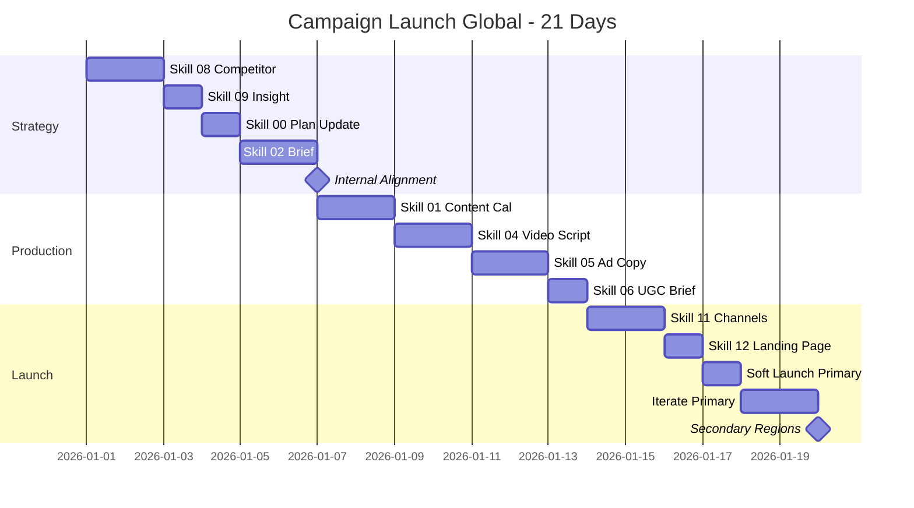

# Workflow: Campaign Launch (Global)

> From idea to live campaign — 14-21 days, multi-region timing, translation-aware, platform-native.

---

## 1. Who is this workflow for?

```
Audience: Marketing teams or agencies launching a new global campaign
Outcome after 14-21 days:
  - Live campaign across 1-3 regions (US / EU / SEA)
  - 10+ creative assets ready (videos, copy, landing page)
  - Channels configured with tracking pixels + UTM
  - Multi-region launch staircase executed
Time: 14-21 calendar days (3-4h/day team work)
Skills used: 8 global skills (08, 09, 00, 02, 01, 04, 05, 06, 11, 12)
Output: 10+ markdown files + live ads + landing page
Default currency: USD primary; per-region splits documented
```

**Pre-requisite:** Approved marketing plan exists (from `client-onboard-global` or prior planning cycle). Ad accounts warmed up (not brand new).

**NOT for:** Always-on evergreen campaigns (those run continuously, not "launch") or single-platform organic-only pushes (use `content-production-global`).

---

## 2. Pre-flight Checklist

Complete these 10 items BEFORE Day 1:

- [ ] Approved marketing plan with channel + budget allocation
- [ ] Target regions confirmed (US / EU / SEA / other) with launch sequence
- [ ] Ad accounts ready: Meta BM, Google Ads, TikTok Ads (per region if needed)
- [ ] Pixels installed + Conversion API live, tested with Test Events
- [ ] Domain + landing page hosting available (or Shopify / Webflow / framer)
- [ ] Translation budget OR bilingual team confirmed for non-English regions
- [ ] Creative team capacity confirmed (designer, video editor, copywriter)
- [ ] Legal / compliance review path identified (FTC, EU GDPR, regional ad rules)
- [ ] Approval chain documented (who signs off on creative, copy, spend)
- [ ] Crisis playbook draft ready (what if a region underperforms / overspends)

> **Skipping pre-flight = burning ad budget.** Most launch failures trace back to one missing item from this list.

---

## 3. Step-by-step: 21 Days × 3-4h/day

### Week 1: Strategy & Brief (Days 1-7)

**Day 1-2: Competitor Refresh**
- Run `/skill 08-competitor-research-global` for current campaign window.
- Pull last 30 days of competitor ads (Meta Ads Library + TikTok Creative Center) per target region.
- Note: competitor positioning per region may differ — US vs EU often diverge sharply.
- Output: `competitor-research-[campaign]-[date].md`

**Day 3: Customer Insight Refresh**
- Run `/skill 09-customer-insight-global`.
- Re-validate persona — has anything shifted since last cycle? Seasonal? Macro events?
- For multi-region: 1 master persona + per-region addendum on cultural nuances.
- Output: `customer-insight-[campaign]-[date].md`

**Day 4: Marketing Plan Update (campaign-specific slice)**
- Run `/skill 00-marketing-plan-global` in campaign-slice mode.
- Define: campaign goal, KPIs, budget per region, launch sequence, kill criteria.
- Confirm USD primary + GBP/EUR/SGD per-region notes.
- Output: `marketing-plan-[campaign]-[date].md`

**Day 5-6: Campaign Brief**
- Run `/skill 02-campaign-brief-global`.
- 9-section brief: big idea, message, audience, channels, creative direction, deliverables, RACI, timeline, budget.
- Translation notes per region — what stays universal, what localizes.
- Output: `campaign-brief-[campaign]-[date].md`

**Day 7: Internal Alignment**
- Share brief in 60-min team review meeting.
- Get sign-off from: Marketing Owner, Creative Lead, Ad Ops Lead.
- Hard gate: no creative work starts until brief signed off in writing.

---

### Week 2: Production (Days 8-14)

**Day 8-9: Content Calendar (Launch + Sustain)**
- Run `/skill 01-content-calendar-global`.
- Plan 4 weeks: launch week (high frequency) + 3 sustain weeks (steady drip).
- Timing per region: schedule launches at regional peak hours (US 9am ET, EU 8am CET, SEA 7pm ICT).
- Output: `content-calendar-[campaign]-[date].md`

**Day 10-11: Video Scripts**
- Run `/skill 04-script-video-global`.
- 3-5 hero scripts per format: 15s (Reels/TikTok), 30s (paid), 60-90s (LP/YouTube).
- A/B variants per script — different hooks, same core message.
- For non-EN regions: translation brief, not literal translation. Cultural adaptation.
- Output: `script-video-[campaign]-[date].md`

**Day 12-13: Ad Copy**
- Run `/skill 05-ad-copy-global`.
- 6-9 copy variants: 3 TOFU + 3 MOFU + 3 BOFU.
- Per-platform variants: Meta primary text + headline + description; Google RSA assets; TikTok captions.
- Translation: send finalized EN copy to translators; budget 2-3 days turnaround.
- Output: `ad-copy-[campaign]-[date].md`

**Day 14: UGC/EGC Brief**
- Run `/skill 06-ugc-egc-brief-global`.
- 2-3 creator briefs + employee-generated brief if applicable.
- Per-region creators preferred (cultural fit > English fluency for some regions).
- Output: `ugc-brief-[campaign]-[date].md`

---

### Week 3: Setup & Launch (Days 15-21)

**Day 15-16: Channel Setup**
- Run `/skill 11-channel-setup-global`.
- Per region: Meta campaign structure (CBO vs ABO), Google Ads campaigns, TikTok ad groups.
- Pixel events tested with Test Events tool.
- UTM convention: `[platform]_[region]_[campaign]_[adset]_[creative]`.
- Output: `channel-setup-[campaign]-[date].md`

**Day 17: Landing Page**
- Run `/skill 12-landing-page-brief-global`.
- LP variants per region if culturally sensitive (currency display, social proof per region).
- Mobile-first design — 70%+ traffic will be mobile in most regions.
- A/B framework noted (hero headline test, CTA test).
- Output: `landing-page-brief-[campaign]-[date].md`

**Day 18: Soft Launch (Primary Region First)**
- Launch in primary region only (where confidence is highest, usually US).
- Budget at 50% of planned full spend for first 48h — collect signal before scaling.
- Monitor CTR + CPC + CVR + initial CPA every 4 hours.

**Day 19-20: Iterate Primary Region**
- Kill bottom 30% of creative by CTR.
- Scale winning ad sets +25% budget per day max (avoid resetting learning phase).
- Document what's working — this informs secondary regions.

**Day 21: Secondary Regions Launch**
- Launch EU + SEA based on primary-region learnings.
- Translated assets live; per-region creative tested.
- Full-budget mode in primary region; soft-launch budget in secondaries.

---

## 4. Skills Chain & Timeline

### Mermaid Gantt Chart



### Skills Chain (Text)

```
08 (Competitor) → 09 (Insight) → 00 (Plan) → 02 (Brief) → APPROVAL
→ 01 (Calendar) + 04 (Script) + 05 (Copy) + 06 (UGC Brief) [parallel]
→ 11 (Channels) + 12 (LP)
→ Soft Launch Primary → Iterate → Secondary Regions
```

### Output Files

| Week | Skill | File |
|------|-------|------|
| 1 | 08 | `competitor-research-[campaign]-[date].md` |
| 1 | 09 | `customer-insight-[campaign]-[date].md` |
| 1 | 00 | `marketing-plan-[campaign]-[date].md` |
| 1 | 02 | `campaign-brief-[campaign]-[date].md` |
| 2 | 01 | `content-calendar-[campaign]-[date].md` |
| 2 | 04 | `script-video-[campaign]-[date].md` |
| 2 | 05 | `ad-copy-[campaign]-[date].md` |
| 2 | 06 | `ugc-brief-[campaign]-[date].md` |
| 3 | 11 | `channel-setup-[campaign]-[date].md` |
| 3 | 12 | `landing-page-brief-[campaign]-[date].md` |

---

## 5. Success Criteria

| Criterion | Minimum target | Good target | Measurement |
|-----------|---------------|-------------|-------------|
| Launch on schedule | Day 21 ± 2 | Day 18 (early) | Calendar vs actual launch date |
| ROAS by Day 14 post-launch | 1.5x | 2.5x+ | Ads platform reporting |
| Multi-region staircase executed | Primary + 1 region | All planned regions live | Region launch checklist |
| Creative diversity | 3 video angles + 6 copy variants | 5 angles + 9 variants | Asset count vs plan |
| Tracking accuracy | Pixel + CAPI verified | Pixel + CAPI + offline conversions | Test Events + match quality score |

> Hitting only minimums signals learning is happening but performance is borderline. Plan for iteration cycle in week 4 if you're below "good".

---

## 6. Common Pitfalls (10 Mistakes Newbies Make)

### 1. Launching all regions simultaneously
**Problem:** Budget spread thin, signal weak, can't tell what works where.
**Cause:** Pressure to "go global on day 1".
**Fix:** Always launch primary region 48-72h ahead. Use signal to inform secondaries.

### 2. Literal translation instead of localization
**Problem:** Translated copy feels off, conversions tank in non-EN regions.
**Cause:** Treating translation as line-by-line word swap.
**Fix:** Brief translators on intent + emotion + cultural context. Re-record voice-over locally where possible.

### 3. Skipping competitor research refresh
**Problem:** Reusing 6-month-old competitor data; missing current ad angles.
**Cause:** "We did this last quarter, no need to redo."
**Fix:** Always refresh skill 08 within 14 days of launch. Markets shift fast.

### 4. No kill criteria defined
**Problem:** Underperforming campaign keeps running for 4 weeks because nobody decided when to stop.
**Cause:** Plan optimistic; no downside scenario.
**Fix:** Document kill triggers in skill 00 (e.g., "Kill if CPA > 2x target by day 7").

### 5. Pixel not tested before launch
**Problem:** First 3 days of data are garbage; learning phase wasted.
**Cause:** "It worked last campaign so it must work."
**Fix:** Test Events tool every campaign launch. Not negotiable.

### 6. Creative variants too similar
**Problem:** All 5 ads test same hook with minor wording changes; can't tell what concept resonates.
**Cause:** Mistaking variation for diversity.
**Fix:** Test angles (problem-led vs solution-led vs proof-led), not synonyms.

### 7. Landing page mismatched to ad
**Problem:** Ad promises X, LP delivers Y; bounce rate >70%.
**Cause:** Ad and LP built by different teams without shared brief.
**Fix:** Skill 12 cross-references campaign brief. Headline match: ad copy ≈ LP H1.

### 8. Scaling winners too fast
**Problem:** +200% budget overnight resets learning phase, performance crashes.
**Cause:** Greedy scaling.
**Fix:** Max +25% budget per ad set per day. Or use CBO for auto-distribution.

### 9. Ignoring per-region timing
**Problem:** Launching at US 9am ET hits EU at 3pm (post-lunch slump) and SEA at 9pm (winding down).
**Cause:** Single launch window.
**Fix:** Per-region scheduling. Skill 11 has timing tables.

### 10. No post-launch review cadence
**Problem:** Campaign launches, then drift. Nobody owns iteration.
**Cause:** Energy spent on launch, none on operate.
**Fix:** Schedule daily check (first 3 days), then 2x/week. Clear owner per region.

---

## 7. AI Research Prompts

### Prompt 1: Regional CPM scan

```
Pull current 2025-2026 CPM benchmarks for [industry] across:
- US (Meta + TikTok)
- UK / Germany / France (Meta + Google)
- Singapore / Vietnam / Indonesia (Meta + TikTok)
Highlight where CPM is 2x+ vs my budget assumptions.
Recommend regions to defer if budget tight.
```

**Use when:** Day 4, while updating plan.
**Expected output:** Regional CPM table + budget reallocation suggestion.

### Prompt 2: Translation cultural audit

```
Review this English ad copy for [campaign]: [paste copy].
Flag any: idioms, references, humor, formality level that won't translate well to:
- French-speaking EU
- German market
- Vietnamese SEA market
Suggest cultural adaptation per region.
```

**Use when:** Day 12, before sending to translators.
**Expected output:** Per-region adaptation notes.

### Prompt 3: Competitor angle map

```
I'm launching a campaign for [product] targeting [audience] in [region].
Top 5 competitors are: [list].
Map their current ad angles by axis: rational vs emotional, feature-led vs benefit-led.
Where's the empty quadrant we should own?
```

**Use when:** Day 1-2, during competitor research.
**Expected output:** 2x2 angle matrix + recommendation.

### Prompt 4: Landing page critique

```
Review this LP brief: [paste brief].
Score on: headline match to ads, value prop clarity, social proof strength,
CTA placement, mobile-first design, trust signals.
Identify the weakest 3 areas — that's where conversion will leak.
```

**Use when:** Day 17, before LP build starts.
**Expected output:** Score per axis + 3 priority fixes.

### Prompt 5: Soft launch decision

```
Day 3 post-launch in primary region. Numbers:
[CTR, CPC, CVR, ROAS, frequency by region]
Kill criteria from plan: [paste].
Should we scale, hold, kill, or pivot? Justify with the 3 strongest signals.
```

**Use when:** Day 19-20, daily review.
**Expected output:** Recommendation + supporting data + next-step.

---

## 8. Resources & Next Steps

### Workflows that follow

| Workflow | When to use | Description |
|----------|-------------|-------------|
| `monthly-cycle-global` | End of month | Performance review across regions |
| `content-production-global` | Weekly during sustain phase | Keep creative fresh post-launch |
| `dropshipping-launch-global` | If product is dropship | Add product-research front-end before campaign |

### Reference docs

- `skills-global/references/` — global benchmarks, MCP integration
- `skills-global/02-campaign-brief-global/SKILL.md` — full brief template
- `skills-global/11-channel-setup-global/SKILL.md` — pixel + UTM conventions

### YouTube tutorial

```
Tutorial: Global Campaign Launch in 21 Days
- Video link: [TBD - YouTube link to be added post v2.5.0 release]
- Estimated length: 12-15 minutes
- Recording window: ~10 days after v2.5.0 ships
- Content: Multi-region setup demo, soft launch decision walkthrough
```

---

## Final Pre-launch Checklist

- [ ] Marketing plan approved + kill criteria documented
- [ ] Campaign brief signed off in writing
- [ ] All creative localized for non-EN regions
- [ ] Landing page live + mobile tested + LP analytics verified
- [ ] Pixel + Conversion API tested with Test Events
- [ ] UTM convention applied to all assets
- [ ] Budgets confirmed in USD + per-region currency
- [ ] Daily review owner assigned per region
- [ ] Soft launch starts in primary region only — secondaries staged 2-3 days later
- [ ] Crisis playbook printed: who decides if we kill, scale, or pivot
