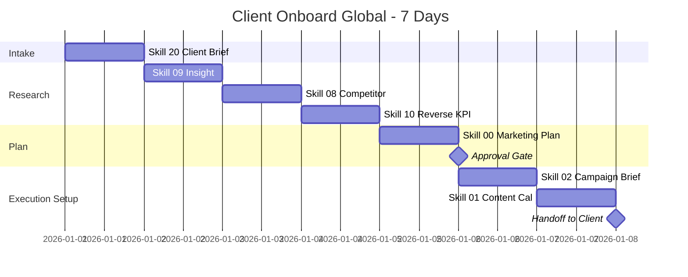

# Workflow: Client Onboard (Global Agency)

> From new international client to full marketing plan delivered — the standard process for global agencies and freelancers.

---

## 1. Who is this workflow for?

```
Audience: Agency / Freelancer onboarding a new international client
Outcome after 5-7 days:
  - Full client brief (11 sections)
  - Customer insight + competitor research + reverse KPI
  - Approved master marketing plan
  - First campaign brief + content calendar (month 1)
Time: ~5-7 working days
Skills used: 7 global skills (20, 09, 08, 10, 00, 02, 01)
Output: 7+ markdown files — handoff package ready to execute
Default currency: USD (per-region currency notes optional)
```

**Pre-requisite:** Sales call done; client signed contract; you have access to client communication channel (email, Slack, or PM tool).

**NOT for:** Existing clients on retainer (use `monthly-cycle-global` instead) or one-off content gigs (use `content-production-global` directly).

---

## 2. Pre-flight Checklist

Complete these 10 items BEFORE Day 1:

- [ ] Signed contract / SOW with scope, timeline, fees agreed
- [ ] Client primary contact identified (name, role, timezone, response SLA)
- [ ] Kickoff meeting scheduled (60-90 min, ideally on Day 1)
- [ ] Shared workspace ready (Notion / Google Drive / Dropbox folder)
- [ ] Communication channel set (Slack channel, email thread, or weekly call)
- [ ] Industry variant chosen for skill 20 (e-commerce / SaaS / B2B services / etc.)
- [ ] Client timezone + working hours noted (US-East, US-West, EU-CET, SEA-ICT, etc.)
- [ ] Currency preference confirmed (USD default; per-region GBP/EUR/SGD if needed)
- [ ] Read access to client's existing data (GA4, Meta Ads, CRM, sales reports)
- [ ] Internal team assigned (strategist, content lead, ad ops, designer)

> **Missing items?** Don't skip — incomplete intake creates rework later. Hold the kickoff until the basics are in place.

---

## 3. Step-by-step: 7 Days × 2-4h/day

### Day 1: Brief Client Intake (kickoff + form)

**Skill:** `20-client-intake-brief-global`
**Owner:** Client fills the form; Agency reviews live during kickoff call.
**Input:** Industry variant matching client's vertical. Available variants:

| Industry | Variant file |
|----------|--------------|
| E-commerce / DTC | `01-ecommerce-dtc.md` |
| SaaS / Software | `02-saas-software.md` |
| B2B Services | `03-b2b-services.md` |
| Coaching / Consulting | `04-coaching-consulting.md` |
| Local Services | `05-local-services.md` |
| Education / Online Course | `06-education-online.md` |
| Healthcare / Wellness | `07-healthcare-wellness.md` |
| Real Estate | `08-real-estate.md` |
| Hospitality / Travel | `09-hospitality-travel.md` |
| Non-profit | `10-nonprofit.md` |

**Output:** `client-brief-[name]-[YYYYMMDD].md` — full 11-section intake.
**Pass criteria:** All 11 sections answered, agency reviewed, no critical gaps.

> **Timezone tip:** If kickoff bridges US-EU (8+ hour gap), schedule at the EU 4-5pm / US 8-9am overlap window. SEA + EU works at SEA 4pm / EU 10am.

### Day 2: Customer Insight

**Skill:** `09-customer-insight-global`
**Input:** Client brief + any existing customer data (CRM exports, survey results, support tickets).
**Output:** `customer-insight-[name]-[YYYYMMDD].md`
**Pass criteria:** At least 1 TRUE insight (motivation + behavior + trigger), not just demographic observation.

> **Insight vs observation:**
> - Observation: "Buyers are women aged 25-35 in tier-1 US cities."
> - Insight: "Women 25-35 in HCOL US cities buy on Sunday evenings — they batch self-care planning while reviewing the week's calendar, looking for 'Monday-ready' results."

### Day 3: Competitor Research

**Skill:** `08-competitor-research-global`
**Input:** Competitor list from brief + your own research (G2, Capterra for SaaS; SimilarWeb; Meta Ads Library).
**Output:** `competitor-research-[name]-[YYYYMMDD].md`
**Pass criteria:** 3-tier competitor mapping (direct / indirect / aspirational) + clear positioning gap.

> **MCP bonus:** With `facebook-ads-library-mcp` connected, AI auto-pulls live competitor ads in target regions.

### Day 4: Reverse KPI

**Skill:** `10-reverse-kpi-global`
**Input:** Revenue target from brief + global benchmarks (region-specific where it matters: US ROAS ≠ SEA ROAS).
**Output:** `kpi-[name]-[YYYYMMDD].md`
**Pass criteria:** 3 scenarios (low / mid / high) with explicit budget breakdown in USD + per-region currency if multi-region.

### Day 5: Marketing Plan

**Skill:** `00-marketing-plan-global`
**Input:** Output from Days 1-4 combined.
**Output:** `marketing-plan-[name]-[YYYYMMDD].md`
**Approver:** Client Marketing Owner + Leadership.
**Pass criteria:** 7-section plan complete, KPIs across 3 scenarios, budget allocated by channel/region.

> **Multi-region note:** If client targets US + EU + SEA, plan a launch staircase — primary region first (highest ROI confidence), then secondaries 2-4 weeks later. Avoid simultaneous global launch on first campaign.

### Day 6: Campaign Brief

**Skill:** `02-campaign-brief-global`
**Input:** Approved marketing plan + concrete launch timeline.
**Output:** `campaign-brief-[name]-[YYYYMMDD].md`
**Pass criteria:** 9-section brief, deliverables with deadlines, RACI clear (who does what, when).

### Day 7: Content Calendar (Month 1)

**Skill:** `01-content-calendar-global`
**Input:** Campaign brief + channels + creator/team capacity.
**Output:** `content-calendar-[name]-month1-[YYYYMMDD].md`
**Pass criteria:** Day-by-day schedule, owner assigned per post, platform-native formats specified.

---

## 4. Skills Chain & Timeline

### Mermaid Gantt Chart



### Skills Chain (Text)

```
20 (Client Brief) → 09 (Customer Insight) → 08 (Competitor Research)
→ 10 (Reverse KPI) → 00 (Marketing Plan) → APPROVAL
→ 02 (Campaign Brief) → 01 (Content Calendar) → HANDOFF
```

### Output Files Mapping

| Day | Skill | File |
|-----|-------|------|
| 1 | 20 | `client-brief-[name]-[date].md` |
| 2 | 09 | `customer-insight-[name]-[date].md` |
| 3 | 08 | `competitor-research-[name]-[date].md` |
| 4 | 10 | `kpi-[name]-[date].md` |
| 5 | 00 | `marketing-plan-[name]-[date].md` |
| 6 | 02 | `campaign-brief-[name]-[date].md` |
| 7 | 01 | `content-calendar-[name]-month1-[date].md` |

---

## 5. Success Criteria

| Criterion | Minimum target | Good target | Measurement |
|-----------|---------------|-------------|-------------|
| All 7 deliverables completed | 7/7 | 7/7 + sign-off | File checklist + client email approval |
| Client kickoff alignment | Brief 11/11 sections | Brief + handoff call done | Brief completeness check |
| Insight quality | 1 true insight | 3+ true insights | Insight file review |
| Plan approval | Approved by client lead | Approved by leadership | Email/Slack confirmation |
| Time to handoff | ≤ 7 working days | ≤ 5 working days | Day count from kickoff to handoff |

> If you hit only the minimums, your retainer is still safe but the client may push back at month 2 review. Target the "good" column to set up renewals.

---

## 6. Common Pitfalls (10 Mistakes Newbies Make)

### 1. Skipping the kickoff call
**Problem:** Brief gets filled in async with vague answers; you spend Days 2-3 chasing clarifications.
**Cause:** "Let's just send the form to save time."
**Fix:** Always do a 60-90 min live kickoff. The form is the agenda, not a substitute for conversation.

### 2. Choosing wrong industry variant
**Problem:** Client brief asks SaaS-style questions for a DTC ecommerce client; data collected is irrelevant.
**Cause:** Picking by surface keywords instead of business model.
**Fix:** Confirm business model first (recurring revenue? one-time purchase? lead-gen?) — that drives the variant choice.

### 3. Treating insight as demographics
**Problem:** "Customer is women 25-35, USA" — that's a target, not an insight. Useless for creative direction.
**Cause:** Stopping at the easy data layer.
**Fix:** Always answer: motivation + behavior + trigger + barrier. If you can't, you don't have an insight yet.

### 4. Researching only direct competitors
**Problem:** Plan misses indirect threats — substitute products, alternative solutions customers consider.
**Cause:** Defining the competitive set too narrowly.
**Fix:** Run skill 08 with 3 tiers (direct / indirect / aspirational). Indirect is where most positioning gaps hide.

### 5. KPI scenarios with unrealistic budgets
**Problem:** "Low" scenario assumes $500/month ad spend producing $50K revenue. Math doesn't work.
**Cause:** Reverse-engineering from revenue target without grounding in benchmarks.
**Fix:** Plug regional benchmarks (skill 10 has US/EU/SEA tables). If your conversion math implies miracle ROAS, the target is wrong.

### 6. Multi-region launch with no staircase
**Problem:** Client wants global launch Day 1; you spread thin budget across 4 regions; nothing scales.
**Cause:** Not pushing back on client ambition with operational reality.
**Fix:** Stage launches. Primary region first (where signal is strongest), then expand. Document why in plan.

### 7. Currency confusion
**Problem:** Plan in USD, client thinks in GBP, leadership reviews in EUR. Numbers feel inconsistent.
**Cause:** Not setting USD-as-primary upfront.
**Fix:** USD is the operating currency for global plans. Add per-region currency footnotes only where needed.

### 8. Plan without leadership approval
**Problem:** You hand off campaign brief, then leadership rejects the plan in week 3.
**Cause:** Skipping the approval gate after Day 5.
**Fix:** Hard stop after marketing plan. Get explicit email approval before Day 6 work begins.

### 9. Campaign brief with no RACI
**Problem:** Team starts work; nobody knows who owns what; deadlines slip.
**Cause:** "It's obvious from context."
**Fix:** Skill 02 has RACI section — fill it. Name people, not roles. Specific deadlines, not "ASAP".

### 10. Content calendar ignoring team capacity
**Problem:** Calendar plans 5 videos/week but you have 1 part-time editor. Burnout by week 3.
**Cause:** Building calendar from "what should we post" instead of "what we can produce".
**Fix:** Reverse the question. Capacity first → calendar adapts. Or budget for more capacity before committing.

---

## 7. AI Research Prompts

5 prompts ready to use during onboarding to sharpen your output.

### Prompt 1: Industry benchmark scan

```
Pull 2025-2026 marketing benchmarks for [industry] in [region: US/EU/SEA].
Include: avg CAC, ROAS, email open rate, conversion rate, CPM/CPC range.
Cite sources where possible. Highlight 3 numbers that are most non-obvious.
```

**Use when:** Day 1-2, before starting reverse KPI work.
**Expected output:** Benchmark table + 3 non-obvious insights.

### Prompt 2: Competitor ad creative analysis

```
Analyze competitor [name]'s last 30 days of Meta + TikTok ads.
What angles are they testing? Which ads have been running longest (suggesting they convert)?
What positioning gap does this expose for [our client]?
```

**Use when:** Day 3, during competitor research.
**Expected output:** Ad angle map + positioning gap recommendation.

### Prompt 3: Customer JTBD probe

```
Given customer brief: [paste persona summary], generate 5 Jobs-to-be-Done hypotheses.
For each: functional job, social job, emotional job, current alternative, frustration.
Rank by likely revenue impact if we build messaging around it.
```

**Use when:** Day 2, during insight work.
**Expected output:** 5 JTBD hypotheses ranked by impact.

### Prompt 4: Plan stress-test

```
Critique this draft marketing plan: [paste plan].
Where are the assumptions weakest? What would break if [specific risk] happened?
Suggest 3 contingencies and which channels could absorb a 30% budget cut.
```

**Use when:** Day 5, before submitting plan for approval.
**Expected output:** Risk list + 3 contingencies + budget flex options.

### Prompt 5: Multi-region sequencing

```
Client wants to launch in US + UK + Singapore. Budget $30K/month total.
Recommend launch sequence: which region first, which budget split per phase, which channels per region.
Justify with regional CPM and conversion data.
```

**Use when:** Day 5, while drafting the plan.
**Expected output:** Phased launch plan + per-region rationale.

---

## 8. Resources & Next Steps

### Workflows that follow

| Workflow | When to use | Description |
|----------|-------------|-------------|
| `campaign-launch-global` | Week 2-3 of relationship | Execute the first campaign from the brief |
| `content-production-global` | Weekly | Produce content batches against the calendar |
| `monthly-cycle-global` | End of each month | Performance review + next month plan |

### Reference docs

- `skills-global/20-client-intake-brief-global/README.md` — full intake variants
- `skills-global/references/` — global benchmarks, MCP integration, pricing references
- `docs/getting-started-global.md` — onboarding crash course (if available)

### YouTube tutorial

```
Tutorial: Global Client Onboard in 7 Days
- Video link: [TBD - YouTube link to be added post v2.5.0 release]
- Estimated length: 8-10 minutes
- Recording window: ~7 days after v2.5.0 ships
- Content: Day-by-day walkthrough, kickoff call demo, plan review demo
```

---

## Final Pre-handoff Checklist

- [ ] Client brief 11 sections complete — no gaps
- [ ] Insight has motivation + behavior + trigger (not demographic only)
- [ ] Competitor map covers 3 tiers with clear gap
- [ ] KPI has 3 scenarios + per-region budget if multi-region
- [ ] Marketing plan approved by client leadership (email/Slack record)
- [ ] Campaign brief has RACI with named people + deadlines
- [ ] Content calendar realistic vs team capacity
- [ ] Currency primary = USD; per-region notes added where relevant
- [ ] All files follow naming: `[skill]-[name]-[date].md`
- [ ] Handoff call scheduled with client to walk through deliverables
