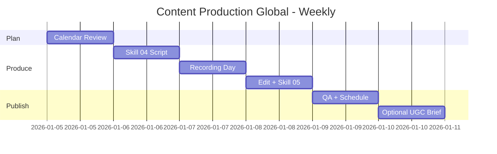

# Workflow: Content Production (Global)

> Weekly content production cycle — English-first, multi-platform, region-aware distribution.

---

## 1. Who is this workflow for?

```
Audience: Content teams or solo creators producing weekly content for global audiences
Outcome each week:
  - 3-5 hero pieces produced (video + copy + visuals)
  - 7-10 distribution-native variants (LinkedIn, TikTok, Instagram, etc.)
  - All scheduled across primary platforms
  - Performance baseline for next week
Time: 5 working days × 2-4h/day (10-20h/week)
Skills used: 4-5 global skills (01 review, 04, 05, 06)
Output: Published content + tracking sheet
Default language: English; localized variants where region-specific
```

**Pre-requisite:** Content calendar exists (from `client-onboard-global` Day 7 or `monthly-cycle-global` Day 3). Tools accessible: video editor (CapCut / Descript / Premiere), graphic design (Canva / Figma), scheduler (Buffer / Later / Hootsuite).

**NOT for:** Launch-week content (use `campaign-launch-global` instead) or one-off content gigs (skip the weekly rhythm).

---

## 2. Pre-flight Checklist

Complete these 10 items by end of previous week:

- [ ] Content calendar reviewed for coming week — themes confirmed
- [ ] Hero asset count agreed (3 vs 5 — based on team capacity)
- [ ] Owner per piece named (writer, video editor, designer, scheduler)
- [ ] Platform priorities set (LinkedIn-heavy for B2B, TikTok-heavy for SEA consumer, etc.)
- [ ] Brand voice doc accessible (from `09-customer-insight-global` or brand context)
- [ ] Stock asset / B-roll library ready (if used)
- [ ] Video / podcast equipment tested (mic, lighting, recording space)
- [ ] Translation budget if non-EN distribution (per word or per video estimate)
- [ ] Scheduler tool authenticated for all platforms
- [ ] Performance tracker sheet open (last week's baseline visible)

> **Skipping pre-flight = chaos by Wednesday.** Most weekly content failures trace to unclear ownership or missing assets.

---

## 3. Step-by-step: 5-Day Weekly Rhythm

### Day 1 (Monday) — Calendar Review + Brief

**Action 1: Review week's slot in calendar**
- Pull this week's slice from `01-content-calendar-global` output.
- Confirm: themes, formats, channels, owners, deadlines.
- Check for last-minute changes: market events, trending topics, client feedback.

**Action 2: Adjust if needed**
- Trending topic in target region? Swap a planned post for a rapid-response piece.
- Major event in region X (e.g., US July 4, UK Bank Holiday, SEA Tet)? Reschedule sensitive content.
- Client urgent ask? Reprioritize the week.

**Action 3: Brief team**
- 30-min Monday standup: who's doing what, when, with what.
- Blockers raised: missing assets, dependencies, approvals needed.
- Owner per piece confirms — no "we'll figure it out".

**Output:** Week-of brief in shared doc / Slack channel.
**Pass criteria:** Every piece has owner + deadline + asset checklist.

---

### Day 2 (Tuesday) — Video Scripts

**Skill:** `04-script-video-global`
**Input:** Week's themes + brand voice + previous week's performance signals.
**Output:** `script-video-week-[W]-[YYYYMMDD].md`

**Script structure (per video):**
- Hook 3 seconds (regional cultural fit — humor / urgency / curiosity varies)
- Setup 10-15 seconds (problem framing)
- Insight / payoff 30-60 seconds (the value)
- CTA 5-10 seconds (platform-native: LinkedIn vs TikTok CTAs differ)

**Per-platform variants:**
- LinkedIn: longer setup OK (2-3 min videos perform well)
- TikTok / Reels: 15-30 second cut, higher hook density
- YouTube Shorts: 60-second version
- YouTube long-form (if produced): 5-8 minute version with deeper structure

**Pass criteria:** All hero scripts written, A/B variants for top 1-2, platform variants noted.

---

### Day 3 (Wednesday) — Production Day

**Action 1: Recording / shooting**
- Studio setup: lighting (key + fill), mic check (-12dB peak), framing
- Record 2-3 takes per video
- Capture B-roll, alternate angles, behind-the-scenes for repurposing

**Action 2: AI avatar / voice clone (optional)**
- If using HeyGen / Synthesia / ElevenLabs: render in batch
- QA each: lip-sync check, voice naturalness, audio clipping
- Disclose AI per platform policy (FTC for US, similar for UK/EU)

**Action 3: Asset capture**
- Screenshots, demos, charts as needed
- Upload raw to project folder with naming convention: `[YYYY-MM-DD]_[topic]_[take#]`

**Pass criteria:** All raw footage / audio captured. Backed up.

---

### Day 4 (Thursday) — Edit + Copy

**Action 1: Video editing**
- Hero pieces: full edit with captions, B-roll, music, intro/outro brand stinger
- Captions burned-in or platform native (use SRT for YouTube, TikTok auto-caption check)
- Aspect ratios per platform: 9:16 for TikTok/Reels/Shorts, 1:1 for IG feed, 16:9 for LinkedIn/YouTube long
- Color correction + audio leveling

**Action 2: Ad / post copy**
- **Skill:** `05-ad-copy-global`
- Per-platform copy variants (LinkedIn voice ≠ TikTok voice ≠ Instagram caption)
- Hashtag strategy: 3-5 LinkedIn, 5-10 Instagram, 3-7 TikTok, 0-2 LinkedIn for B2B
- Hook line within first 125 characters (LinkedIn truncation point)

**Action 3: Visuals for static posts**
- Carousels for LinkedIn / Instagram
- Quote cards from video transcripts
- Brand-consistent: same fonts, color palette, logo placement

**Pass criteria:** All hero pieces edited + per-platform copy ready + visuals approved.

---

### Day 5 (Friday) — Schedule + Distribute

**Action 1: Final QA**
- Brand consistency check across all assets
- CTA clarity per piece
- UTMs added to any external links
- Subtitles / captions verified
- Mobile preview — most viewers see content on mobile

**Action 2: Schedule per platform**
- Buffer / Later / Hootsuite: input all posts with platform-specific copy
- Timing per region (use scheduler's analytics or skill 11 timing tables):
  - US LinkedIn: Tue-Thu 8-10am ET
  - SEA TikTok: 7-9pm ICT
  - EU Instagram: 12-2pm CET
  - UK LinkedIn: 9-11am GMT
- Tag with campaign / week ID for tracking

**Action 3: Backup distribution**
- Email newsletter: link to LinkedIn article / blog post (Substack, Beehiiv, Mailchimp)
- Community: Slack / Discord / FB Group seed posts
- Internal stakeholders: Slack alert when major piece live (engagement boost from team)

**Pass criteria:** All posts scheduled across 5+ platforms; tracking sheet updated.

---

### Optional Day 6-7 — Async Engagement + UGC Brief

**UGC brief for next week (skill 06):**
- If creator partners involved, brief them by Friday for next-week shoots
- Include: hook ideas, key messages, do's and don'ts, examples
- Output: `ugc-brief-week-[W+1]-[YYYYMMDD].md`

**Engagement window:**
- First 2-4 hours after each post: reply to every comment
- Algorithm rewards early engagement
- Cross-platform: when you post on LinkedIn, drop a teaser in Slack/Discord

---

## 4. Skills Chain & Timeline

### Mermaid Gantt Chart



### Skills Chain (Text)

```
Calendar Review (from skill 01)
→ 04 (Video Script) → Production → Edit → 05 (Ad Copy) → Visuals
→ Schedule + Distribute
→ Optional: 06 (UGC Brief for next week)
```

### Output Files (Weekly)

| Day | Skill | File / Asset |
|-----|-------|-------------|
| Mon | — | Week-of brief (Slack / doc) |
| Tue | 04 | `script-video-week-[W]-[date].md` |
| Wed | — | Raw footage / audio in project folder |
| Thu | 05 | `ad-copy-week-[W]-[date].md` + edited videos + visuals |
| Fri | — | Scheduled posts + tracking sheet update |
| Sat (opt) | 06 | `ugc-brief-week-[W+1]-[date].md` |

---

## 5. Success Criteria

| Criterion | Minimum target | Good target | Measurement |
|-----------|---------------|-------------|-------------|
| Hero pieces produced per week | 3 | 5 | Asset count vs plan |
| Distribution variants per hero | 5 platforms | 7+ platforms | Per-piece checklist |
| Time from idea to publish | ≤7 days | ≤5 days | Calendar date vs publish date |
| Engagement rate | 2%+ | 4%+ | (Reactions + comments + shares) / impressions |
| Reach growth WoW | 5%+ | 15%+ | This week vs last week reach |

> Hitting only minimums signals stable production but plateauing reach. Target the "good" column to compound week-over-week.

---

## 6. Common Pitfalls (10 Mistakes Newbies Make)

### 1. Same content across all platforms
**Problem:** LinkedIn post copy-pasted to TikTok caption — feels off, low engagement.
**Cause:** Time pressure; treating distribution as multi-publish.
**Fix:** Each platform has native voice. Repurpose the message, rewrite the wording.

### 2. Skipping Monday brief
**Problem:** Wednesday confusion — who's recording? What's the hook?
**Cause:** "We talked about it last Friday."
**Fix:** Monday standup non-optional. 30 minutes saves 3 hours mid-week.

### 3. No captions / subtitles
**Problem:** 85% of mobile viewers watch muted; no captions = no view-through.
**Cause:** "TikTok auto-captions, that's enough."
**Fix:** Burn-in captions for hero pieces. Auto-captions for platform native.

### 4. Recording without retakes
**Problem:** First take has audio issues; nobody noticed; final video is bad.
**Cause:** Single-take mentality.
**Fix:** Always 2-3 takes minimum. Pick best in edit.

### 5. Editing during production day
**Problem:** Wednesday recording bleeds into Thursday editing because takes weren't reviewed in field.
**Cause:** Skipping in-field playback.
**Fix:** Quick playback check after each take. Reshoot in-field, not next day.

### 6. CTAs misaligned per platform
**Problem:** "Click link in bio" CTA on LinkedIn; LinkedIn doesn't do "link in bio".
**Cause:** Default-to-Instagram thinking.
**Fix:** Platform-specific CTAs: LinkedIn → "comment for the link" or attach doc; TikTok → bio link; YouTube → description / community tab.

### 7. Posting at wrong regional time
**Problem:** US-targeted post live at 3am ET; first 4 hours of engagement lost.
**Cause:** Single timezone scheduling.
**Fix:** Schedule per region. Most schedulers support this.

### 8. No engagement window
**Problem:** Post goes live, creator goes offline. Algorithm sees no early engagement, throttles reach.
**Cause:** "It'll find its audience."
**Fix:** Block first 2 hours after major posts for replies. Compounds reach.

### 9. Over-producing low-value posts
**Problem:** Spending 4 hours on a daily filler post with 200 impressions.
**Cause:** Treating all posts equally.
**Fix:** 80/20: 1-2 hero pieces get 70% of effort. Filler is filler.

### 10. No performance review weekly
**Problem:** Same content patterns repeat week after week with no improvement.
**Cause:** "Review is a monthly thing."
**Fix:** 15-min Friday wrap: what 1 thing worked, what 1 thing failed. Inform next week's plan.

---

## 7. AI Research Prompts

### Prompt 1: Trending topic scan per region

```
Scan trending topics this week for [industry] in:
- US LinkedIn / TikTok
- UK LinkedIn / Instagram
- SEA TikTok / Facebook
List top 5 per region. Highlight any that align with our brand voice [paste tone].
Suggest 1 piece we could produce in 24h to ride the trend.
```

**Use when:** Day 1, before finalizing week's brief.
**Expected output:** Trending topics + rapid-response idea.

### Prompt 2: Hook variation generator

```
Generate 10 alternative hooks for this video script: [paste opening 3 sec].
Variations should test: question vs statement, problem vs benefit, shock vs curiosity.
Format: hook 5-9 words max, conversational not formal.
```

**Use when:** Day 2, while drafting scripts.
**Expected output:** 10 hooks ranked by punchiness.

### Prompt 3: Per-platform copy adaptation

```
This is the master message: [paste].
Adapt for each platform with native voice:
- LinkedIn (200-400 words, professional but human)
- TikTok caption (90-150 chars + 5 hashtags)
- Instagram caption (200-300 chars, conversational)
- X / Twitter (1-2 short tweets)
Keep core idea identical, adjust tone + length.
```

**Use when:** Day 4, during copy production.
**Expected output:** 4-platform adapted copy.

### Prompt 4: Engagement analysis

```
This week's posts data: [paste impressions, engagements, completion rate per platform].
Identify:
- Format patterns: video vs static vs carousel — which won?
- Time patterns: which posting time slot worked per platform?
- Topic patterns: which themes got highest engagement?
3 recommendations for next week's mix.
```

**Use when:** Day 5 wrap or weekend, before next Monday.
**Expected output:** 3 actionable recommendations.

### Prompt 5: Script critique

```
Review this script for clarity + hook strength: [paste].
Check: hook within 3 sec, problem framed by sec 10, payoff clear by 30, CTA before 60.
Where does attention drop? What 2 edits would tighten it?
```

**Use when:** Day 2, after first draft.
**Expected output:** Drop-off analysis + 2 specific edits.

---

## 8. Resources & Next Steps

### Workflows that connect

| Workflow | When | Description |
|----------|------|-------------|
| `monthly-cycle-global` | Last week of month | Roll up weeks into monthly review |
| `campaign-launch-global` | When launching new campaign | Pause weekly cycle to launch |
| `client-onboard-global` | New client | Restart weekly cycle for new account |

### Reference docs

- `skills-global/01-content-calendar-global/SKILL.md` — calendar template
- `skills-global/04-script-video-global/SKILL.md` — script structures
- `skills-global/05-ad-copy-global/SKILL.md` — copy templates per funnel
- `skills-global/06-ugc-egc-brief-global/SKILL.md` — creator briefing

### YouTube tutorial

```
Tutorial: Weekly Global Content Production
- Video link: [TBD - YouTube link to be added post v2.5.0 release]
- Estimated length: 8-10 minutes
- Recording window: ~10 days after v2.5.0 ships
- Content: Live walkthrough Mon-Fri production cycle
```

---

## Final Friday Checklist

- [ ] All hero pieces published or scheduled
- [ ] Per-platform copy variants live (not copy-pasted)
- [ ] Captions / subtitles on all videos
- [ ] CTAs platform-appropriate (no "link in bio" on LinkedIn)
- [ ] Posts timed for regional peak hours
- [ ] First-2-hour engagement window owner assigned
- [ ] Performance tracker updated with this week's baseline
- [ ] UGC brief sent for next week if creators involved
- [ ] Friday 15-min wrap done — 1 win + 1 lesson captured
- [ ] Monday brief draft started for next week
