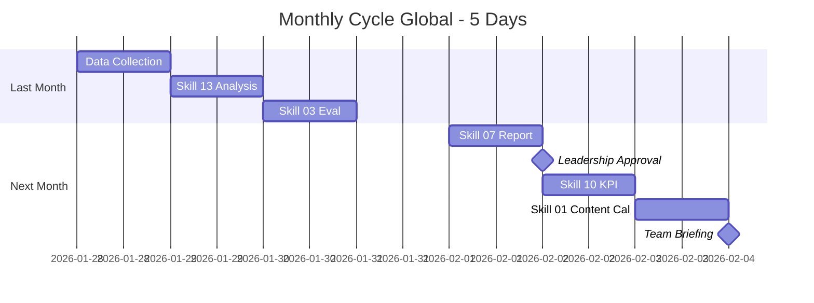

# Workflow: Monthly Cycle (Global)

> End-of-month performance review across all regions, then plan next month — multi-currency, multi-region, comparative analysis.

---

## 1. Who is this workflow for?

```
Audience: Marketing teams running ongoing campaigns across multiple regions
Outcome after 3-5 days:
  - Last-month performance report (multi-region, multi-currency)
  - Diagnosis of what worked / failed per region
  - KPIs and budget for next month
  - Updated content calendar for next 30 days
Time: 3-5 working days (last 2-3 days of month + first 2-3 of next)
Skills used: 5 global skills (13, 03, 07, 10, 01)
Output: 5+ markdown files
Default reporting currency: USD primary; per-region currency provided alongside
```

**Pre-requisite:** Campaign(s) live for at least 30 days; data accessible from Meta Ads / Google Ads / TikTok Ads / GA4 / CRM.

**NOT for:** First-month launch teams (still in iteration mode — use `campaign-launch-global` review steps) or teams without analytics access (fix that first).

---

## 2. Pre-flight Checklist

Complete these 10 items by Day 27 of the month:

- [ ] Access confirmed to all ad platforms in all regions (Meta BM, Google Ads, TikTok Ads)
- [ ] GA4 or equivalent analytics access (per region property if multi-region)
- [ ] CRM / sales data available (orders, customers, revenue per region)
- [ ] Currency conversion source identified (XE.com, OANDA, or accounting system)
- [ ] Last month's report on hand for comparison (set monthly baseline)
- [ ] KPI targets from plan / contract documented
- [ ] Internal review meeting scheduled (Day 30 or Day 1 of next month)
- [ ] Leadership presentation slot booked (typically Day 2-3 of next month)
- [ ] MCP servers connected if used (for auto-pull of ads data)
- [ ] Template tracking sheet ready with regional columns

> **Skipping pre-flight = scrambling on Day 28.** Most monthly review pain comes from missing data access, not analysis difficulty.

---

## 3. Step-by-step: 5 Days × 3-4h/day

### Day 28 (last month) — Data Collection

**Action 1: Pull regional ad data**
- Meta Ads Manager: spend, impressions, clicks, CPM, CPC, CTR, CPA, ROAS per region
- Google Ads: search + display + shopping per region
- TikTok Ads: per region (where active)
- Export to one Sheet with regional tabs: US / UK-EU / SEA-APAC / Other

**Action 2: Pull GA4 + CRM data**
- GA4: traffic by source/region, conversion events, revenue per region
- CRM: orders, customers, MRR/ARR (if SaaS), repeat purchase rate
- Match ad spend to revenue per region for ROAS sanity check

**Action 3: Currency normalization**
- Convert all regional numbers to USD using month-end rate
- Keep per-region native currency in parallel column
- Document FX rate used (date + source) for auditability

> **Pro tip:** Use MCP integrations (Adspirer, Pipeboard, brijr/meta-mcp) for auto-pull. Saves 1-2 hours.

---

### Day 29 — Data Analysis

**Skill:** `13-data-analysis-global`
**Input:** Sheet from Day 28 + last-month baseline + KPI targets.
**Output:** `data-analysis-month-[M]-[YYYYMMDD].md`

**Focus areas:**
- Per-region performance vs target (was US the strongest? Did EU lag?)
- Trend signals: which region accelerating, which decelerating
- Anomalies: unexpected spikes / drops, attribution issues
- Cohort behavior: new vs returning customers per region

**Pass criteria:** Insights extracted (not just numbers reported). At least 1 regional comparison insight.

---

### Day 30 — Performance Evaluation

**Skill:** `03-performance-eval-global`
**Input:** Data analysis from Day 29.
**Output:** `performance-eval-month-[M]-[YYYYMMDD].md`

**Diagnostic questions answered:**
- Why did region X beat region Y? (Audience size? Creative? Pricing? Local competition?)
- Where's the funnel leaking — top, middle, bottom — per region?
- Which channels are saturated vs underdeveloped per region?
- What's the root cause for the 1-2 biggest variances?

**Pass criteria:** Each region has a diagnostic with root cause + recommendation.

---

### Day 1 (next month) — Marketing Report

**Skill:** `07-marketing-report-global`
**Input:** Data analysis + performance eval + month context (events, launches, blockers).
**Output:** `marketing-report-month-[M]-[YYYYMMDD].md`
**Approver:** Marketing Owner → presents to Leadership.

**5-section report:**
1. Executive summary (5-min read for C-suite)
2. Per-region performance table (USD primary + native currency)
3. What worked / what didn't (top 3 each)
4. Comparative analysis (this month vs last month vs same month last year)
5. Recommendations for next month

**Pass criteria:** Leadership can read in 5 minutes and know what to approve next.

---

### Day 2 — Reverse KPI for Next Month

**Skill:** `10-reverse-kpi-global`
**Input:** Revenue target for next month + this month's actuals (adjust benchmarks).
**Output:** `kpi-month-[M+1]-[YYYYMMDD].md`

**Output structure:**
- 3 scenarios per region (low / mid / high)
- Budget allocation per region per channel
- Sensitivity table: "if CPA drifts 20%, here's what breaks"
- Currency: USD primary + per-region native

**Pass criteria:** Total budget across regions matches approved spend; per-region breakdown defensible.

---

### Day 3 — Content Calendar for Next Month

**Skill:** `01-content-calendar-global`
**Input:** New KPIs + upcoming campaigns + lessons from this month + regional events calendar.
**Output:** `content-calendar-month-[M+1]-[YYYYMMDD].md`

**Calendar structure:**
- Week-by-week themes per region
- Per-platform native formats
- Local events / holidays per region (US July 4, UK Bank Holidays, SEA Tet, etc.)
- Owner assigned per piece

**Pass criteria:** Calendar realistic vs team capacity; regional events captured.

---

## 4. Skills Chain & Timeline

### Mermaid Gantt Chart



### Skills Chain (Text)

```
Data Collection (manual + MCP)
→ 13 (Data Analysis) → 03 (Performance Eval) → 07 (Report)
→ APPROVAL by Leadership
→ 10 (Reverse KPI for next month) → 01 (Content Calendar)
→ Team briefing + execution starts
```

### Output Files

| Day | Skill | File |
|-----|-------|------|
| 28 | — | Data sheet (multi-region) |
| 29 | 13 | `data-analysis-month-[M]-[date].md` |
| 30 | 03 | `performance-eval-month-[M]-[date].md` |
| 1 | 07 | `marketing-report-month-[M]-[date].md` |
| 2 | 10 | `kpi-month-[M+1]-[date].md` |
| 3 | 01 | `content-calendar-month-[M+1]-[date].md` |

---

## 5. Success Criteria

| Criterion | Minimum target | Good target | Measurement |
|-----------|---------------|-------------|-------------|
| Cycle completed in 5 days | 5 days | 4 days | Day count from Day 28 to Day 3 next month |
| All regions reported | 100% live regions | 100% + comparative | Region checklist in report |
| Leadership presents in ≤5 min | Reads + understands | Approves on the spot | Meeting timer |
| Next-month KPIs approved | Approved with edits | Approved as drafted | Email/Slack confirmation |
| Content calendar handed off | Calendar published | Calendar + assets pre-staged | File + tracking sheet |

> If you slip past 5 days into Day 4-5 of next month, the team starts Month +1 mid-flight without a plan. That's how missed quarters happen.

---

## 6. Common Pitfalls (10 Mistakes Newbies Make)

### 1. Reporting in mixed currency
**Problem:** US in USD, UK in GBP, SEA in SGD — leadership can't compare regions apples-to-apples.
**Cause:** "We'll let leadership convert."
**Fix:** USD primary always. Per-region native in adjacent column. Document FX rate.

### 2. Numbers without insight
**Problem:** Report has 12 charts and no conclusions. Leadership asks "so what?"
**Cause:** Confusing comprehensive with useful.
**Fix:** Lead with the 3 most important findings. Charts support, don't substitute.

### 3. No comparative baseline
**Problem:** "We did $50K revenue" — vs what? Last month? Last quarter? Plan?
**Cause:** Reporting in isolation.
**Fix:** Always 3-way compare: vs plan, vs last month, vs same month last year (if available).

### 4. Skipping the diagnostic step
**Problem:** Going straight from data to next-month plan without asking why this month went sideways.
**Cause:** Time pressure.
**Fix:** Skill 03 is non-optional. Root cause this month before planning next month.

### 5. Per-region noise treated as signal
**Problem:** SEA had a 30% jump because of one large enterprise deal. Plan assumes ongoing 30% growth.
**Cause:** Treating outliers as trends.
**Fix:** Note one-time events separately. Don't bake them into next month's targets.

### 6. KPIs disconnected from realistic CPA
**Problem:** Plan assumes CPA stays flat while doubling spend. CPA always rises with scale.
**Cause:** Linear extrapolation.
**Fix:** Skill 10 has scaling factors. CPA + 10-25% per scaling tier is realistic.

### 7. Calendar planned for ideal team
**Problem:** Calendar assumes 3 videos/week; team only delivered 2/week last month.
**Cause:** Hoping the team will speed up.
**Fix:** Plan from actual capacity. Add 10-15% buffer for unexpected.

### 8. No regional events in calendar
**Problem:** Big push planned during US Thanksgiving / EU summer holiday / SEA Tet — half the audience offline.
**Cause:** Single-region calendar mindset.
**Fix:** Per-region events list reviewed before drafting calendar.

### 9. Leadership presentation too long
**Problem:** 30-slide deck for a 30-min meeting; nothing decided.
**Cause:** Showing all the work instead of the conclusions.
**Fix:** 5 slides max for executive summary. Detail in appendix.

### 10. No follow-through tracker
**Problem:** Decisions made in review meeting; nobody tracks if they got implemented.
**Cause:** Meeting-as-deliverable thinking.
**Fix:** Each decision → owner + deadline → tracker. Review next cycle.

---

## 7. AI Research Prompts

### Prompt 1: Regional variance diagnostic

```
This month's data: [paste per-region table].
Last month's data: [paste].
US ROAS dropped 30% while UK held steady.
What are the 5 most likely root causes? Rank by probability.
What data would I need to confirm each?
```

**Use when:** Day 30, during performance eval.
**Expected output:** Ranked hypothesis list + verification path.

### Prompt 2: Currency normalization sanity check

```
I converted these regional numbers to USD using rate from [date]:
[paste table].
Are any FX-induced movements being mistaken for real performance changes?
Where did currency move >3% this month and how much of the variance is FX?
```

**Use when:** Day 29, during data analysis.
**Expected output:** FX impact callout per region.

### Prompt 3: Comparative report draft

```
Draft a 5-min executive summary from this data:
[paste month report bullets].
Audience: CEO + CFO. They care about: ROAS trend, region winners/losers, ask for next month.
Length: 200 words max. Lead with the most important finding.
```

**Use when:** Day 1, before drafting full report.
**Expected output:** Draft executive summary.

### Prompt 4: Scaling sensitivity

```
Plan for next month assumes:
- US: $20K spend, $80K revenue (4x ROAS)
- UK: $10K spend, $30K revenue (3x)
- SEA: $5K spend, $20K revenue (4x)
What breaks first if Meta CPM rises 15%? If conversion rate drops 10%?
Which region is most exposed?
```

**Use when:** Day 2, while finalizing KPI.
**Expected output:** Risk per region + mitigation suggestion.

### Prompt 5: Calendar optimization

```
This month's content data: [paste post-by-post performance].
Identify: top 3 pieces by ROI, bottom 3 by ROI.
Pattern: which formats / topics / posting times worked best per region?
Rebuild next month's mix recommendation based on this.
```

**Use when:** Day 3, while drafting calendar.
**Expected output:** Format/topic/time mix per region.

---

## 8. Resources & Next Steps

### Workflows that connect

| Workflow | When | Description |
|----------|------|-------------|
| `campaign-launch-global` | If new campaign needed | Launch the next campaign from updated plan |
| `content-production-global` | Weekly | Execute content calendar |
| `client-onboard-global` | New client mid-cycle | Onboard new client without disrupting cycle |

### Reference docs

- `skills-global/13-data-analysis-global/SKILL.md` — analysis templates
- `skills-global/07-marketing-report-global/SKILL.md` — report 5-section structure
- `skills-global/references/mcp-ads-integration-global.md` — auto-pull guide

### YouTube tutorial

```
Tutorial: Multi-Region Monthly Review
- Video link: [TBD - YouTube link to be added post v2.5.0 release]
- Estimated length: 10-12 minutes
- Recording window: ~14 days after v2.5.0 ships
- Content: Live walkthrough of US + UK + SEA monthly review
```

---

## Final Cycle Checklist

- [ ] All regional data collected and reconciled
- [ ] USD primary + native currency throughout
- [ ] At least 1 cross-region comparative insight surfaced
- [ ] Performance eval has root cause per region
- [ ] Marketing report 5 sections complete + executive summary <200 words
- [ ] Leadership approval recorded (email/Slack)
- [ ] Next-month KPIs with 3 scenarios per region
- [ ] Calendar published + team briefed
- [ ] Regional events / holidays captured in calendar
- [ ] Decisions tracker updated for next cycle review
